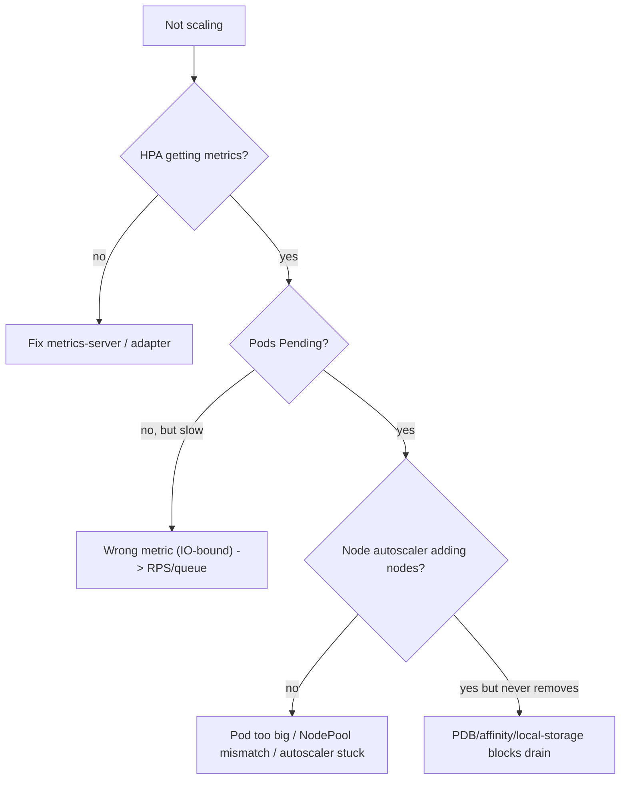

# Autoscaling - Scenarios & SRE Ops

> Debugging "autoscaling does nothing" and "we scale up but never down." Frequently tested concepts, CKA/CKAD tasks, interview questions, EKS production scenarios, diagnostics, and runbooks. Pair with [01 - Autoscaling Guide](01%20-%20Autoscaling%20Guide.md).

See also: [01 - Autoscaling Guide](01%20-%20Autoscaling%20Guide.md) · [02 - Scheduling & Resources Scenarios & SRE Ops](02%20-%20Scheduling%20%26%20Resources%20Scenarios%20%26%20SRE%20Ops.md) · [02 - Workload Resilience Scenarios & SRE Ops](02%20-%20Workload%20Resilience%20Scenarios%20%26%20SRE%20Ops.md)

---

## Table of Contents

- [1. Frequently Tested Concepts](#1-frequently-tested-concepts)
- [2. Keywords → Cause](#2-keywords--cause)
- [3. CKA/CKAD Practical Tasks](#3-ckackad-practical-tasks)
- [4. Interview Questions](#4-interview-questions)
- [5. EKS Production Scenarios](#5-eks-production-scenarios)
- [6. "Autoscaling Does Nothing" Checklist](#6-autoscaling-does-nothing-checklist)
- [7. Runbooks](#7-runbooks)
- [8. One-Line Recap](#8-one-line-recap)

---

## 1. Frequently Tested Concepts

- **HPA CPU target = usage/request** (not limit).
- **metrics-server required** for CPU/mem HPA; custom metrics need an adapter/KEDA.
- **CPU HPA fails for IO-bound apps** → use RPS/queue/latency.
- **VPA-Auto + HPA-CPU conflict.**
- **Node scale-down = drain lite** → blocked by strict PDBs/affinity/local storage.
- **Karpenter** > Cluster Autoscaler for bin-packing/cost on EKS.
- **KEDA** for event-driven + scale-to-zero.

[⬆ Back to top](#table-of-contents)

---

## 2. Keywords → Cause

| Phrase                                  | Points to                                       |
| :-------------------------------------- | :---------------------------------------------- |
| "HPA shows `<unknown>` target"          | metrics-server missing/broken                   |
| "HPA won't scale though latency high"   | IO-bound; CPU not the bottleneck                |
| "HPA over-scales / wastes money"        | CPU request too low                             |
| "we scale up but never down"            | Strict PDB / affinity / local storage           |
| "Pod Pending forever, node never added" | Pod too big for any instance / autoscaler stuck |
| "HPA and VPA fighting"                  | Both acting on CPU                              |
| "queue backs up but pods flat"          | Need KEDA on queue depth                        |

[⬆ Back to top](#table-of-contents)

---

## 3. CKA/CKAD Practical Tasks

**T1 - Create an HPA:**

```bash
kubectl autoscale deploy web --cpu-percent=60 --min=3 --max=20
kubectl get hpa web
kubectl describe hpa web        # current vs target, events
```

**T2 - HPA with custom behavior (fast up, slow down):**

```yaml
spec:
  minReplicas: 3
  maxReplicas: 20
  metrics:
    - type: Resource
      resource:
        { name: cpu, target: { type: Utilization, averageUtilization: 60 } }
  behavior:
    scaleDown: { stabilizationWindowSeconds: 300 }
```

**T3 - Diagnose a non-scaling HPA:**

```bash
kubectl describe hpa web | grep -A5 Events
kubectl top pods -l app=web        # is metrics-server returning data?
```

**T4 - Check node autoscaler decisions:**

```bash
kubectl -n kube-system logs deploy/cluster-autoscaler --tail=200   # CA
kubectl -n karpenter logs deploy/karpenter --tail=200              # Karpenter
kubectl get nodeclaims                                            # Karpenter nodes
```

[⬆ Back to top](#table-of-contents)

---

## 4. Interview Questions

**Q1: HPA target is "60% CPU." 60% of what?**

> Of the **CPU request**, summed/averaged across Pods. Not the limit, not node capacity. So the request value directly controls aggressiveness.

**Q2: Why won't CPU-based HPA help an IO-bound service?**

> Its bottleneck is waiting on IO, so CPU stays low while latency climbs. Scale on RPS, concurrency, or queue depth (KEDA) instead.

**Q3: Can you run HPA and VPA together?**

> Not on the same resource. HPA-on-CPU needs a stable request; VPA-Auto keeps changing it. Safe: HPA on custom metrics + VPA on memory, or VPA in recommend-only mode.

**Q4: "We scale up fine but never scale down." Why?**

> Scale-down is drain-governed: strict PDBs, anti-affinity/topology that blocks rescheduling, or local-storage Pods pin nodes. Loosen PDBs, relax constraints, use networked storage.

**Q5: Cluster Autoscaler vs Karpenter on EKS?**

> CA scales fixed node-group ASGs; Karpenter provisions arbitrary instance types to fit pending Pods and consolidates for cost. Karpenter is faster and bin-packs better.

**Q6: What does scale-to-zero require?**

> Event-driven triggering (KEDA) since there's no Pod to read CPU from at zero, plus tolerance for cold-start latency.

[⬆ Back to top](#table-of-contents)

---

## 5. EKS Production Scenarios

### Medium

**M1 - HPA stuck at minReplicas, `describe` shows `unknown` CPU.**

> metrics-server not installed/healthy. Install/repair it; verify `kubectl top pods` returns data.

**M2 - Karpenter not launching nodes for Pending Pods.**

> NodePool requirements don't match the Pod (zone/arch/instance constraints), or the Pod requests exceed any allowed instance. Check Karpenter logs + NodePool limits and the Pod's nodeSelector/affinity.

**M3 - Nodes never consolidate; cluster stays oversized after a spike.**

> PDBs block eviction or `do-not-disrupt` annotations present. Audit PDBs and Karpenter disruption settings; ensure ≥2 replicas so a disruption is allowed.

**M4 - HPA flapping replicas every minute.**

> No stabilization window. Set `scaleDown.stabilizationWindowSeconds` (e.g. 300) and rate policies; raise `minReplicas`.

### Hard

**H1 - Black-Friday spike: HPA scales pods to 50 but they sit Pending for 6 minutes.**

> Node provisioning lag. Pre-warm with higher `minReplicas` / scheduled scaling (KEDA cron), use Karpenter (faster than CA), keep a small over-provisioning "pause Pod" buffer (low-priority placeholder Pods that get preempted) so capacity is ready instantly.

**H2 - Queue workers can't keep up though CPU is 30%.**

> Wrong signal. Switch to **KEDA** scaling on SQS/Kafka depth; scale-to-zero off-peak. CPU HPA is blind to backlog.

**H3 - HPA and VPA-Auto both target CPU; replicas oscillate wildly.**

> They're fighting. Move HPA to a custom metric (RPS) and let VPA own memory, or set VPA to recommendation mode. Never co-own CPU.

**H4 - Karpenter spot consolidation keeps killing a stateful workload.**

> Stateful Pods on spot/consolidatable nodes. Add `karpenter.sh/do-not-disrupt` (or run on an on-demand NodePool), taint spot, set PDBs, and handle interruption signals. See [01 - StatefulSets & Storage Guide](01%20-%20StatefulSets%20%26%20Storage%20Guide.md).

**H5 - Scale-down stalls because one DaemonSet Pod or a `kube-system` Pod has no PDB.**

> Unmovable Pods pin the node. Use `--skip-nodes-with-system-pods`/safe-to-evict annotations appropriately, add PDBs for critical add-ons, and let Karpenter know what's disruptable.

[⬆ Back to top](#table-of-contents)

---

## 6. "Autoscaling Does Nothing" Checklist



```bash
kubectl describe hpa <name>                         # current vs target, fetch errors
kubectl describe pod <pending> | sed -n '/Events/,$p' # Insufficient cpu? affinity?
kubectl -n karpenter logs deploy/karpenter --tail=200
kubectl get pdb -A                                   # DisruptionsAllowed: 0 blocks scale-down
```

[⬆ Back to top](#table-of-contents)

---

## 7. Runbooks

### Runbook: HPA not scaling

1. `kubectl describe hpa` - metric value present? If `<unknown>` → metrics-server/adapter.
2. Confirm CPU **request** is set and realistic (denominator of utilization).
3. If load is IO-bound → switch metric to RPS/queue (Prometheus Adapter/KEDA).
4. Check `maxReplicas` isn't already hit; check `behavior` stabilization.

### Runbook: cluster won't scale down

1. `kubectl get pdb -A` → any `DisruptionsAllowed: 0`?
2. Identify Pods pinning nodes: local storage, no controller, restrictive affinity, system Pods.
3. Loosen PDBs (≥1 disruption with ≥2 replicas), move to networked storage, relax topology.
4. Verify Karpenter/CA logs show consolidation proceeding.

[⬆ Back to top](#table-of-contents)

---

## 8. One-Line Recap

> **HPA scales pods on usage/request (set requests right!); use RPS/queue for IO-bound; metrics-server is mandatory. Don't co-own CPU with VPA-Auto. Karpenter beats CA on EKS for bin-packing/cost. KEDA for events + scale-to-zero. "Up but never down" = PDB/affinity/local-storage blocking drain.**

[⬆ Back to top](#table-of-contents)

---

> Continue to [01 - Workload Resilience Guide](01%20-%20Workload%20Resilience%20Guide.md).
