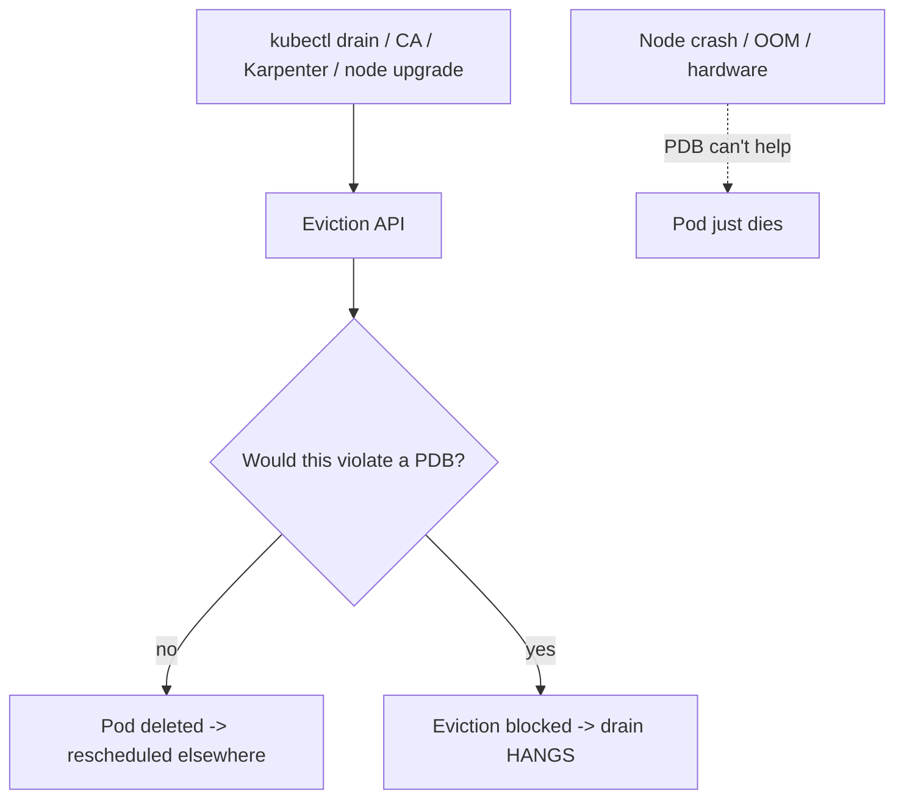
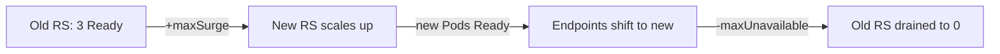

# Workload Resilience - Guide

> Where Kubernetes becomes a grown-up: not just "run my containers" but "change the system without breaking users." The catch - "don't break users" is a _constraint_, and constraints can **deadlock**. PodDisruptionBudgets protect availability but can also block rollouts and node scale-down if set too strictly. Covers disruptions (voluntary vs involuntary), PDBs, node draining, rollout strategies, and the classic stuck-forever scenarios - on **AWS EKS**.

See also: [02 - Workload Resilience Scenarios & SRE Ops](02%20-%20Workload%20Resilience%20Scenarios%20%26%20SRE%20Ops.md) · [01 - Autoscaling Guide](01%20-%20Autoscaling%20Guide.md) · [01 - Scheduling & Resources Guide](01%20-%20Scheduling%20%26%20Resources%20Guide.md) · [01 - Request Lifecycle Guide](01%20-%20Request%20Lifecycle%20Guide.md)

---

## Table of Contents

- [1. Disruptions: Voluntary vs Involuntary](#1-disruptions-voluntary-vs-involuntary)
- [2. PodDisruptionBudget (PDB)](#2-poddisruptionbudget-pdb)
- [3. Node Drain: What Actually Happens](#3-node-drain-what-actually-happens)
- [4. Scale-down Is "Drain Lite"](#4-scale-down-is-drain-lite)
- [5. Rollouts ≠ Drains](#5-rollouts--drains)
- [6. The Stuck-Forever Scenarios](#6-the-stuck-forever-scenarios)
- [7. Setting PDBs Without Self-Sabotage](#7-setting-pdbs-without-self-sabotage)
- [8. Graceful Shutdown & Zero-Downtime](#8-graceful-shutdown--zero-downtime)
- [9. EKS Specifics](#9-eks-specifics)
- [10. Best Practices](#10-best-practices)

---



---

## 1. Disruptions: Voluntary vs Involuntary

| Type            | Examples                                                                                 | PDB applies?            |
| :-------------- | :--------------------------------------------------------------------------------------- | :---------------------- |
| **Involuntary** | Node crash, kernel panic, power loss, OOMKill, hardware failure, **spot reclaim**        | ❌ No - stuff just dies |
| **Voluntary**   | `kubectl drain`, CA/Karpenter node removal, node upgrade, deleting a Pod for maintenance | ✅ Yes - PDB-governed   |

> PDBs only control **voluntary** disruptions. If your node explodes, a PDB won't save you - that's an application/replication concern. PDB is about _controlled maintenance_.

[⬆ Back to top](#table-of-contents)

---

## 2. PodDisruptionBudget (PDB)

A PDB is a policy targeting Pods by label selector:

- **`minAvailable: N`** - keep at least N (or N%) available, or
- **`maxUnavailable: N`** - allow at most N unavailable.

"Available" ≈ **Ready**. So **PDB is glued to readiness** - bad readiness signals make a PDB overly strict (it thinks you already have too few). `kubectl get pdb` shows **`ALLOWED DISRUPTIONS`**; if it's `0`, no eviction can proceed.

[⬆ Back to top](#table-of-contents)

---

## 3. Node Drain: What Actually Happens

```bash
kubectl drain <node> --ignore-daemonsets --delete-emptydir-data
```

1. **Cordon** - mark node unschedulable.
2. Evict Pods one by one via the **Eviction API**.
3. For each: does a PDB apply, and would eviction violate it?
4. If allowed → Pod deleted → controllers recreate it elsewhere → scheduler places it.
5. If the PDB says no → eviction blocked → **drain hangs**.

DaemonSet Pods are normally _not_ evicted (they belong on every node) - hence `--ignore-daemonsets`.

[⬆ Back to top](#table-of-contents)

---

## 4. Scale-down Is "Drain Lite"

When Cluster Autoscaler / Karpenter remove a node they must move its Pods elsewhere, respecting **PDBs, node selectors/affinity/taints, and local storage**. The same blockers that hang `kubectl drain` block scale-down - which is why teams notice _"we scale up fine but never scale down."_ It's almost always PDBs + placement constraints. See [01 - Autoscaling Guide](01%20-%20Autoscaling%20Guide.md).

[⬆ Back to top](#table-of-contents)

---

## 5. Rollouts ≠ Drains

A Deployment **rolling update** is _controller-driven replacement_, not eviction-driven drain:

1. Create new Pods (new ReplicaSet).
2. Wait for them to become **Ready**.
3. Gradually terminate old Pods.

Governed by `maxSurge`, `maxUnavailable`, **readiness probes**, and `progressDeadlineSeconds` - _not_ directly by the Eviction API. PDBs primarily gate evictions (drain/CA), but in practice a strict availability story still stalls rollouts when new Pods never become Ready or surge capacity is missing.



[⬆ Back to top](#table-of-contents)

---

## 6. The Stuck-Forever Scenarios

| Scenario                                  | Why it deadlocks                                                                                | Fix                                                             |
| :---------------------------------------- | :---------------------------------------------------------------------------------------------- | :-------------------------------------------------------------- |
| **A: Single replica + `minAvailable: 1`** | Evicting the only Pod violates the PDB                                                          | Run ≥2 replicas, or loosen/temporarily remove PDB               |
| **B: PDB selector too broad**             | Shared label (`app=api`) matches multiple workloads → far stricter than intended                | Use precise labels (component/role)                             |
| **C: Readiness failing**                  | "Available" count already below required → blocks _all_ eviction exactly when you need recovery | Fix readiness; don't couple it to fragile deps                  |
| **D: Strict topology/affinity**           | PDB allows eviction but scheduler can't place the replacement                                   | Relax constraints, add capacity, multi-AZ node groups           |
| **E: Local storage**                      | Pod can't move off its node                                                                     | Use networked storage (CSI/EBS/EFS), or accept reduced mobility |

[⬆ Back to top](#table-of-contents)

---

## 7. Setting PDBs Without Self-Sabotage

- **Stateless, replicas ≥ 2:** `maxUnavailable: 1` is usually sane.
- **Large fleets:** `maxUnavailable: 10%` is smoother.
- **Critical services:** enough replicas across AZs + `topologySpreadConstraints` so losing one node/zone doesn't kill too many.
- **Single-replica stateful:** a PDB can't give you HA - that requires app-level replication.

> Key idea: **a PDB is only meaningful if you run enough replicas to survive a disruption.** A PDB on one replica is just a maintenance deadlock.

[⬆ Back to top](#table-of-contents)

---

## 8. Graceful Shutdown & Zero-Downtime

A clean Pod termination:

1. Pod marked Terminating; removed from EndpointSlices (stops new traffic).
2. **`preStop` hook** runs (e.g. `sleep 10`) - lets in-flight requests finish and LB deregistration complete.
3. **SIGTERM** to the container; app should drain connections.
4. After `terminationGracePeriodSeconds`, **SIGKILL**.

```yaml
lifecycle:
  preStop: { exec: { command: ["sh", "-c", "sleep 10"] } }
terminationGracePeriodSeconds: 30
```

On EKS, align the **ALB/NLB target-group deregistration delay** with the grace period, and use **AWS LB Controller readiness gates** so Pods aren't Ready until registered - true zero-downtime rollouts. See [01 - Services & Networking Guide](01%20-%20Services%20%26%20Networking%20Guide.md).

[⬆ Back to top](#table-of-contents)

---

## 9. EKS Specifics

- **Managed node group upgrades** drain nodes respecting PDBs - a too-strict PDB will **stall the whole upgrade**. AWS waits, then may force after a timeout.
- **Spot interruptions are involuntary** (2-minute notice). Run **AWS Node Termination Handler** / Karpenter interruption handling to cordon+drain on the rebalance signal, converting a hard kill into a graceful drain.
- **Karpenter consolidation** is a voluntary disruption - protect workloads with PDBs and `karpenter.sh/do-not-disrupt`.
- **Cluster upgrades**: control plane → add-ons → node groups, one AZ/group at a time, PDBs honored. See [01 - Control Plane Reliability Guide](01%20-%20Control%20Plane%20Reliability%20Guide.md).

[⬆ Back to top](#table-of-contents)

---

## 10. Best Practices

- **Run ≥2 (ideally 3) replicas across AZs** for anything that needs availability - it's the prerequisite for every PDB/rollout guarantee.
- **PDB: `maxUnavailable: 1` or `10%`** for stateless; precise selectors; never a PDB that allows zero disruptions on a workload you also need to drain.
- **Never set `maxSurge: 0` _and_ `maxUnavailable: 0`** unless you have a separate blue/green strategy - that's "change nothing while changing everything."
- **Get readiness right** - it drives PDB availability, rollout progress, and traffic. A broken probe deadlocks maintenance.
- **Add `preStop` + grace period + deregistration delay** for zero-downtime; use readiness gates on EKS.
- **Use `topologySpreadConstraints`** so a node/AZ loss never removes a majority of replicas.
- **Handle spot interruptions** with NTH/Karpenter; keep stateful/critical on on-demand.
- **Test drains in non-prod** (`kubectl drain`) to surface PDB/affinity deadlocks before an upgrade does.

[⬆ Back to top](#table-of-contents)

---

> Continue to [02 - Workload Resilience Scenarios & SRE Ops](02%20-%20Workload%20Resilience%20Scenarios%20%26%20SRE%20Ops.md).
