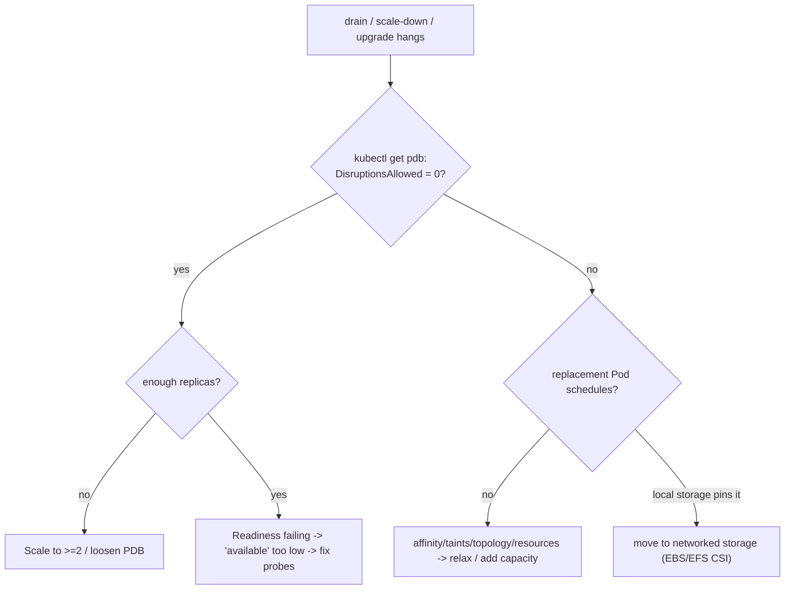

# Workload Resilience - Scenarios & SRE Ops

> Debugging "why won't this drain / scale down / finish rolling out?" Frequently tested concepts, CKA/CKAD tasks, interview questions, EKS production scenarios, diagnostics, and runbooks. Pair with [01 - Workload Resilience Guide](01%20-%20Workload%20Resilience%20Guide.md).

See also: [01 - Workload Resilience Guide](01%20-%20Workload%20Resilience%20Guide.md) · [02 - Autoscaling Scenarios & SRE Ops](02%20-%20Autoscaling%20Scenarios%20%26%20SRE%20Ops.md) · [02 - Incident Response Scenarios & SRE Ops](02%20-%20Incident%20Response%20Scenarios%20%26%20SRE%20Ops.md)

---

## Table of Contents

- [1. Frequently Tested Concepts](#1-frequently-tested-concepts)
- [2. Keywords → Cause](#2-keywords--cause)
- [3. CKA/CKAD Practical Tasks](#3-ckackad-practical-tasks)
- [4. Interview Questions](#4-interview-questions)
- [5. EKS Production Scenarios](#5-eks-production-scenarios)
- [6. "Why won't it drain?" Decision Tree](#6-why-wont-it-drain-decision-tree)
- [7. Runbooks](#7-runbooks)
- [8. One-Line Recap](#8-one-line-recap)

---

## 1. Frequently Tested Concepts

- **PDB governs only voluntary disruptions.**
- **Drain = cordon + Eviction API**, PDB-checked per Pod.
- **Scale-down = drain lite** → same blockers.
- **Rollout safety = `maxSurge`/`maxUnavailable`/readiness/progressDeadline.**
- **Never `maxSurge:0` + `maxUnavailable:0`.**
- **PDB ≈ readiness**; broken probes make PDB over-strict.
- EKS: node-group upgrade respects PDB; **spot reclaim is involuntary**.

[⬆ Back to top](#table-of-contents)

---

## 2. Keywords → Cause

| Phrase                                           | Points to                              |
| :----------------------------------------------- | :------------------------------------- |
| "cannot evict pod ... violate disruption budget" | PDB blocking (DisruptionsAllowed 0)    |
| "node won't drain / upgrade hangs"               | PDB / unmovable Pod / no placement     |
| "scale up works, never scales down"              | PDB / affinity / local storage         |
| "rollout stuck at X/Y"                           | New Pods not Ready / no surge capacity |
| "5xx during deploy"                              | No graceful shutdown / readiness gate  |
| "all replicas died with one node"                | No anti-affinity / topology spread     |
| "PDB protects 1 replica"                         | Misunderstanding - need ≥2 replicas    |

[⬆ Back to top](#table-of-contents)

---

## 3. CKA/CKAD Practical Tasks

**T1 - Create a PDB:**

```bash
kubectl create pdb web-pdb --selector=app=web --min-available=2
kubectl get pdb web-pdb        # ALLOWED DISRUPTIONS column
```

**T2 - Drain a node safely (CKA staple):**

```bash
kubectl cordon <node>
kubectl drain <node> --ignore-daemonsets --delete-emptydir-data --timeout=120s
kubectl uncordon <node>
```

**T3 - See why an eviction is denied:**

```bash
kubectl describe pdb <pdb>      # Allowed disruptions: 0?
# drain output: "cannot evict pod as it would violate the pod's disruption budget"
```

**T4 - Tune a rollout for safety:**

```yaml
strategy:
  type: RollingUpdate
  rollingUpdate: { maxSurge: 1, maxUnavailable: 0 }
minReadySeconds: 10
progressDeadlineSeconds: 600
```

**T5 - Watch / pause / resume / undo a rollout:**

```bash
kubectl rollout status deploy/web
kubectl rollout pause deploy/web
kubectl rollout undo deploy/web --to-revision=3
```

[⬆ Back to top](#table-of-contents)

---

## 4. Interview Questions

**Q1: What does a PDB actually protect against?**

> Only voluntary disruptions (drain, autoscaler removal, upgrades). Not crashes/OOM/hardware/spot reclaim - those are involuntary.

**Q2: Why does a single-replica PDB deadlock maintenance?**

> `minAvailable: 1` on one Pod means evicting it always violates the budget → drain/upgrade/scale-down hang forever. Need ≥2 replicas.

**Q3: Why does "scale up work but scale down never happen"?**

> Scale-down must drain nodes; PDBs, restrictive affinity/topology, or local-storage Pods block it. The autoscaler gives up.

**Q4: How do you make a rollout zero-downtime?**

> Correct readiness, `maxUnavailable: 0` + `maxSurge`, `minReadySeconds`, `preStop` + grace period, and (EKS) ALB readiness gates + deregistration delay.

**Q5: A rollout is stuck at 2/5. Where do you look?**

> New Pods not becoming Ready (probe/dep/image), insufficient surge capacity, or `progressDeadlineSeconds` exceeded. `kubectl rollout status` + `describe` the new ReplicaSet's Pods.

**Q6: How does PDB relate to readiness?**

> "Available" ≈ Ready. If readiness is failing, the PDB thinks you already have too few available and blocks all eviction - worst possible time.

[⬆ Back to top](#table-of-contents)

---

## 5. EKS Production Scenarios

### Medium

**M1 - Managed node group upgrade stuck at "updating."**

> A PDB with `DisruptionsAllowed: 0` blocks draining a node. Scale the workload to ≥2 replicas or relax the PDB; the upgrade then proceeds.

**M2 - Spot node reclaimed; app drops requests for ~30s.**

> No interruption handling. Deploy AWS Node Termination Handler (or rely on Karpenter) to cordon+drain on the rebalance/interruption signal; add `preStop` + grace period.

**M3 - Deploys cause brief 502s on the ALB.**

> Pods die before deregistering. Add `preStop` sleep, align target-group deregistration delay, enable readiness gates.

**M4 - A PDB blocks eviction of unrelated workloads.**

> Selector too broad (shared `app` label). Tighten to a unique component label.

### Hard

**H1 - Cluster upgrade window blown: nodes won't drain across the fleet.**

> Multiple workloads at `minAvailable == replicas`. Audit all PDBs (`kubectl get pdb -A`), ensure each protected workload has spare replicas, stagger node-group rotation by AZ, and pre-validate with a test drain.

**H2 - A node dies (involuntary) and takes 3 of 3 replicas with it.**

> All replicas were co-located (no anti-affinity/topology spread). Add `topologySpreadConstraints` across `topology.kubernetes.io/zone` + `kubernetes.io/hostname`; PDB doesn't help against involuntary loss - spread does.

**H3 - Rollout "succeeds" but errors persist 30s after; rollback same.**

> Readiness too optimistic (Ready before warm) + no drain on termination. Tighten readiness to true serving capacity, add `minReadySeconds`, `preStop`, and deregistration delay.

**H4 - Karpenter consolidation repeatedly disrupts a critical service mid-request.**

> No PDB / not marked do-not-disrupt. Add a PDB (`maxUnavailable: 1`) and `karpenter.sh/do-not-disrupt` where appropriate; ensure graceful shutdown so consolidation is safe.

**H5 - A StatefulSet rollout bricks the database cluster.**

> `RollingUpdate` updated Pods faster than the DB could re-sync/elect. Use `OnDelete` (manual, coordinated with DB upgrade procedure) or a very cautious partitioned rollout. See [01 - StatefulSets & Storage Guide](01%20-%20StatefulSets%20%26%20Storage%20Guide.md).

[⬆ Back to top](#table-of-contents)

---

## 6. "Why won't it drain?" Decision Tree



[⬆ Back to top](#table-of-contents)

---

## 7. Runbooks

### Runbook: node won't drain

1. `kubectl get pdb -A` - find `ALLOWED DISRUPTIONS: 0`.
2. Is it a single-replica workload? Scale to ≥2 or temporarily relax the PDB.
3. Readiness OK? A failing probe makes the PDB think availability is already too low.
4. Replacement Pod Pending? `describe` it for affinity/resource/topology reasons.
5. Local storage? Migrate to CSI or accept node stickiness.
6. Re-run drain; uncordon when done.

### Runbook: zero-downtime deploy checklist

1. Readiness reflects true serving capacity.
2. `maxUnavailable: 0` + sensible `maxSurge`; `minReadySeconds` set.
3. `preStop` sleep + `terminationGracePeriodSeconds` ≥ drain time.
4. ALB deregistration delay aligned; readiness gates enabled.
5. PDB allows ≥1 disruption; replicas spread across AZs.
6. Watch `kubectl rollout status` and error rate; `rollout undo` if it stalls.

[⬆ Back to top](#table-of-contents)

---

## 8. One-Line Recap

> **PDBs gate only voluntary disruptions and are glued to readiness; a single-replica PDB deadlocks maintenance. Drain = cordon + Eviction API; scale-down is drain lite (same blockers). Rollout safety = surge/unavailable/readiness/progressDeadline - never both zero. Spread across AZs for involuntary loss; preStop + grace + readiness gates for zero-downtime on EKS.**

[⬆ Back to top](#table-of-contents)

---

> Continue to [01 - StatefulSets & Storage Guide](01%20-%20StatefulSets%20%26%20Storage%20Guide.md).
