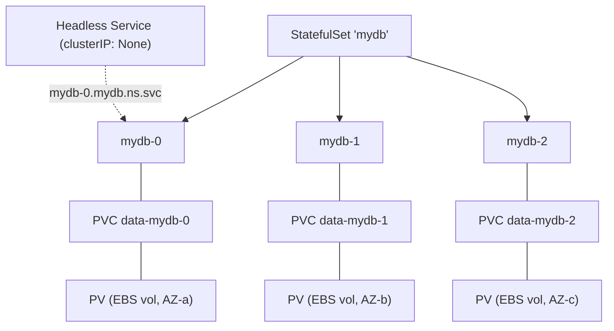
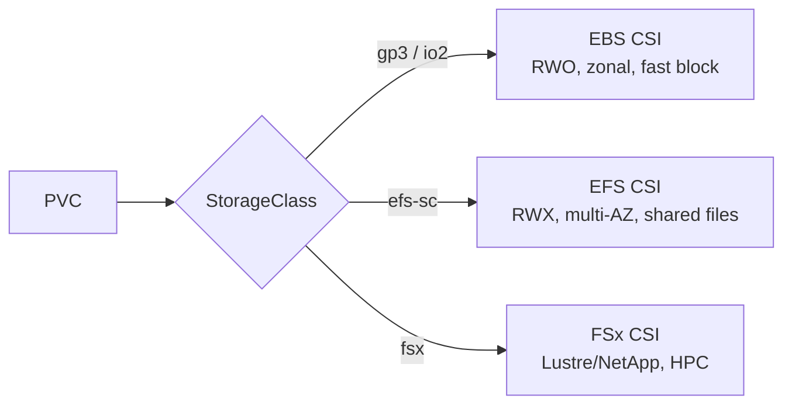

# StatefulSets & Storage - Guide

> Stateless is easy - kill it, replace it, nobody cares. Stateful is a diva: it cares about identity, ordering, storage, and sometimes which rack it woke up in. Kubernetes handles stateful workloads, but only if you understand the _contract_ it actually offers. Covers StatefulSet mechanics, PV/PVC/StorageClass, access modes, failover reality, and the classic traps - with **EBS/EFS CSI on AWS EKS**.

See also: [02 - StatefulSets & Storage Scenarios & SRE Ops](02%20-%20StatefulSets%20%26%20Storage%20Scenarios%20%26%20SRE%20Ops.md) · [01 - Services & Networking Guide](01%20-%20Services%20%26%20Networking%20Guide.md) · [01 - Workload Resilience Guide](01%20-%20Workload%20Resilience%20Guide.md) · [01 - Reliability Architectures Guide](01%20-%20Reliability%20Architectures%20Guide.md)

---

## Table of Contents

- [1. The Core Problem: Identity + Stable Storage](#1-the-core-problem-identity--stable-storage)
- [2. StatefulSet Guarantees (and Non-guarantees)](#2-statefulset-guarantees-and-non-guarantees)
- [3. Headless Service: Stable Discovery](#3-headless-service-stable-discovery)
- [4. PV, PVC, StorageClass](#4-pv-pvc-storageclass)
- [5. volumeClaimTemplates: Per-Pod Disks](#5-volumeclaimtemplates-per-pod-disks)
- [6. Reschedule Depends on Volume Type](#6-reschedule-depends-on-volume-type)
- [7. Access Modes: RWO vs RWX vs RWOP](#7-access-modes-rwo-vs-rwx-vs-rwop)
- [8. Ordering & Rollout Behavior](#8-ordering--rollout-behavior)
- [9. Failure Modes & "Stateful ≠ HA"](#9-failure-modes--stateful--ha)
- [10. Storage on EKS (EBS / EFS / FSx)](#10-storage-on-eks-ebs--efs--fsx)
- [11. Best Practices](#11-best-practices)

---

---

## 1. The Core Problem: Identity + Stable Storage

A Deployment gives you _N interchangeable replicas_ - perfect for web servers, terrible for databases. Stateful workloads need:

- **Stable identity** (replica 0 _is_ replica 0, not "some Pod").
- **Stable storage** that persists across restart/reschedule.
- Often **stable network identity** so peers find each other.
- Sometimes **ordered** startup/shutdown to avoid chaos.

That's exactly what a **StatefulSet** provides.

[⬆ Back to top](#table-of-contents)

---

## 2. StatefulSet Guarantees (and Non-guarantees)

**Guarantees:**

- Stable names: `mydb-0`, `mydb-1`, `mydb-2`.
- Stable DNS via a **Headless Service**: `mydb-0.mydb.default.svc.cluster.local`.
- Stable per-Pod storage via `volumeClaimTemplates`.
- Controlled, ordered rollout semantics.

**Does NOT magically give you:**

- Data correctness (your database's job).
- Correct leader election (your app's job).
- Multi-region DR (you still need backups/replication).

> Kubernetes provides the **platform primitives**; your app provides the **distributed-systems sanity**.

[⬆ Back to top](#table-of-contents)

---

## 3. Headless Service: Stable Discovery

StatefulSets pair with a **Headless Service** (`clusterIP: None`). Instead of a single virtual IP, DNS returns **Pod IPs directly**, enabling per-Pod addressing: `mydb-0` resolves to Pod 0, `mydb-1` to Pod 1. Clustered databases use this to build their peer lists. See [01 - Services & Networking Guide](01%20-%20Services%20%26%20Networking%20Guide.md).

[⬆ Back to top](#table-of-contents)

---

## 4. PV, PVC, StorageClass

| Object           | Means                                                                   |
| :--------------- | :---------------------------------------------------------------------- |
| **StorageClass** | _How_ to provision storage (type, params, reclaim policy, binding mode) |
| **PVC**          | _I want_ X GiB with these properties (the claim)                        |
| **PV**           | An _actual_ piece of storage backing a claim                            |

**Dynamic provisioning** (the norm): create a PVC → the CSI driver provisions a disk/share → a PV appears and binds. Key StorageClass knobs:

- **`reclaimPolicy`**: `Delete` (disk dies with PVC) vs `Retain` (disk survives - manual cleanup). _Misunderstanding this deletes data or leaks disks._
- **`volumeBindingMode: WaitForFirstConsumer`**: delays provisioning until a Pod is scheduled, so the volume lands in the **right AZ** (essential for zonal EBS).
- **`allowVolumeExpansion: true`**: lets you grow PVCs.

[⬆ Back to top](#table-of-contents)

---

## 5. volumeClaimTemplates: Per-Pod Disks

A StatefulSet's `volumeClaimTemplates` creates a PVC **per Pod**: `mydb-0` → `data-mydb-0`, `mydb-1` → `data-mydb-1`. Those PVC names stay tied to the Pod identity - the killer feature: if `mydb-1` is rescheduled, it **reattaches `data-mydb-1`** and continues. PVCs are _not_ deleted when you scale down (data is precious) unless you opt into `persistentVolumeClaimRetentionPolicy`.

[⬆ Back to top](#table-of-contents)

---

## 6. Reschedule Depends on Volume Type

Whether a stateful Pod can move freely depends on the backend:

| Pattern              | Mobility                                             | Examples                                       |
| :------------------- | :--------------------------------------------------- | :--------------------------------------------- |
| **Network-attached** | Portable - reattaches on another node                | EBS (same AZ), EFS (cross-AZ), NFS, Ceph       |
| **Local storage**    | Sticky - married to one node; node death = data loss | Local NVMe/SSD, local PV, hostPath (dangerous) |

> "Local PV + StatefulSet" is a deliberate trade-off: **performance vs mobility**. On EKS, **EBS is zonal** - a Pod with an EBS PVC can only reschedule onto a node in the **same AZ** as its volume.

[⬆ Back to top](#table-of-contents)

---

## 7. Access Modes: RWO vs RWX vs RWOP

| Mode                        | Meaning                           | Typical use                               |
| :-------------------------- | :-------------------------------- | :---------------------------------------- |
| **RWO** (ReadWriteOnce)     | RW by a single **node** at a time | Block volumes (EBS) - per-replica DB data |
| **ROX** (ReadOnlyMany)      | RO by many nodes                  | Shared read content                       |
| **RWX** (ReadWriteMany)     | RW by many nodes                  | File shares (EFS) - shared filesystems    |
| **RWOP** (ReadWriteOncePod) | RW by a single **Pod**            | Strict single-writer                      |

Most databases use **RWO per replica**. RWX (EFS) is great for shared files, not for DB data dirs. Trying to mount one RWO PVC from multiple Pods → blocked or mount failures.

[⬆ Back to top](#table-of-contents)

---

## 8. Ordering & Rollout Behavior

By default StatefulSets are **ordered**: create `-0` → `-1` → `-2`; delete in reverse; update one at a time. This matters for ZooKeeper/etcd/DB clusters where bootstrap order matters.

Update strategies:

- **RollingUpdate** - gradual, usually reverse-ordinal; supports `partition` for staged/canary rollouts.
- **OnDelete** - _you_ control exactly when each Pod updates (manual, safer for DBs).

> Safe DB approach: `OnDelete` or a cautious partitioned `RollingUpdate`, coordinated with the database's own upgrade procedure. `podManagementPolicy: Parallel` removes ordering for apps that don't need it (faster scale).

[⬆ Back to top](#table-of-contents)

---

## 9. Failure Modes & "Stateful ≠ HA"

When `mydb-1` on Node A dies with the node:

1. Node controller marks Node A `NotReady` after timeouts.
2. `mydb-1` becomes unavailable; eventually Kubernetes recreates it.

**What blocks recovery:**

- Volume can't detach from the dead node (cloud detach delays - common with EBS).
- Volume is **local** to the dead node (data gone).
- Scheduling constraints (EBS AZ pin, affinity, resources).
- Even when the Pod returns, **your DB must re-elect leaders / catch up replicas / replay logs** - Kubernetes doesn't understand your replication protocol.

> **A single-replica StatefulSet is still a single point of failure.** StatefulSet gives persistence + identity, _not_ HA. HA needs: multiple replicas, app-level replication, anti-affinity/topology spread, honest readiness, and **backups** (replication ≠ backup).

[⬆ Back to top](#table-of-contents)

---

## 10. Storage on EKS (EBS / EFS / FSx)

| Driver      | Type         | Access | AZ scope      | Use for                                   |
| :---------- | :----------- | :----- | :------------ | :---------------------------------------- |
| **EBS CSI** | Block        | RWO    | **Single AZ** | Databases, per-Pod data (gp3/io2)         |
| **EFS CSI** | NFS          | RWX    | **Multi-AZ**  | Shared files, cross-AZ reschedule freedom |
| **FSx CSI** | Lustre/ONTAP | RWX    | varies        | HPC/ML, high throughput                   |

- **EBS is zonal** → use `WaitForFirstConsumer` so the volume is created in the Pod's AZ, and spread replicas across AZs (each with its own EBS volume).
- **EFS sidesteps the AZ pin** (any node, any AZ can mount) at higher latency - handy for workloads needing reschedule flexibility, not for low-latency DB data.
- Install drivers as **EKS managed add-ons**; grant them **IRSA** permissions to manage volumes.
- **Snapshots** via `VolumeSnapshot` (EBS CSI) feed your backup story; use **AWS Backup** for policy-driven retention.

[⬆ Back to top](#table-of-contents)

---

## 11. Best Practices

- **Use networked storage (EBS/EFS CSI), not hostPath/local**, for anything you can't afford to lose. hostPath "works in dev, hurts in prod."
- **`WaitForFirstConsumer` + multi-AZ replica spread** so EBS volumes land correctly and an AZ loss doesn't take the quorum.
- **Run ≥3 replicas with app-level replication** for HA - and don't confuse replication with backup. Take **snapshots/backups** (VolumeSnapshot + AWS Backup).
- **Anti-affinity / topology spread** so replicas never share a node/AZ.
- **Readiness = "can serve queries,"** not "process alive" - prevents client errors during warmup and bad failover.
- **Coordinate StatefulSet upgrades with the DB** (`OnDelete` or partitioned rollouts); never blindly RollingUpdate a database.
- **Set `reclaimPolicy` deliberately** (`Retain` for precious data) and understand PVC retention on scale-down/delete.
- **Enable `allowVolumeExpansion`** so you can grow without migration.

[⬆ Back to top](#table-of-contents)

---

> Continue to [02 - StatefulSets & Storage Scenarios & SRE Ops](02%20-%20StatefulSets%20%26%20Storage%20Scenarios%20%26%20SRE%20Ops.md).
