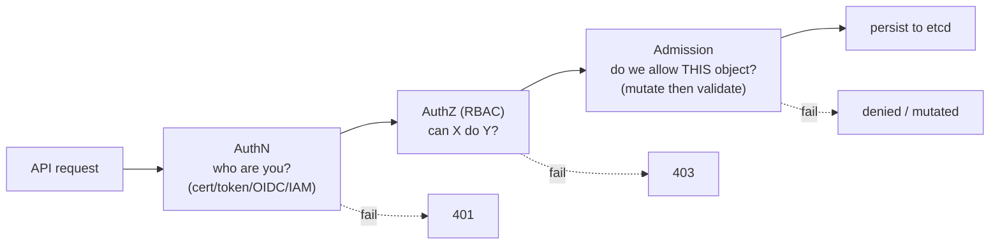

# Security & RBAC - Guide

> Kubernetes security boils down to one question: **"Who is allowed to ask the API server to do what?"** Because the API _is_ the control plane - anything that can talk to it with powerful credentials can rewrite reality. This guide builds the identity → permission → policy triangle (ServiceAccounts → RBAC → Admission), then secrets management and least-privilege patterns, mapped onto **AWS EKS** (IRSA, Pod Identity, KMS, IAM↔RBAC).

See also: [02 - Security & RBAC Scenarios & SRE Ops](02%20-%20Security%20%26%20RBAC%20Scenarios%20%26%20SRE%20Ops.md) · [01 - Multi-Tenancy Guide](01%20-%20Multi-Tenancy%20Guide.md) · [01 - Architecture Guide](01%20-%20Architecture%20Guide.md) · [01 - Observability Guide](01%20-%20Observability%20Guide.md)

---

## Table of Contents

- [1. The Security Triangle](#1-the-security-triangle)
- [2. Authentication (incl. EKS IAM)](#2-authentication-incl-eks-iam)
- [3. ServiceAccounts & Pod Credentials](#3-serviceaccounts--pod-credentials)
- [4. RBAC: Roles, Bindings, Verbs](#4-rbac-roles-bindings-verbs)
- [5. The #1 RBAC Footgun & Escalation Paths](#5-the-1-rbac-footgun--escalation-paths)
- [6. Admission Control](#6-admission-control)
- [7. Pod Security Standards](#7-pod-security-standards)
- [8. Secrets: What They Are and Aren't](#8-secrets-what-they-are-and-arent)
- [9. Workload Identity: IRSA & Pod Identity](#9-workload-identity-irsa--pod-identity)
- [10. EKS Security Specifics](#10-eks-security-specifics)
- [11. Best Practices](#11-best-practices)

---



---

## 1. The Security Triangle

| Stage                  | Question                                       | Mechanism                         |
| :--------------------- | :--------------------------------------------- | :-------------------------------- |
| **Identity (AuthN)**   | "Who are you?"                                 | Certs, tokens, OIDC; on EKS → IAM |
| **Permission (AuthZ)** | "Can X do Y?"                                  | **RBAC**                          |
| **Policy (Admission)** | "Even if allowed, do we permit _this_ object?" | Admission webhooks, PSA           |

> Internalize this triangle and Kubernetes security stops being mystical. RBAC answers _"are you allowed to ask?"_; admission answers _"do we permit this kind of request?"_.

[⬆ Back to top](#table-of-contents)

---

## 2. Authentication (incl. EKS IAM)

The apiserver identifies callers via: **client certs** (admins), **bearer tokens** (ServiceAccounts), **OIDC** (SSO), or **webhook** auth. Workloads inside the cluster authenticate as a **ServiceAccount**.

On **EKS**, human/role access uses **AWS IAM**:

- The `aws-iam-authenticator` flow maps an IAM principal to a Kubernetes identity.
- Modern EKS uses **access entries** (API-managed) instead of the legacy **`aws-auth` ConfigMap** to bind IAM roles/users to Kubernetes groups → RBAC.
- `kubectl` gets a token via `aws eks get-token`.

[⬆ Back to top](#table-of-contents)

---

## 3. ServiceAccounts & Pod Credentials

A **ServiceAccount (SA)** is a namespaced identity Pods use to call the API. Each namespace has a `default` SA; Pods that don't specify one use it.

Modern clusters use **Bound ServiceAccount Tokens**: short-lived, audience-bound, auto-rotated, mounted via a projected volume - far safer than the old long-lived secret tokens. But it's still a credential in the Pod.

> **Reality check:** if a Pod never calls the Kubernetes API, it shouldn't have a token at all. Set `automountServiceAccountToken: false`.

Knobs: `spec.serviceAccountName`, `automountServiceAccountToken: false`.

[⬆ Back to top](#table-of-contents)

---

## 4. RBAC: Roles, Bindings, Verbs

| Object                 | Scope                                                |
| :--------------------- | :--------------------------------------------------- |
| **Role**               | Permissions _within_ a namespace                     |
| **ClusterRole**        | Cluster-wide or reusable                             |
| **RoleBinding**        | Binds a Role/ClusterRole to a subject in a namespace |
| **ClusterRoleBinding** | Binds a ClusterRole cluster-wide                     |

**Subjects:** Users, Groups, ServiceAccounts. **Rules** = `apiGroups` (`""` core, `apps`, `batch`) × `resources` (pods, secrets, deployments) × `verbs` (`get`, `list`, `watch`, `create`, `update`, `patch`, `delete`).

> Note: `list` returns object _contents_, not just names - so `list secrets` reveals secret values. `watch` streams changes (controllers need it).

[⬆ Back to top](#table-of-contents)

---

## 5. The #1 RBAC Footgun & Escalation Paths

**`list`/`get secrets` is basically god mode** - secrets hold DB passwords, cloud creds, tokens. Classic escalation chains:

- **`create pods` + secrets** → mount any secret and exfiltrate.
- **`pods/exec`** → shell into a Pod that has secrets/creds → steal them.
- **`bind`/`escalate` on roles** → grant yourself more permissions.
- **`nodes/proxy`, `nodes`, privileged + hostPath** → host compromise (nuclear).

Lock down who can `create pods`, `pods/exec`, `pods/attach`, `portforward`, read secrets, and bind roles. Avoid wildcard `resources: *` / `verbs: *` - they silently grant power over _future_ resources.

[⬆ Back to top](#table-of-contents)

---

## 6. Admission Control

Even if RBAC says yes, admission can say no - or mutate first:

- **Mutating** webhooks change the object (inject sidecars, default labels, add tolerations).
- **Validating** webhooks accept/reject (deny privileged Pods, require labels, enforce image registries).

Built-ins: `NamespaceLifecycle`, `NodeRestriction`, `LimitRanger`, `ResourceQuota`. Policy engines: **Kyverno** (policy-as-YAML, mutate+validate), **OPA Gatekeeper** (ConstraintTemplates). This is where **org-wide rules** live: no privileged containers, must set requests, approved registries only, no hostPath, require non-root + read-only root FS.

[⬆ Back to top](#table-of-contents)

---

## 7. Pod Security Standards

**Pod Security Admission (PSA)** enforces three standards per namespace (via labels):

| Standard       | Allows                                                        |
| :------------- | :------------------------------------------------------------ |
| **privileged** | Anything (system namespaces only)                             |
| **baseline**   | Blocks the worst (no privileged, hostNetwork, etc.)           |
| **restricted** | Strict: non-root, no privilege escalation, drop caps, seccomp |

```yaml
# namespace label to enforce
pod-security.kubernetes.io/enforce: restricted
```

Combine with `securityContext`: `runAsNonRoot: true`, `readOnlyRootFilesystem: true`, `allowPrivilegeEscalation: false`, `capabilities.drop: ["ALL"]`, seccomp `RuntimeDefault`.

[⬆ Back to top](#table-of-contents)

---

## 8. Secrets: What They Are and Aren't

A Kubernetes **Secret** is just "a convenient API object for sensitive bytes" - **base64-encoded, not encrypted** by default. Base64 is encoding, not security. The real questions:

- Who can read secrets via the API? (RBAC)
- Are secrets **encrypted at rest** in etcd?
- How are they injected into Pods?
- Can you avoid static secrets entirely?

**Injection methods** (least-bad order): **CSI/external store mount** > **file volume** (can refresh, re-readable) > **env var** (leaks via dumps/logs/`describe`, needs restart to rotate).

**Encryption at rest** protects etcd data/backups - _not_ someone with API read or a compromised Pod where the secret is mounted. On EKS, enable **KMS envelope encryption** of secrets (a customer-managed KMS key encrypts the data-encryption keys).

[⬆ Back to top](#table-of-contents)

---

## 9. Workload Identity: IRSA & Pod Identity

Static cloud access keys in Secrets are one of the worst recurring problems. **Workload identity** gives Pods **short-lived, auto-rotated** cloud credentials scoped per ServiceAccount - no long-lived keys.

On **EKS**, two options:

|               | **IRSA** (IAM Roles for Service Accounts)   | **EKS Pod Identity** (newer)     |
| :------------ | :------------------------------------------ | :------------------------------- |
| Mechanism     | OIDC federation; SA annotated with role ARN | Agent + `PodIdentityAssociation` |
| Cross-account | Yes                                         | Simpler association model        |
| Setup         | Per-cluster OIDC provider                   | No OIDC provider per cluster     |

Both: **one IAM role per workload, least privilege, automatic rotation**. For _external_ secret stores, use the **Secrets Store CSI Driver** (mount from AWS Secrets Manager/Parameter Store, optionally don't sync to a k8s Secret) or the **External Secrets Operator** (syncs into k8s Secrets - RBAC still matters).

[⬆ Back to top](#table-of-contents)

---

## 10. EKS Security Specifics

- **IAM↔RBAC** via access entries / `aws-auth` - keep it as code, least privilege, no blanket `system:masters`.
- **KMS encryption** of secrets at rest (enable at/after cluster creation).
- **IRSA/Pod Identity** for all AWS access - never node instance-profile creds for app permissions; restrict the node role and block Pod access to **IMDS** (hop limit 1 / IMDSv2) so Pods can't steal the node role.
- **Private API endpoint** + security groups; **security groups for Pods** (VPC CNI) for fine-grained network identity.
- **Audit logging** → CloudWatch (control-plane logs), plus **GuardDuty EKS Protection** and **Amazon Inspector** for image/runtime findings.
- **ECR image scanning** + admission signature verification to stop poisoned images.

[⬆ Back to top](#table-of-contents)

---

## 11. Best Practices

- **One ServiceAccount per workload** (`api-sa`, `worker-sa`) - never reuse `default`; bind only exact permissions.
- **Prefer Roles over ClusterRoles**; namespace-scope everything you can.
- **No wildcard verbs/resources**; no `cluster-admin` for convenience.
- **`automountServiceAccountToken: false`** for Pods that don't call the API.
- **Guard `create pods`, `pods/exec`, secret reads, and role-binding verbs** - these are the escalation paths.
- **Enforce `restricted` PSA** for app namespaces; harden `securityContext`.
- **Encrypt secrets at rest (KMS)**; prefer external stores + CSI; rotate (plan restarts via PDB + rolling updates).
- **Use IRSA/Pod Identity**; block IMDS access from Pods; least-privilege IAM per workload.
- **Audit everything**: enable control-plane audit logs, alert on RBAC changes and `exec`/secret access.

[⬆ Back to top](#table-of-contents)

---

> Continue to [02 - Security & RBAC Scenarios & SRE Ops](02%20-%20Security%20%26%20RBAC%20Scenarios%20%26%20SRE%20Ops.md).
