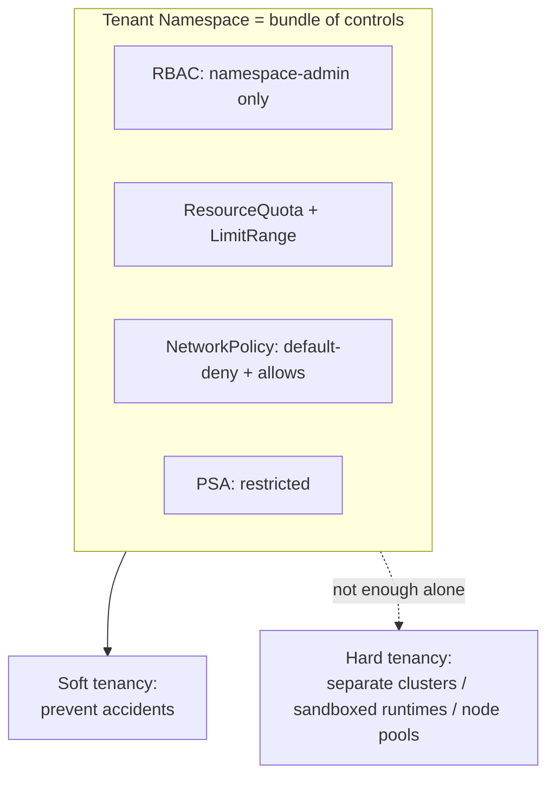
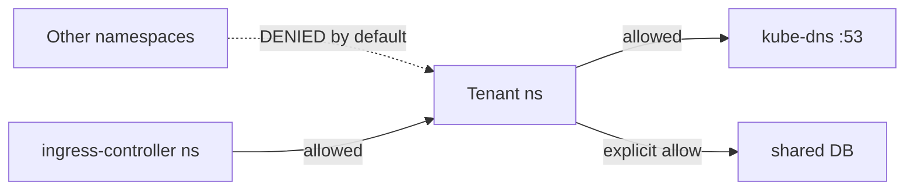
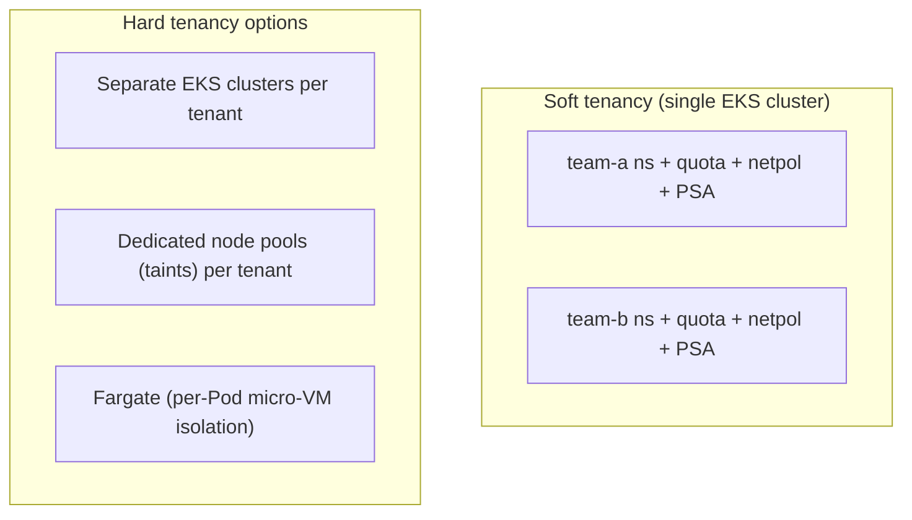

# Multi-Tenancy - Guide

> The blunt truth: **a namespace is not a security boundary by itself.** Multi-tenancy is a _bundle_ of controls, not a feature. The real question is whether you're running **soft** multi-tenancy (trusted-ish teams, prevent accidents) or **hard** multi-tenancy (mutually untrusting tenants, assume malice) - the second is much harder. Covers the four pillars, soft vs hard walls, audit/policy enforcement, and EKS patterns.

See also: [02 - Multi-Tenancy Scenarios & SRE Ops](02%20-%20Multi-Tenancy%20Scenarios%20%26%20SRE%20Ops.md) · [01 - Security & RBAC Guide](01%20-%20Security%20%26%20RBAC%20Guide.md) · [01 - Scheduling & Resources Guide](01%20-%20Scheduling%20%26%20Resources%20Guide.md) · [01 - Services & Networking Guide](01%20-%20Services%20%26%20Networking%20Guide.md)

---

## Table of Contents

- [1. What Namespaces Do and Don't Isolate](#1-what-namespaces-do-and-dont-isolate)
- [2. Soft vs Hard Multi-Tenancy](#2-soft-vs-hard-multi-tenancy)
- [3. Pillar A - RBAC Boundaries](#3-pillar-a---rbac-boundaries)
- [4. Pillar B - Resource Governance (Quota + LimitRange)](#4-pillar-b---resource-governance-quota--limitrange)
- [5. Pillar C - Network Isolation](#5-pillar-c---network-isolation)
- [6. Pillar D - Pod Security](#6-pillar-d---pod-security)
- [7. Audit Logs & Policy Engines](#7-audit-logs--policy-engines)
- [8. The Gotchas That Cause Outages](#8-the-gotchas-that-cause-outages)
- [9. EKS Multi-Tenancy Patterns](#9-eks-multi-tenancy-patterns)
- [10. Best Practices Checklist](#10-best-practices-checklist)

---



---

## 1. What Namespaces Do and Don't Isolate

| Namespaces **do** isolate       | Namespaces do **NOT** isolate                                      |
| :------------------------------ | :----------------------------------------------------------------- |
| Object names (`svc/foo` per ns) | Network traffic (without NetworkPolicy)                            |
| RBAC scope                      | Node CPU/memory (noisy neighbors)                                  |
| Quotas/limits                   | Cluster-scoped objects (CRDs, nodes, StorageClasses, ClusterRoles) |
| Policy scope (PSA labels)       | The kernel (shared → escape surface)                               |

> A namespace is a boundary **only if you enforce it** with the four pillars below.

[⬆ Back to top](#table-of-contents)

---

## 2. Soft vs Hard Multi-Tenancy

|             | **Soft** (most companies)                        | **Hard** (untrusted tenants)                                                                     |
| :---------- | :----------------------------------------------- | :----------------------------------------------------------------------------------------------- |
| Trust model | Teams not actively malicious                     | Assume malicious workloads                                                                       |
| Goal        | Prevent accidents, contain blast radius          | Prevent active escape/exfiltration                                                               |
| Controls    | Namespaces + RBAC + quotas + NetworkPolicy + PSA | + separate clusters, sandboxed runtimes (Kata), per-tenant node pools, mesh mTLS, heavy auditing |

> **Rule of thumb:** if you must assume malicious code, prefer **cluster separation** or **sandboxed runtimes** - Kubernetes on a shared Linux kernel is not a perfect hostile-tenant isolation system.

[⬆ Back to top](#table-of-contents)

---

## 3. Pillar A - RBAC Boundaries

- Teams **manage their own namespace** resources (Deployments, Services, ConfigMaps).
- Teams **cannot** create/modify cluster-scoped objects: `ClusterRole(Binding)`, `CRD`, `StorageClass`, `Node`, often `Namespace`.
- Teams **cannot** access `kube-system` or other tenants' namespaces.
- **Restrict powerful subresources**: `pods/exec`, `pods/attach`, `pods/portforward`, `secrets` (especially in prod - `exec` is shell access).
- Give **"admin within namespace"** (Role/RoleBinding), never `cluster-admin`. Separate deployer/viewer/operator roles.

> The fastest way to _end_ multi-tenancy is binding `cluster-admin` "for convenience." See [01 - Security & RBAC Guide](01%20-%20Security%20%26%20RBAC%20Guide.md).

[⬆ Back to top](#table-of-contents)

---

## 4. Pillar B - Resource Governance (Quota + LimitRange)

**ResourceQuota** caps a namespace's totals:

```yaml
apiVersion: v1
kind: ResourceQuota
metadata: { name: team-a-quota, namespace: team-a }
spec:
  hard:
    requests.cpu: "20"
    requests.memory: 40Gi
    limits.cpu: "40"
    pods: "100"
    services.loadbalancers: "2"
    requests.storage: 500Gi
```

**LimitRange** sets per-Pod/container defaults + min/max:

```yaml
apiVersion: v1
kind: LimitRange
metadata: { name: defaults, namespace: team-a }
spec:
  limits:
    - type: Container
      default: { cpu: 500m, memory: 512Mi }
      defaultRequest: { cpu: 100m, memory: 128Mi }
      max: { cpu: "4", memory: 8Gi }
```

This prevents one tenant from starving the cluster, kills BestEffort chaos (defaults enforce requests), and makes scheduling/HPA predictable. See [01 - Scheduling & Resources Guide](01%20-%20Scheduling%20%26%20Resources%20Guide.md).

[⬆ Back to top](#table-of-contents)

---

## 5. Pillar C - Network Isolation

Without enforced **NetworkPolicy**, assume **east-west is wide open** across namespaces. Baseline tenant model:

- **Default-deny** ingress + egress per namespace.
- Allow **egress to DNS** (CoreDNS, UDP/TCP 53).
- Allow **ingress from the ingress-controller** namespace only.
- Allow **explicit** egress to approved shared services (DB, metrics, logging).



This turns networking from an _accident_ into an explicit contract. Needs an enforcing CNI (VPC CNI policy agent or Cilium). See [01 - Services & Networking Guide](01%20-%20Services%20%26%20Networking%20Guide.md).

[⬆ Back to top](#table-of-contents)

---

## 6. Pillar D - Pod Security

Apply **Pod Security Admission** per namespace:

- Tenant namespaces → **`restricted`** (non-root, no privilege escalation, no hostPath/hostNetwork, drop caps).
- Shared/system namespaces → `baseline`, or `privileged` only where unavoidable.

This blocks the classic "tenant becomes node admin" escape hammers. Pair with admission policies (Kyverno/Gatekeeper) for org rules.

[⬆ Back to top](#table-of-contents)

---

## 7. Audit Logs & Policy Engines

**Audit logs** record every API event (who, what, from where, allowed/denied) - your forensic record and tripwire. Levels: **Metadata** (broad, safe), **Request** (body - selective for high-risk), **RequestResponse** (huge - rare). On EKS, enable the **audit** control-plane log type → CloudWatch.

**Alert on high-signal events:**

- New `ClusterRoleBinding`/`RoleBinding` granting high privilege.
- `pods/exec`/`attach`/`portforward` in prod.
- Secret reads (especially `list`).
- Privileged/hostPath/hostNetwork Pod creation.
- Admission _denials_ (someone tried something forbidden).
- Webhook config changes (policy tampering).

**Policy engines** enforce _how resources must look_ at admission: require requests/limits, non-root, deny `:latest`, approved registries only, signed images, NetworkPolicy-per-namespace. **Kyverno** (YAML-native, can mutate) and **Gatekeeper** (OPA/Rego, expressive). See [01 - Security & RBAC Guide](01%20-%20Security%20%26%20RBAC%20Guide.md) for supply-chain (signing/SBOM) gates.

[⬆ Back to top](#table-of-contents)

---

## 8. The Gotchas That Cause Outages

- **Shared labels** make PDBs/NetworkPolicies match more than intended → blocks unrelated workloads.
- **Default SA token automounted everywhere** → wider blast radius.
- **`exec` allowed in prod** → secret exfiltration is trivial.
- **No quotas** → one CI job spawns 500 Pods and melts a node pool.
- **No topology spread** → "isolated" tenants still share a node and fight for cache/IO.

[⬆ Back to top](#table-of-contents)

---

## 9. EKS Multi-Tenancy Patterns



- **Soft:** one cluster, namespace-per-team, the four pillars, **IRSA per workload** so tenants get only their own AWS permissions.
- **Hard:** **separate clusters per tenant** (cleanest), or **dedicated node pools** (taints/tolerations + affinity) so tenants don't share nodes, or **Fargate** (each Pod in its own micro-VM - strong kernel isolation), or sandboxed runtimes.
- **Cost/visibility:** tag/label per tenant; use **CloudWatch Container Insights** + cost allocation; quotas double as cost guardrails.
- Isolate **system components** (ingress, DNS, logging) into guarded namespaces / node groups.

[⬆ Back to top](#table-of-contents)

---

## 10. Best Practices Checklist

- **Namespace per team/env** (`team-a-dev`, `team-a-prod`).
- **Dedicated SA per workload**; disable token automount unless needed.
- **RBAC:** namespace-admin only; no `cluster-admin`; restrict `exec`/`attach`/`portforward`/secret reads.
- **ResourceQuota + LimitRange in every namespace** (no exceptions).
- **Default-deny NetworkPolicy + explicit allows** (keep an always-on allow-DNS).
- **PSA `restricted`** for tenant namespaces.
- **Separate system components** into guarded namespaces/node pools.
- **Audit logging on**; alert on RBAC changes and admission denials.
- **For untrusted tenants:** prefer separate clusters / sandboxed runtimes - don't pretend namespaces are a security wall.
- **IRSA per workload** so cloud permissions are tenant-scoped.

[⬆ Back to top](#table-of-contents)

---

> Continue to [02 - Multi-Tenancy Scenarios & SRE Ops](02%20-%20Multi-Tenancy%20Scenarios%20%26%20SRE%20Ops.md).
