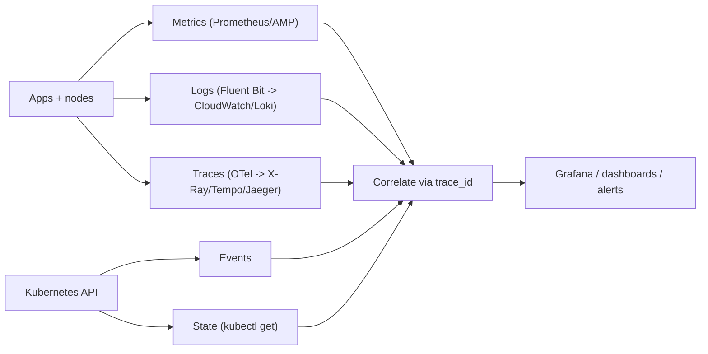
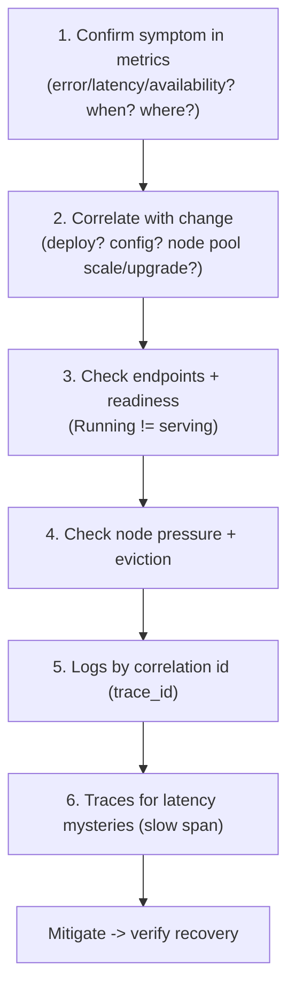
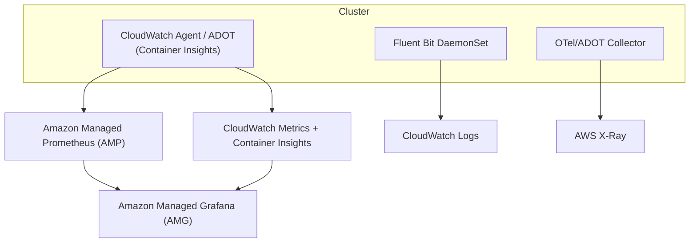

# Observability - Guide

> Observability in Kubernetes is "figure out what's happening in a distributed system where everything is ephemeral and lying by omission." The trick: combine five signals - **metrics, logs, traces, events, and resource state** - and wire them together with correlation IDs. Do it well and debugging becomes _boring_ (the highest compliment). Covers the signals, golden-signals/SLOs, a calm debugging playbook, k8s-specific gotchas, and the **AWS EKS** stack (Container Insights, AMP, AMG, OTel).

See also: [02 - Observability Scenarios & SRE Ops](02%20-%20Observability%20Scenarios%20%26%20SRE%20Ops.md) · [01 - Incident Response Guide](01%20-%20Incident%20Response%20Guide.md) · [01 - Scheduling & Resources Guide](01%20-%20Scheduling%20%26%20Resources%20Guide.md) · [01 - Control Plane Reliability Guide](01%20-%20Control%20Plane%20Reliability%20Guide.md)

---

## Table of Contents

- [1. The Five Signals](#1-the-five-signals)
- [2. Metrics: Vital Signs](#2-metrics-vital-signs)
- [3. Logs: Narrative with Context](#3-logs-narrative-with-context)
- [4. Traces: Request Passport Stamps](#4-traces-request-passport-stamps)
- [5. Events: The Platform's Diary](#5-events-the-platforms-diary)
- [6. State: Ground Truth Right Now](#6-state-ground-truth-right-now)
- [7. Golden Signals & SLOs](#7-golden-signals--slos)
- [8. The Calm Debugging Playbook](#8-the-calm-debugging-playbook)
- [9. k8s-specific Gotchas](#9-k8s-specific-gotchas)
- [10. Observability on EKS](#10-observability-on-eks)
- [11. Best Practices](#11-best-practices)

---



---

## 1. The Five Signals

| Signal      | Answers                                | Source                      |
| :---------- | :------------------------------------- | :-------------------------- |
| **Metrics** | "Is it getting worse, when, where?"    | Prometheus / metrics-server |
| **Logs**    | "What exactly failed and why?"         | stdout/stderr → log agent   |
| **Traces**  | "Where did time go across services?"   | OpenTelemetry               |
| **Events**  | "What did Kubernetes _try_ to do?"     | apiserver events            |
| **State**   | "What does the API say is true _now_?" | `kubectl get`               |

> Wire `trace_id` into logs and traces, ship events to your log backend, and a single click takes you from "error spike" → "the exact request path" → "the exact log lines."

[⬆ Back to top](#table-of-contents)

---

## 2. Metrics: Vital Signs

Layers: **node** (CPU/mem/disk/network/pressure), **pod/container** (usage, throttling, restarts), **k8s objects** (desired vs available replicas, HPA status), **application** (RPS, latency, error rate, queue depth).

**Watch first (high signal):**

- _Service:_ request rate, error rate (5xx/exceptions), latency p50/p95/p99, saturation (CPU throttling, mem, queue depth).
- _Platform:_ MemoryPressure/DiskPressure counts, pod restart rate, CPU throttling, etcd/apiserver latency.

```bash
kubectl top nodes
kubectl top pods -A
```

[⬆ Back to top](#table-of-contents)

---

## 3. Logs: Narrative with Context

Container logs are stdout/stderr; a logging stack collects them via a **DaemonSet agent** (Fluent Bit/Vector) and ships to storage/search (CloudWatch Logs, Loki, OpenSearch).

**The #1 logging rule:** emit **structured** logs with `timestamp`, `request_id`/`trace_id`, service+version, and ns/pod/node metadata (often auto-injected). Then logs correlate to metrics and traces.

`kubectl logs` is for **triage**, not long-term strategy - once a Pod is gone, centralized logs are the only memory:

```bash
kubectl logs <pod> --tail=200
kubectl logs <pod> -c <container> --tail=200
kubectl logs <pod> --previous --tail=200   # after a restart - find the real cause
```

[⬆ Back to top](#table-of-contents)

---

## 4. Traces: Request Passport Stamps

A trace shows a request's path - `ingress → service A → service B → DB → cache` - each hop a **span** with timing. Traces reveal whether you're CPU-bound, IO-bound, lock-contended, or waiting on a dependency - debugging microservice latency with logs alone costs years of your life.

Typical setup: **OpenTelemetry SDK** in apps → **OTel Collector** in-cluster → backend (X-Ray/Tempo/Jaeger). The one correlation that turns chaos into sense: same `trace_id` in logs _and_ traces.

[⬆ Back to top](#table-of-contents)

---

## 5. Events: The Platform's Diary

Events answer "what did Kubernetes try to do?" - invaluable for scheduling failures (Insufficient CPU/taints), image pull errors, mount/attach errors, probe failures, eviction reasons, rollout issues.

```bash
kubectl get events --sort-by=.lastTimestamp
kubectl describe pod|node|deploy <name>
```

Events are **ephemeral** (rotated away) - serious setups ship them to a log backend (e.g., `kube-events-exporter`).

[⬆ Back to top](#table-of-contents)

---

## 6. State: Ground Truth Right Now

The API's view of desired vs observed - are endpoints present? Pods ready? HPA scaling? Nodes pressured? Rollout stalled?

```bash
kubectl get deploy,rs,pods -o wide
kubectl get svc,ep,endpointslices -o wide
kubectl get hpa ; kubectl describe hpa <name>
kubectl describe deploy <name>
```

[⬆ Back to top](#table-of-contents)

---

## 7. Golden Signals & SLOs

The classic **golden signals**: **Latency, Traffic, Errors, Saturation**. Turn them into **SLOs**:

- "99.9% of requests < 300ms"
- "<0.1% 5xx"

Then **alert on SLO burn rate**, not on "CPU is 80%." CPU alerts are usually noise unless tied to saturation/throttling. Burn-rate alerting (fast burn → page; slow burn → ticket) catches real user impact without crying wolf.

[⬆ Back to top](#table-of-contents)

---

## 8. The Calm Debugging Playbook



> Most outages are **change-related** - step 2 catches the majority. "Pods Running but service down" is almost always **endpoints/readiness** (step 3). See [01 - Request Lifecycle Guide](01%20-%20Request%20Lifecycle%20Guide.md).

[⬆ Back to top](#table-of-contents)

---

## 9. k8s-specific Gotchas

- **CPU throttling** doesn't look like failure until probes/timeouts start → cascading endpoint loss. See [01 - Scheduling & Resources Guide](01%20-%20Scheduling%20%26%20Resources%20Guide.md).
- **Pod restarts hide root cause** unless you check `--previous` logs + events.
- **Without tracing, "who is slow?" becomes politics.**
- **NetworkPolicy drops** look like "random timeouts" without flow logs (Cilium/Hubble or VPC Flow Logs help).
- **Ingress hides client IP** unless forwarded headers are logged.

[⬆ Back to top](#table-of-contents)

---

## 10. Observability on EKS



| Need                                   | EKS option                                                                              |
| :------------------------------------- | :-------------------------------------------------------------------------------------- |
| Cluster/pod metrics + dashboards       | **CloudWatch Container Insights**                                                       |
| Prometheus-compatible metrics (PromQL) | **Amazon Managed Service for Prometheus (AMP)**                                         |
| Dashboards across sources              | **Amazon Managed Grafana (AMG)**                                                        |
| Logs                                   | **Fluent Bit → CloudWatch Logs** (set retention!)                                       |
| Traces                                 | **AWS X-Ray** / **ADOT** (AWS Distro for OpenTelemetry)                                 |
| Control-plane visibility               | Enable EKS **control-plane logs** (api/audit/authenticator/controllerManager/scheduler) |

- **ADOT** (AWS Distro for OpenTelemetry) is the AWS-supported collector for metrics+traces.
- Set **log retention** on CloudWatch log groups - default never-expire is a cost trap.
- **Control-plane logs** are off by default - enable `audit` at minimum for security/forensics.

[⬆ Back to top](#table-of-contents)

---

## 11. Best Practices

- **Instrument the four golden signals per service; alert on SLO burn rate**, not raw CPU.
- **Structured logs with `trace_id`** everywhere; correlate logs↔traces↔metrics.
- **Always check `--previous` logs + events** for restart/crash root cause.
- **Ship events to a backend** - they're ephemeral and the platform's only diary.
- **Enable EKS control-plane logs** (esp. audit) and **set CloudWatch retention**.
- **Use Container Insights + AMP + AMG** for a managed stack; ADOT for OTel.
- **Every incident leaves behind** a new dashboard, alert, or runbook improvement.
- **Track GPU/queue/latency metrics** for specialized workloads (see [01 - LLM Inference Guide](01%20-%20LLM%20Inference%20Guide.md)).

[⬆ Back to top](#table-of-contents)

---

> Continue to [02 - Observability Scenarios & SRE Ops](02%20-%20Observability%20Scenarios%20%26%20SRE%20Ops.md).
