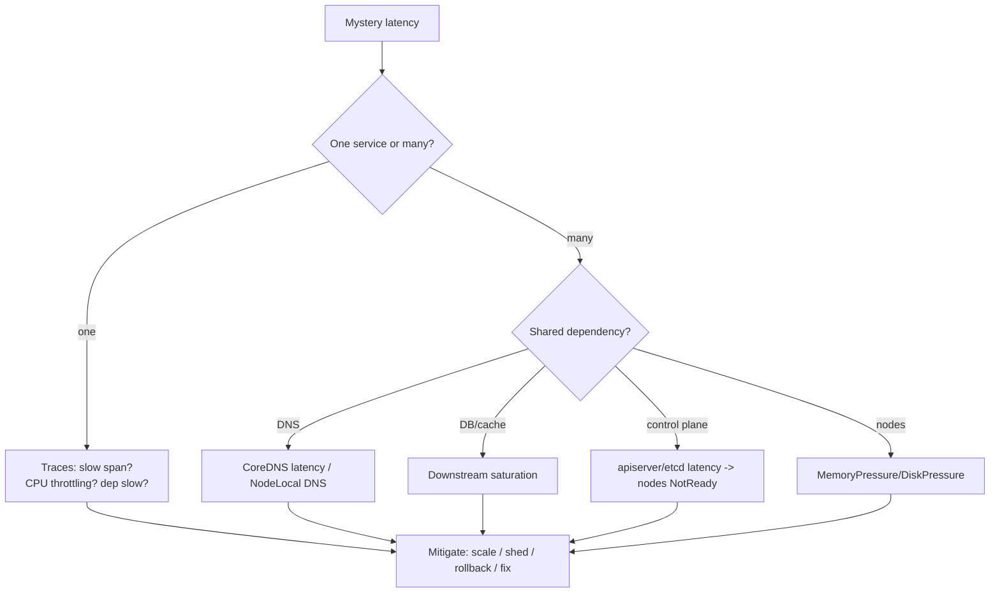

# Observability - Scenarios & SRE Ops

> Building signal that actually catches outages, and triaging mystery latency. Frequently tested concepts, CKA/CKAD tasks, interview questions, EKS production scenarios, and runbooks. Pair with [01 - Observability Guide](01%20-%20Observability%20Guide.md).

See also: [01 - Observability Guide](01%20-%20Observability%20Guide.md) · [02 - Incident Response Scenarios & SRE Ops](02%20-%20Incident%20Response%20Scenarios%20%26%20SRE%20Ops.md) · [02 - Control Plane Reliability Scenarios & SRE Ops](02%20-%20Control%20Plane%20Reliability%20Scenarios%20%26%20SRE%20Ops.md)

---

## Table of Contents

- [1. Frequently Tested Concepts](#1-frequently-tested-concepts)
- [2. Keywords → Signal](#2-keywords--signal)
- [3. CKA/CKAD Practical Tasks](#3-ckackad-practical-tasks)
- [4. Interview Questions](#4-interview-questions)
- [5. EKS Production Scenarios](#5-eks-production-scenarios)
- [6. "Everything Is Slow" Triage](#6-everything-is-slow-triage)
- [7. Runbooks](#7-runbooks)
- [8. One-Line Recap](#8-one-line-recap)

---

## 1. Frequently Tested Concepts

- **Five signals:** metrics, logs, traces, events, state.
- **Golden signals:** latency, traffic, errors, saturation → **SLOs** → **burn-rate alerts**.
- **`kubectl logs --previous`** for crash root cause.
- **Events are ephemeral** → ship them.
- **trace_id correlation** ties everything together.
- EKS: **Container Insights / AMP / AMG / X-Ray / ADOT**; enable control-plane logs; set log retention.

[⬆ Back to top](#table-of-contents)

---

## 2. Keywords → Signal

| Phrase                            | Reach for                   |
| :-------------------------------- | :-------------------------- |
| "is it getting worse / when?"     | Metrics                     |
| "what exactly failed?"            | Logs (`--previous`)         |
| "where did the time go?"          | Traces (slow span)          |
| "what did k8s try to do?"         | Events                      |
| "is it actually serving?"         | State (endpoints/readiness) |
| "alert on CPU 80%" (anti-pattern) | Use SLO burn rate instead   |
| "random timeouts, pods healthy"   | NetworkPolicy drops / DNS   |

[⬆ Back to top](#table-of-contents)

---

## 3. CKA/CKAD Practical Tasks

**T1 - Triage a crashing Pod:**

```bash
kubectl get pods -o wide
kubectl describe pod <pod> | sed -n '/Events/,$p'
kubectl logs <pod> --previous --tail=200
```

**T2 - Cluster-wide event sweep:**

```bash
kubectl get events -A --sort-by=.lastTimestamp | tail -40
```

**T3 - Resource usage hot spots:**

```bash
kubectl top nodes
kubectl top pods -A --sort-by=cpu
kubectl top pods -A --sort-by=memory
```

**T4 - Confirm serving truth:**

```bash
kubectl get endpointslices -l kubernetes.io/service-name=<svc> -o wide
kubectl get hpa,deploy,rs -o wide
```

[⬆ Back to top](#table-of-contents)

---

## 4. Interview Questions

**Q1: What are the four golden signals and how do you alert on them?**

> Latency, traffic, errors, saturation. Encode as SLOs and alert on **burn rate** (fast burn → page, slow burn → ticket) rather than raw resource thresholds.

**Q2: A Pod restarted and you don't know why. What do you do?**

> `kubectl describe pod` (events + Last State/reason) and `kubectl logs --previous` to read the dead container's output. The live logs won't show the crash cause.

**Q3: Why ship Kubernetes events somewhere?**

> They're ephemeral and rotated away - they're the platform's record of scheduling/mount/probe/eviction decisions. Without shipping them, post-incident forensics is impossible.

**Q4: How do you debug latency across microservices?**

> Distributed tracing with a shared `trace_id`; find the slow span, then jump to correlated logs. Logs/metrics alone can't attribute cross-service latency.

**Q5: Why are CPU-threshold alerts considered noise?**

> High CPU isn't user-visible harm by itself; saturation/throttling and SLO breaches are. Alert on what hurts users (latency/errors), not on a resource being busy.

**Q6: On EKS, where do control-plane logs go and why enable them?**

> CloudWatch Logs (api/audit/authenticator/controllerManager/scheduler), off by default. Enable audit for security forensics and throttling/latency investigation.

[⬆ Back to top](#table-of-contents)

---

## 5. EKS Production Scenarios

### Medium

**M1 - CloudWatch Logs bill keeps growing.**

> Log groups default to never-expire. Set retention per group; ship only what you need; sample debug logs. (Same trap as the AWS CloudWatch note.)

**M2 - No pod metrics in dashboards / `kubectl top` fails.**

> metrics-server / Container Insights agent not installed/healthy. Install the add-on; verify the agent DaemonSet is running.

**M3 - Can't find why a Pod was OOMKilled after it restarted.**

> Use `--previous` logs + `describe` Last State (exit 137). Add memory metrics + alerts. See [01 - Scheduling & Resources Guide](01%20-%20Scheduling%20%26%20Resources%20Guide.md).

**M4 - Team wants PromQL but you're on CloudWatch metrics.**

> Send metrics to **AMP** (Prometheus-compatible) and visualize in **AMG**; keep Container Insights for AWS-native views.

### Hard

**H1 - Intermittent "random timeouts," pods all Ready, no app errors.**

> Likely NetworkPolicy drops or DNS. Enable flow visibility (Cilium/Hubble or VPC Flow Logs), check CoreDNS latency, and test from a debug pod. Correlate with any recent policy change.

**H2 - A latency regression appears but no deploy happened.**

> Correlate with node pool scale/upgrade, dependency latency (traces), CPU throttling, or noisy neighbors. Traces localize the slow span; check `container_cpu_cfs_throttled` and node pressure.

**H3 - Alert fatigue: on-call is paged constantly, misses the real outage.**

> CPU/threshold alerts everywhere. Replace with SLO burn-rate alerts, composite/dedup, and route low-urgency to tickets. Page only on user-facing SLO breach.

**H4 - Post-incident, you can't reconstruct who/what changed RBAC.**

> Control-plane audit logs weren't enabled. Turn on EKS audit logging → CloudWatch; alert on RBAC changes and admission denials. See [01 - Security & RBAC Guide](01%20-%20Security%20%26%20RBAC%20Guide.md).

**H5 - High-cardinality custom metrics blow up Prometheus/AMP cost and query latency.**

> Per-request/per-user labels exploded series. Drop high-cardinality labels, aggregate, use exemplars/traces for per-request detail instead of metrics.

[⬆ Back to top](#table-of-contents)

---

## 6. "Everything Is Slow" Triage



Fast checks: `kubectl top pods/nodes`, p95 latency + error graphs, trace breakdown, CoreDNS metrics, node pressure, control-plane latency. See [01 - Incident Response Guide](01%20-%20Incident%20Response%20Guide.md).

[⬆ Back to top](#table-of-contents)

---

## 7. Runbooks

### Runbook: stand up minimum viable observability on EKS

1. Metrics: Container Insights + (optional) AMP for PromQL.
2. Logs: Fluent Bit → CloudWatch Logs **with retention set**.
3. Traces: ADOT/OTel Collector → X-Ray (or Tempo/Jaeger).
4. Dashboards: AMG with golden-signal panels per service.
5. Alerts: SLO burn-rate (fast + slow) → SNS/PagerDuty.
6. Enable EKS control-plane logs (audit at minimum).

### Runbook: triage mystery latency

1. Confirm scope in metrics (one service vs many; when it started).
2. Correlate with change (deploy/config/node pool).
3. Endpoints + readiness OK? Node pressure? Throttling?
4. Trace a slow request → identify the slow span/dependency.
5. Mitigate (scale stateless tier, shed load, rollback); verify recovery.
6. Capture evidence; add a dashboard/alert so it's caught faster next time.

[⬆ Back to top](#table-of-contents)

---

## 8. One-Line Recap

> **Five signals (metrics/logs/traces/events/state) correlated by trace_id. Alert on SLO burn rate, not CPU. `--previous` logs for crashes; ship ephemeral events. On EKS: Container Insights + AMP + AMG + X-Ray/ADOT, enable control-plane audit logs, and set CloudWatch retention. Most outages are change-related; "Running but down" is endpoints/readiness.**

[⬆ Back to top](#table-of-contents)

---

> Continue to [01 - Control Plane Reliability Guide](01%20-%20Control%20Plane%20Reliability%20Guide.md).
