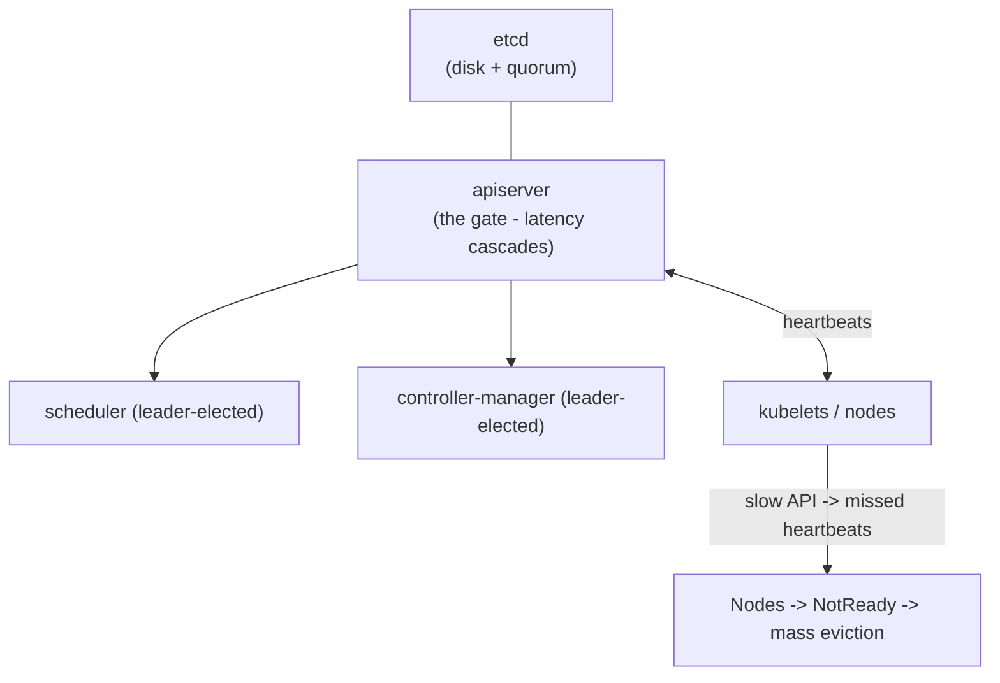
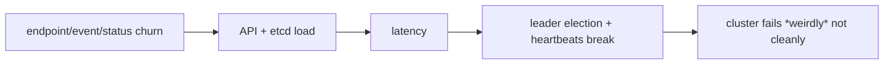
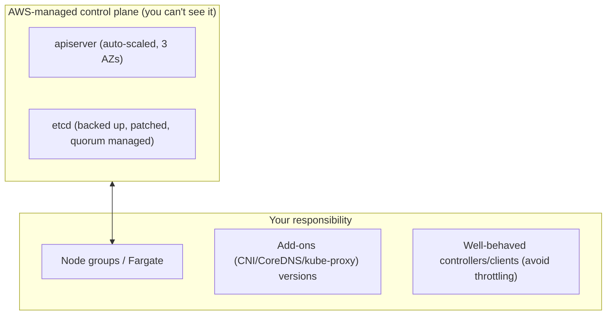

# Control Plane Reliability - Guide

> Control-plane reliability is the difference between "my workloads are down" and "I can't even _tell_ what my workloads are doing." A sick control plane makes Kubernetes a very confident **amnesiac**. Covers etcd, the apiserver, leader election, the node-heartbeat cascade, large-cluster scalability (watch storms, APF, churn), upgrades, backups/DR - and what changes when **AWS EKS** runs the control plane for you.

See also: [02 - Control Plane Reliability Scenarios & SRE Ops](02%20-%20Control%20Plane%20Reliability%20Scenarios%20%26%20SRE%20Ops.md) · [01 - Architecture Guide](01%20-%20Architecture%20Guide.md) · [01 - Multi-Cluster Guide](01%20-%20Multi-Cluster%20Guide.md) · [01 - Incident Response Guide](01%20-%20Incident%20Response%20Guide.md)

---

## Table of Contents

- [1. etcd: Storage + Consensus](#1-etcd-storage--consensus)
- [2. kube-apiserver: The Shared Bottleneck](#2-kube-apiserver-the-shared-bottleneck)
- [3. Controller Manager & Scheduler: Leader Election](#3-controller-manager--scheduler-leader-election)
- [4. The Node-Heartbeat Cascade](#4-the-node-heartbeat-cascade)
- [5. Large-Cluster Scalability](#5-large-cluster-scalability)
- [6. Upgrades: Changing the Plane While Flying](#6-upgrades-changing-the-plane-while-flying)
- [7. Backups & Disaster Recovery](#7-backups--disaster-recovery)
- [8. What Changes on EKS](#8-what-changes-on-eks)
- [9. Red Flags to Alert On](#9-red-flags-to-alert-on)
- [10. Best Practices](#10-best-practices)

---

---

## 1. etcd: Storage + Consensus

The distributed key-value store holding **all** cluster state. Every object lives here; the apiserver reads/writes it constantly.

- **Quorum required:** 3 members tolerate 1 loss (2/3); 5 tolerate 2 (3/5). Odd numbers for fault tolerance.
- **Extremely disk-sensitive** - etcd needs low-latency fsync; slow disks = slow everything.

**Failure modes:** disk latency/saturation, member-down → quorum loss (cluster effectively read-only/unavailable), oversized/too-chatty writes, neglected compaction/defrag (storage bloat).

**Pain looks like:** API requests slow/time out, controllers fall behind, `kubectl` "sticky"/hangs, can't create/update objects.

> **Mental model:** if etcd is unhealthy, Kubernetes is amnesiac - running Pods keep running, but no decisions can be made.

[⬆ Back to top](#table-of-contents)

---

## 2. kube-apiserver: The Shared Bottleneck

The gate: authN/authZ/admission, validates+stores objects, serves **watch** streams. It's only as fast as etcd, and **its latency cascades everywhere**.

**Failure modes:** watch storms / too many LISTs, **expensive admission webhooks** (slow webhook → slow every write), slow etcd, CPU/mem saturation, **large objects** (giant CRDs, huge annotations/ConfigMaps).

**Pain looks like:** `kubectl` slow/fails, controllers can't reconcile, **node heartbeats fail → nodes NotReady** (secondary cascade), autoscalers lag.

[⬆ Back to top](#table-of-contents)

---

## 3. Controller Manager & Scheduler: Leader Election

Both run multiple replicas for HA but only **one active leader** at a time, holding a **Lease** object. If the leader can't renew (e.g., flaky apiserver), a standby takes over.

**Failure modes:** flaky apiserver → leader-election **flapping** → reconciliation pauses, scheduling jitter. Signs: bursts of "leader changed" logs, scheduling-latency spikes, controllers lagging. Stable apiserver performance keeps leases renewing smoothly.

[⬆ Back to top](#table-of-contents)

---

## 4. The Node-Heartbeat Cascade

Nodes report status via kubelet → apiserver. If the apiserver is slow/unreachable:

1. Nodes stop posting heartbeats.
2. Node controller marks them `NotReady`.
3. Pods get evicted/rescheduled - **mass disruption**.

> The nasty emergent behavior: **control-plane trouble looks like a node outage** and triggers cascading recovery. Treat apiserver latency as an _availability_ risk, not "just slowness."

[⬆ Back to top](#table-of-contents)

---

## 5. Large-Cluster Scalability

Big clusters melt from **churn** on the API + etcd, not CPU:

- **LIST/WATCH model** is the nervous system: efficient when well-behaved, a disaster with watch storms (too many watchers, tight LIST loops, aggressive resync, large payloads, frequent endpoint updates).
- **EndpointSlices** shard endpoints to reduce churn, but a Service selecting thousands of flapping Pods still floods writes.
- **etcd write pressure** from event spam (CrashLoop storms), endpoint updates, over-frequent status writes, rapid pod create/destroy.
- **APF (API Priority and Fairness):** classifies requests into priority levels, queues + rate-limits fairly so one noisy client can't starve others - a key multi-tenant control-plane protection. Give system components higher priority; keep interactive `kubectl` usable.
- **CRD bloat / operator overload:** huge status blobs updated often, operators reconciling too aggressively, slow webhooks on every write.
- **Controller backpressure:** when reconciliation can't keep up - rollouts slow, autoscaling lags, workqueue depth grows.

> **Big-cluster mantra:** preventing weird failure = preventing churn + protecting the API (APF, lean CRDs, stable readiness, fast HA webhooks).

[⬆ Back to top](#table-of-contents)

---

## 6. Upgrades: Changing the Plane While Flying

**Version skew rule:** control plane must be ≥ kubelets (within the supported window); don't jump multiple minors at once.

**Safe choreography:**

1. Upgrade the **control plane** first (managed providers handle this).
2. Upgrade **critical add-ons** (CNI, CoreDNS, CSI) to compatible versions.
3. **Roll node pools gradually** - cordon + drain, respect PDBs, watch error budgets.
4. **Verify:** scheduling, DNS, service routing, storage attach/mount.

**Common breakers:** CNI incompatibility (pods can't network), CoreDNS misconfig (discovery breaks), CSI issues (volumes won't mount), **too-strict PDBs (drains stall → upgrade never finishes)**. See [01 - Workload Resilience Guide](01%20-%20Workload%20Resilience%20Guide.md).

[⬆ Back to top](#table-of-contents)

---

## 7. Backups & Disaster Recovery

| Backup type         | Restores                                            | Doesn't restore                         |
| :------------------ | :-------------------------------------------------- | :-------------------------------------- |
| **etcd snapshot**   | All k8s objects (Deployments, Secrets, RBAC…)       | External cloud resources; volume _data_ |
| **App data backup** | Volume contents (CSI/cloud snapshots), DB dumps/WAL | (its own scope)                         |

etcd restore is "restore a _cluster_," not a namespace - heavy. App data needs **app-consistent** backups (crash-consistent disk snapshots aren't always logically consistent).

**DR tiers:** (1) etcd snapshots + restore runbook → (2) + volume snapshot automation → (3) multi-cluster failover, DNS/global-LB failover, replicated data. Higher tiers = distributed-systems engineering, not just Kubernetes. See [01 - Multi-Cluster Guide](01%20-%20Multi-Cluster%20Guide.md).

[⬆ Back to top](#table-of-contents)

---

## 8. What Changes on EKS

- **AWS owns etcd + apiserver**: HA across 3 AZs, auto-scaled, patched, **etcd backed up automatically**. No etcd ops, no apiserver flags.
- **You still cause control-plane problems**: watch storms, hot-looping controllers, expensive webhooks, huge objects → **API throttling (429)**. APF still applies; identify offenders via **control-plane audit logs** in CloudWatch.
- **Upgrades**: `aws eks update-cluster-version` (control plane) → managed add-ons → node groups. AWS enforces skew.
- **DR**: etcd is AWS's problem; _your_ DR focus is **app data** (EBS snapshots/AWS Backup), GitOps for cluster re-creation, and multi-cluster/region strategy. A cluster-recreate-from-Git is often cleaner than etcd restore on EKS.
- **Monitoring**: enable control-plane logs; watch the EKS apiserver request/latency CloudWatch metrics and AWS Health.

[⬆ Back to top](#table-of-contents)

---

## 9. Red Flags to Alert On

- apiserver **p99 latency** spikes; rising **429s**/5xx.
- etcd **fsync/disk latency** high (self-managed).
- controller **workqueue depth/backlog** growing.
- **scheduler** scheduling-latency spikes.
- **leader election flapping** ("leader changed" bursts).
- **cluster-wide NotReady** patterns (heartbeat cascade).
- **admission webhook** timeouts/errors.

[⬆ Back to top](#table-of-contents)

---

## 10. Best Practices

- **Prefer a managed control plane (EKS)** - let AWS own etcd quorum, backups, and apiserver scaling.
- **Treat apiserver latency as an availability risk** - it cascades into node NotReady and mass eviction.
- **Protect the API:** APF flow controls, well-behaved controllers (watches+informers, backoff), no tight LIST loops.
- **Keep admission webhooks fast, HA, and with sane timeouts/failurePolicy** - a slow webhook stalls every write.
- **Avoid churn:** stable readiness (no flapping endpoints), fix CrashLoops (event spam), lean CRD status, shard huge Services.
- **Upgrade in order** (control plane → add-ons → nodes), respect PDBs, verify DNS/routing/storage each step.
- **DR by tier:** automate app-data snapshots (AWS Backup), GitOps to rebuild clusters, test failover with game days.
- **Alert on control-plane red flags**, not just workload metrics.

[⬆ Back to top](#table-of-contents)

---

> Continue to [02 - Control Plane Reliability Scenarios & SRE Ops](02%20-%20Control%20Plane%20Reliability%20Scenarios%20%26%20SRE%20Ops.md).
