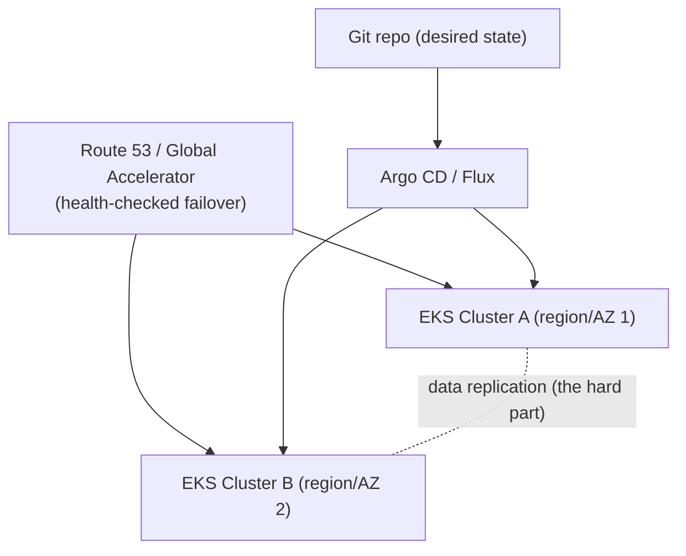
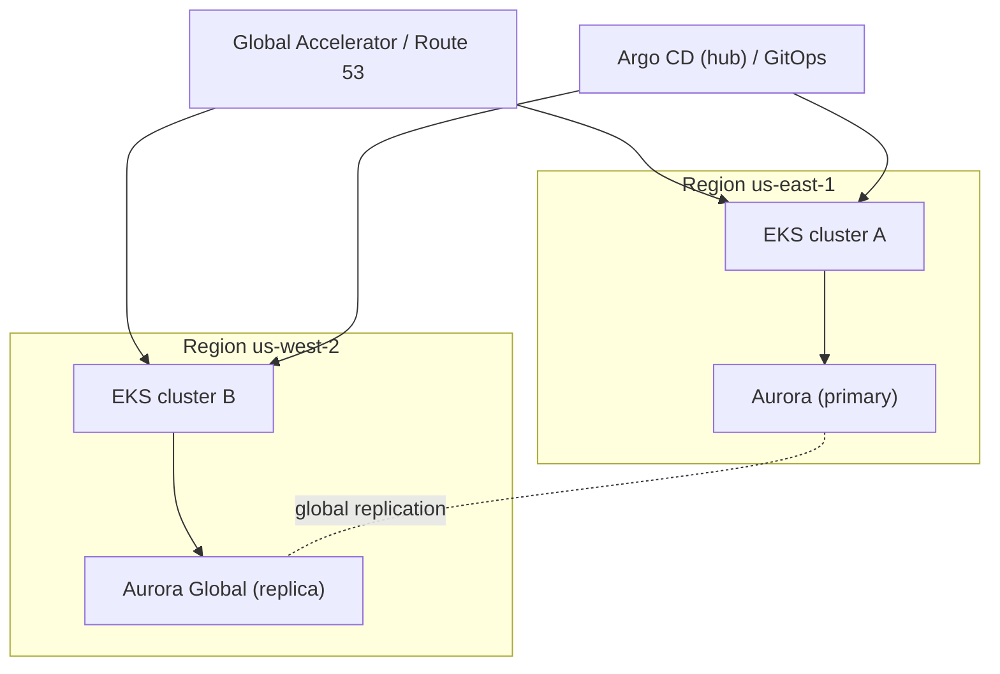

# Multi-Cluster - Guide

> Multi-cluster is what you reach for when a single cluster is too big a blast radius, you need regional redundancy, or you want safer upgrades (canary a _whole_ cluster). But it isn't one thing - it's a **menu of patterns**, each with trade-offs, and the real bottleneck is almost always **data and state**, not the app layer. Covers the patterns, GitOps, cross-cluster traffic, the data problem, and DR testing - on **AWS EKS**.

See also: [02 - Multi-Cluster Scenarios & SRE Ops](02%20-%20Multi-Cluster%20Scenarios%20%26%20SRE%20Ops.md) · [01 - Control Plane Reliability Guide](01%20-%20Control%20Plane%20Reliability%20Guide.md) · [01 - Reliability Architectures Guide](01%20-%20Reliability%20Architectures%20Guide.md) · [01 - Incident Response Guide](01%20-%20Incident%20Response%20Guide.md)

---

## Table of Contents

- [1. Why Multi-Cluster At All?](#1-why-multi-cluster-at-all)
- [2. Pattern A - Cluster per Environment/Team](#2-pattern-a---cluster-per-environmentteam)
- [3. Pattern B - Active/Passive DR](#3-pattern-b---activepassive-dr)
- [4. Pattern C - Active/Active](#4-pattern-c---activeactive)
- [5. Pattern D - Cluster-as-a-Unit Canary](#5-pattern-d---cluster-as-a-unit-canary)
- [6. GitOps: Keeping Clusters Consistent](#6-gitops-keeping-clusters-consistent)
- [7. Cross-Cluster Traffic Management](#7-cross-cluster-traffic-management)
- [8. The Real Bottleneck: Data & State](#8-the-real-bottleneck-data--state)
- [9. Testing DR (RTO/RPO, Game Days)](#9-testing-dr-rtorpo-game-days)
- [10. On AWS EKS](#10-on-aws-eks)
- [11. Best Practices](#11-best-practices)

---

---

## 1. Why Multi-Cluster At All?

| Goal              | Why                                   |
| :---------------- | :------------------------------------ |
| **Resilience**    | Survive cluster/region failure        |
| **Isolation**     | Separate tenants / critical workloads |
| **Latency**       | Place workloads near users            |
| **Compliance**    | Data residency                        |
| **Change safety** | Upgrade one cluster first             |

> If you don't have a clear goal, multi-cluster just becomes "more stuff that breaks." Every cluster doubles operational surface.

[⬆ Back to top](#table-of-contents)

---

## 2. Pattern A - Cluster per Environment/Team

dev / staging / prod (sometimes per-team) clusters. **Most common, simplest.**

- **Pros:** clean isolation, easy RBAC/policy boundaries, reduced blast radius.
- **Cons:** duplicated ops overhead; must keep configs consistent (**GitOps** is the cure).

[⬆ Back to top](#table-of-contents)

---

## 3. Pattern B - Active/Passive DR

Primary serves traffic; standby (warm/hot) is ready but idle. **Failover:** detect outage (SLO burn) → shift traffic (DNS failover - simple but TTL-slow; or global LB - faster) → promote data replication (DB failover) → verify + scale.

- **Pros:** simpler than active/active; fewer consistency headaches.
- **Cons:** failover automation + testing essential; standby must stay in sync (configs, secrets, images, policies).
- **Key:** if the **DB isn't replicated/failable, your multi-cluster story is theater.**

[⬆ Back to top](#table-of-contents)

---

## 4. Pattern C - Active/Active (hard mode)

Both clusters serve prod simultaneously.

- **Pros:** best availability/latency; maintenance without downtime (in theory).
- **Cons:** **data consistency is the boss fight** - global traffic management + multi-region data strategy; split-brain, partial outages, inconsistent caches.
- **Good fit:** stateless services, read-heavy with replicated read stores, eventually-consistent designs. **Bad fit:** single-primary DBs without robust replication/consensus.

[⬆ Back to top](#table-of-contents)

---

## 5. Pattern D - Cluster-as-a-Unit Canary

Two prod-like clusters: A stable, B gets the new version first. Route a small % to B → validate → expand → then upgrade A.

- **Pros:** drastically reduces upgrade risk; clusters become **rollback units**.
- **Cons:** cost (duplicate capacity), traffic-steering complexity.

[⬆ Back to top](#table-of-contents)

---

## 6. GitOps: Keeping Clusters Consistent

The least-painful way to manage many clusters: **Git repo = desired state**, a controller (**Argo CD / Flux**) continuously reconciles each cluster to match.

- **Benefits:** repeatability, auditability (PR history), drift detection, consistent policy.
- **Structure:** one **platform** repo (CNI, CoreDNS, ingress, policies) + one **apps** repo, with **overlays per cluster/region/env** (Kustomize/Helm values).
- **Secrets in GitOps:** never commit raw secrets - use **External Secrets Operator** / sealed secrets / external store references (AWS Secrets Manager). See [01 - Security & RBAC Guide](01%20-%20Security%20%26%20RBAC%20Guide.md).

[⬆ Back to top](#table-of-contents)

---

## 7. Cross-Cluster Traffic Management

Kubernetes has **no native multi-cluster Service** - you steer at the edge:

| Mechanism                                         | Trade-off                                 |
| :------------------------------------------------ | :---------------------------------------- |
| **DNS + health checks** (Route 53)                | Simple; slower (TTL/caching)              |
| **Global load balancer** (AWS Global Accelerator) | Faster failover, more features            |
| **Anycast**                                       | Advanced                                  |
| **Service mesh multi-cluster** (Istio/Linkerd)    | Rich routing/mTLS; extra complexity layer |

Keep clusters **independent**; do steering at DNS/LB/mesh, not by pretending two clusters are one.

[⬆ Back to top](#table-of-contents)

---

## 8. The Real Bottleneck: Data & State

Multi-cluster failover is mostly a **data problem**:

- Can the database fail over safely?
- Are writes safe in both places?
- Is there split-brain protection?
- Can you meet **RPO/RTO** targets?

> If your data layer isn't designed for it, app-layer redundancy won't help. This is why **managed regional/global databases** (Aurora Global, DynamoDB Global Tables) often carry the multi-region story, not Kubernetes.

[⬆ Back to top](#table-of-contents)

---

## 9. Testing DR (RTO/RPO, Game Days)

> The only DR plan that works is the one you **test**.

- **Runbooks as code**; periodic **game days** (simulate region failure).
- Measure **RTO** (time to restore service) and **RPO** (data-loss window).
- Test all three failure classes: **control plane**, **data plane**, **dependencies** (DNS, registry, secrets store).

[⬆ Back to top](#table-of-contents)

---

## 10. On AWS EKS

- **Single cluster is already multi-AZ** (control plane + node groups across 3 AZs) - that handles AZ failure without multi-cluster. Multi-cluster is for **region** failure, isolation, or upgrade canaries.
- **Traffic:** Route 53 health-checked failover or **Global Accelerator**; per-region ALBs.
- **Data:** **Aurora Global Database**, **DynamoDB Global Tables**, cross-region S3 replication - let managed services own multi-region consistency.
- **Config:** GitOps (Argo CD/Flux) with per-cluster overlays; **EKS Blueprints/Terraform** to stamp identical clusters.
- **Secrets:** replicate via Secrets Manager multi-region + ESO; **ECR cross-region replication** so images exist in both regions.
- **Fleet management:** consider **EKS + GitOps hub**, or ACK/Crossplane for cross-cluster resource management.

[⬆ Back to top](#table-of-contents)

---

## 11. Best Practices

- **Have a clear reason** before going multi-cluster - otherwise it's net negative reliability.
- **Use single-cluster multi-AZ** for AZ resilience; reserve multi-cluster for region failure / isolation / upgrade canaries.
- **GitOps everything** (Argo CD/Flux) with platform+apps repos and per-cluster overlays - drift across clusters is the silent killer.
- **Solve the data layer first** with managed global databases; app redundancy without data failover is theater.
- **Steer traffic at the edge** (Route 53 / Global Accelerator); don't fake a multi-cluster Service.
- **Replicate the boring stuff**: secrets (Secrets Manager + ESO), images (ECR replication), configs (Git).
- **Test DR with game days**; measure and meet RTO/RPO; rehearse failover and rollback.
- **Make clusters rollback units** for risky upgrades (cluster-as-a-unit canary).

[⬆ Back to top](#table-of-contents)

---

> Continue to [02 - Multi-Cluster Scenarios & SRE Ops](02%20-%20Multi-Cluster%20Scenarios%20%26%20SRE%20Ops.md).
