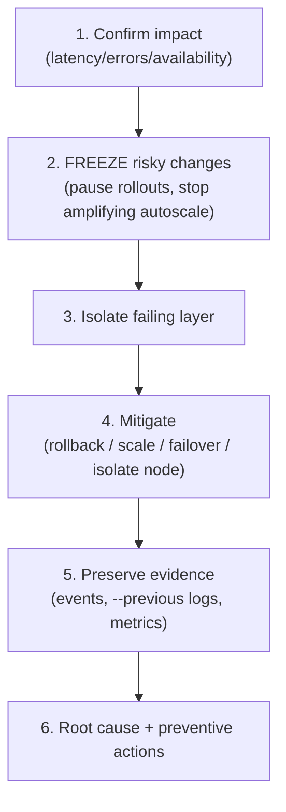
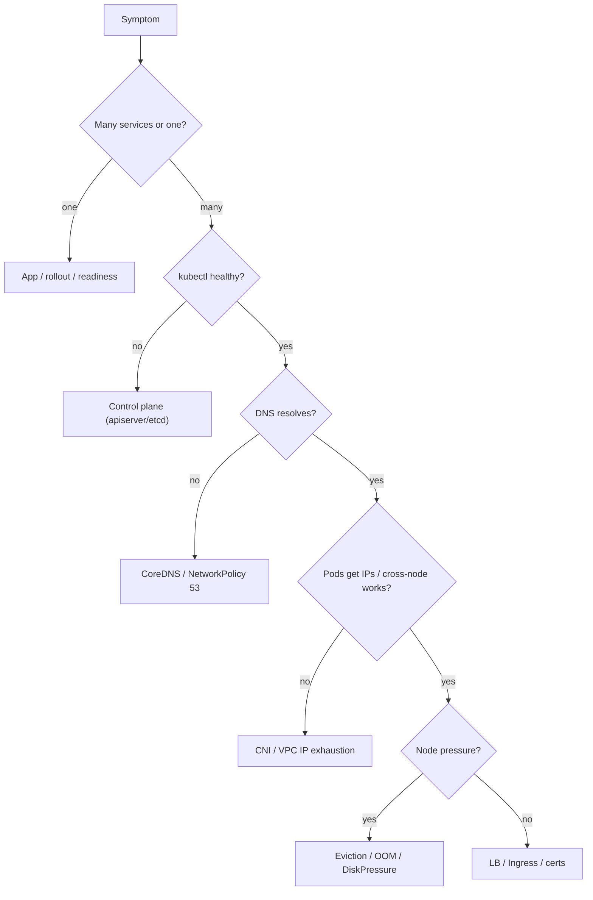

# Incident Response - Guide

> What to do when Kubernetes is on fire - **without becoming fire**. The point is _not_ "random kubectl until it works." It's: **confirm symptom → freeze risky changes → isolate the failing layer → mitigate → preserve evidence → root-cause.** This guide is the methodology + a library of battle-tested playbooks for the ugly incidents you'll actually meet, on **AWS EKS**.

See also: [02 - Incident Response Scenarios & SRE Ops](02%20-%20Incident%20Response%20Scenarios%20%26%20SRE%20Ops.md) · [01 - Observability Guide](01%20-%20Observability%20Guide.md) · [01 - Control Plane Reliability Guide](01%20-%20Control%20Plane%20Reliability%20Guide.md) · [01 - Workload Resilience Guide](01%20-%20Workload%20Resilience%20Guide.md)

---

## Table of Contents

- [1. The Global Incident Algorithm](#1-the-global-incident-algorithm)
- [2. Layer Isolation: Where Is It Broken?](#2-layer-isolation-where-is-it-broken)
- [3. Playbook A - Bad Rollout](#3-playbook-a---bad-rollout)
- [4. Playbook B - CrashLoop / OOM Storm](#4-playbook-b---crashloop--oom-storm)
- [5. Playbook C - DNS Meltdown](#5-playbook-c---dns-meltdown)
- [6. Playbook D - CNI / Network Failure](#6-playbook-d---cni--network-failure)
- [7. Playbook E - Control Plane / API Slowness](#7-playbook-e---control-plane--api-slowness)
- [8. Playbook F - Image Pull & Volume Failures](#8-playbook-f---image-pull--volume-failures)
- [9. Playbook G - NetworkPolicy / Ingress / Certs](#9-playbook-g---networkpolicy--ingress--certs)
- [10. Playbook H - Stuck Terminating & Mystery Latency](#10-playbook-h---stuck-terminating--mystery-latency)
- [11. The After-Action](#11-the-after-action)
- [12. Best Practices](#12-best-practices)

---



---

## 1. The Global Incident Algorithm

Use it **every time**:

1. **Confirm impact** - what's broken: latency, errors, or availability?
2. **Freeze risky changes** - pause rollouts; stop autoscaling if it's amplifying.
3. **Identify the failing layer** - app / service routing / node pressure / CNI/DNS / control plane.
4. **Mitigate** - rollback, scale, fail over, isolate bad nodes. _Stop the bleeding before root-causing._
5. **Preserve evidence** - events, `--previous` logs, metric snapshots.
6. **After stabilization** - root cause + preventive actions.

> **First rule of firefighting:** reduce blast radius and protect user impact _first_. Diagnosis can wait until the bleeding stops.

[⬆ Back to top](#table-of-contents)

---

## 2. Layer Isolation: Where Is It Broken?



[⬆ Back to top](#table-of-contents)

---

## 3. Playbook A - Bad Rollout

**Most common outage cause.** Symptoms: errors spike right after deploy; new pods crash/not ready; endpoints shrink.

```bash
kubectl rollout status deploy/<name>
kubectl describe deploy/<name>; kubectl get rs; kubectl get pods -l app=<app>
kubectl rollout undo deploy/<name>     # stop the bleeding
kubectl get endpointslices -l kubernetes.io/service-name=<svc> -o wide   # verify recovery
```

Capture `--previous` logs, events, the image/config diff. Root causes: wrong config/secret, readiness too optimistic/pessimistic, missing deps, DB migration mismatch.

[⬆ Back to top](#table-of-contents)

---

## 4. Playbook B - CrashLoop / OOM Storm

Symptoms: restart counts climbing, `OOMKilled`, node memory pressure.

```bash
kubectl describe pod <pod>; kubectl logs <pod> --previous --tail=200
kubectl describe node <node>; kubectl get pods -A | grep Evicted
```

If OOMKilled: raise memory limit (if safe), scale out (stateless), roll back if change-triggered. If widespread: stop autoscalers thrashing (cap HPA max / pause rollout). See [01 - Scheduling & Resources Guide](01%20-%20Scheduling%20%26%20Resources%20Guide.md).

[⬆ Back to top](#table-of-contents)

---

## 5. Playbook C - DNS Meltdown

Symptoms: services can't resolve each other, random timeouts, "no such host."

```bash
kubectl run tmp --rm -it --image=busybox -- sh   # nslookup kubernetes.default; nslookup <svc>.<ns>.svc
kubectl -n kube-system get pods -l k8s-app=kube-dns
kubectl -n kube-system logs -l k8s-app=kube-dns --tail=200
```

Mitigations: scale CoreDNS, deploy **NodeLocal DNSCache**, fix upstream forwarding, check NetworkPolicy isn't blocking UDP/TCP 53, reduce DNS query storms (`ndots`, aggressive retries).

[⬆ Back to top](#table-of-contents)

---

## 6. Playbook D - CNI / Network Failure

Symptoms: pods can't talk cross-node; new pods stuck `ContainerCreating` (CNI setup fails); routing broken.

```bash
kubectl describe pod <pod>     # look for CNI errors / "failed to assign IP"
kubectl get pods -A | grep -E "aws-node|calico|cilium"
kubectl -n kube-system logs -l k8s-app=aws-node --tail=200
```

Mitigations: on EKS, `failed to assign an IP` = **VPC CNI exhaustion** → prefix delegation / secondary CIDRs; restart CNI pods on affected nodes (careful); cordon/drain worst nodes; roll back a CNI upgrade if it coincides. See [01 - Services & Networking Guide](01%20-%20Services%20%26%20Networking%20Guide.md).

[⬆ Back to top](#table-of-contents)

---

## 7. Playbook E - Control Plane / API Slowness

Symptoms: `kubectl` hangs, nodes flip NotReady, controllers lag, create/update timeouts.

- Confirm widespread control-plane symptoms vs app-only.
- **Reduce load:** stop runaway controllers/jobs, pause large deployments, avoid bulk `kubectl get all -A` during the incident.
- On EKS: check **control-plane logs** + apiserver CloudWatch metrics + **429s**/APF rejections + AWS Health.
- Slow **admission webhooks** stall writes → fix availability/timeouts. See [01 - Control Plane Reliability Guide](01%20-%20Control%20Plane%20Reliability%20Guide.md).

[⬆ Back to top](#table-of-contents)

---

## 8. Playbook F - Image Pull & Volume Failures

**ErrImagePull / ImagePullBackOff:**

```bash
kubectl describe pod <pod>    # auth? tag not found? rate limit? TLS?
```

Fixes: roll back to known-good digest, fix `imagePullSecrets`/ECR perms, **pin digests** in prod, mirror/cache if rate-limited.

**Volume mount/attach (`FailedMount`, `Multi-Attach`):**

```bash
kubectl describe pod <pod>; kubectl describe pvc <pvc>; kubectl get volumeattachment
```

Fixes: detach stuck EBS volume from a dead node, check CSI controller/node pods, fix StorageClass/PVC, ensure no RWO multi-mount. See [01 - StatefulSets & Storage Guide](01%20-%20StatefulSets%20%26%20Storage%20Guide.md).

[⬆ Back to top](#table-of-contents)

---

## 9. Playbook G - NetworkPolicy / Ingress / Certs

**NetworkPolicy self-DDoS:** services time out but pods Ready; DNS fails in some namespaces. → temporarily apply an allow policy for critical paths (DNS, ingress→app, app→db), roll back the offending policy. Root cause: default-deny without required allows (esp. DNS egress).

**Ingress outage:** 404 (rule/host/path mismatch), 502/503 (backend no endpoints/readiness), TLS errors (cert/SNI/renewal). Check `kubectl describe ingress`, controller logs, endpoints, and the backing **ALB target group health**.

**Cert expiry (slow-motion disaster):** sudden TLS failures at a specific time → renew/reissue, fix cert-manager/ACM, **add expiry alerts well before deadline**.

[⬆ Back to top](#table-of-contents)

---

## 10. Playbook H - Stuck Terminating & Mystery Latency

**Stuck Terminating (finalizers):** pod/namespace sits in Terminating forever; drains never finish.

```bash
kubectl get ns <ns> -o json | grep -i finalizer
```

Fix the controller responsible for removing the finalizer (best); removing finalizers manually is a dangerous last resort (can leak resources). Root causes: operator/webhook down, external cleanup failing.

**"Everything is slow" (high ambiguity):** is it one service or many? CPU throttling? DB/cache slow? DNS slow? node pressure? control plane lagging? Use `kubectl top`, p95 latency + error graphs, trace the slow span. Mitigate: scale stateless tiers, shed load/rate-limit, roll back recent change, raise CPU limits if throttling. See [01 - Observability Guide](01%20-%20Observability%20Guide.md).

[⬆ Back to top](#table-of-contents)

---

## 11. The After-Action

Don't skip the post-mortem:

- What was the **trigger**?
- What were the **earliest signals**?
- Which **mitigations worked fastest**?
- What **guardrail** would have prevented it? (better canary, stricter admission, SLO burn alerts, safer rollout settings, requests/limits hygiene, DR runbook improvements)

> Blameless post-mortems. Every incident should leave behind a new **dashboard, alert, or runbook**.

[⬆ Back to top](#table-of-contents)

---

## 12. Best Practices

- **Freeze first, diagnose second** - pause rollouts and amplifying autoscalers before deep investigation.
- **Most outages are change-related** - correlate with the latest deploy/config/node change immediately.
- **Mitigate via rollback/scale/failover** before root-causing; protect users over curiosity.
- **Preserve evidence** (`--previous` logs, events, metric snapshots) before deleting pods/nodes.
- **Pre-write runbooks** for the common incidents (A–H) and rehearse via **game days**.
- **Build prevention into the platform**: SLO burn alerts, safe rollout defaults, default-deny-with-DNS-allow, requests/limits, PDBs, digest pinning, cert-expiry alerts.
- **Blameless after-action** that ships a concrete guardrail.

[⬆ Back to top](#table-of-contents)

---

> Continue to [02 - Incident Response Scenarios & SRE Ops](02%20-%20Incident%20Response%20Scenarios%20%26%20SRE%20Ops.md).
