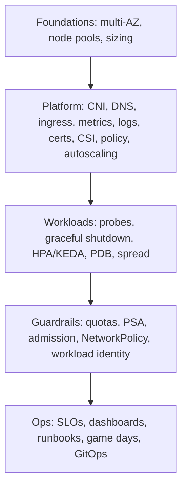
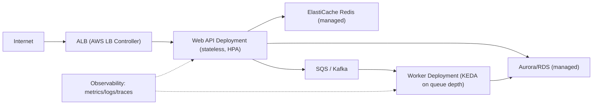

# Reliability Architectures - Guide

> Gluing every previous topic into a blueprint you can run in anger. Reliability in Kubernetes isn't one feature - it's a stack of **small, boring decisions** that prevent exciting failures. This guide gives the layered blueprint (foundations → platform → workloads → guardrails → ops) and a **concrete reference architecture for Web + Workers** with real YAML, all on **AWS EKS**.

See also: [02 - Reliability Architectures Scenarios & SRE Ops](02%20-%20Reliability%20Architectures%20Scenarios%20%26%20SRE%20Ops.md) · [01 - Workload Resilience Guide](01%20-%20Workload%20Resilience%20Guide.md) · [01 - Autoscaling Guide](01%20-%20Autoscaling%20Guide.md) · [01 - Multi-Cluster Guide](01%20-%20Multi-Cluster%20Guide.md) · [01 - LLM Inference Guide](01%20-%20LLM%20Inference%20Guide.md)

---

## Table of Contents

- [1. The Blueprint in Layers](#1-the-blueprint-in-layers)
- [2. Cluster Foundations: Failure Domains & Node Pools](#2-cluster-foundations-failure-domains--node-pools)
- [3. Platform Services You Must Not Forget](#3-platform-services-you-must-not-forget)
- [4. Namespace Strategy](#4-namespace-strategy)
- [5. Workload Patterns](#5-workload-patterns)
- [6. Reference Architecture: Web + Workers](#6-reference-architecture-web--workers)
- [7. Web API: Deployment + Service + PDB + HPA](#7-web-api-deployment--service--pdb--hpa)
- [8. Workers: KEDA + PDB](#8-workers-keda--pdb)
- [9. Governance: Quota, LimitRange, NetworkPolicy, Secrets](#9-governance-quota-limitrange-networkpolicy-secrets)
- [10. The Deadlock List (Interaction Warnings)](#10-the-deadlock-list-interaction-warnings)
- [11. Best Practices / Gold Standard](#11-best-practices--gold-standard)

---



---

## 1. The Blueprint in Layers

Reliability = disciplined choices at five layers: **foundations** (solid ground), **platform services** (cluster utilities), **workload patterns** (apps behaving well), **safety guardrails** (security/governance that also prevents outages), and **ops muscle memory** (SLOs, runbooks, game days). Nothing exotic - just disciplined.

[⬆ Back to top](#table-of-contents)

---

## 2. Cluster Foundations: Failure Domains & Node Pools

- **Failure domains:** multiple nodes across **multiple AZs**; spread critical workloads with `topologySpreadConstraints` + pod anti-affinity. Goal: a node/AZ failure reduces _capacity_, not _availability_.
- **Node pools by purpose:**
  - **system** - DNS, ingress, metrics, logging, controllers.
  - **apps** - application workloads.
  - **batch** - jobs/CI (often spot).
  - **stateful** (optional) - predictable IO, or just enforce storage policy.
  - This prevents "a batch job melted DNS."
- **Sizing:** too-small nodes → fragmentation (pods don't fit); too-large → bigger blast radius per node failure. A moderate size usually wins. On EKS, **Karpenter** picks right-sized instances per pending pods. See [01 - Autoscaling Guide](01%20-%20Autoscaling%20Guide.md).

[⬆ Back to top](#table-of-contents)

---

## 3. Platform Services You Must Not Forget

The utilities your workloads silently depend on - flaky here means _everything feels haunted_:

| Service                  | Notes                                   |
| :----------------------- | :-------------------------------------- |
| **CNI** (VPC CNI/Cilium) | With NetworkPolicy support              |
| **CoreDNS**              | Multiple replicas + NodeLocal DNSCache  |
| **Ingress/Gateway**      | HA AWS LB Controller (ALB)              |
| **Metrics**              | metrics-server + AMP/Container Insights |
| **Logging**              | Fluent Bit DaemonSet → CloudWatch/Loki  |
| **Certs**                | cert-manager / ACM                      |
| **Storage**              | EBS/EFS CSI + StorageClasses            |
| **Policy**               | PSA + Kyverno/Gatekeeper                |
| **Autoscaling**          | HPA + Karpenter (+ KEDA)                |

> Run these on dedicated **system** nodes, or at least protect them with a high **PriorityClass** + PDBs.

[⬆ Back to top](#table-of-contents)

---

## 4. Namespace Strategy

Your first blast-radius tool: `platform-system`, `ingress`, `observability`, `security`, `team-a-dev`, `team-a-prod`… Per-namespace quotas stop runaway teams; per-namespace policies stop privilege creep; incident isolation becomes "_this_ namespace is melting, not the cluster." See [01 - Multi-Tenancy Guide](01%20-%20Multi-Tenancy%20Guide.md).

[⬆ Back to top](#table-of-contents)

---

## 5. Workload Patterns

**Stateless** (Deployments): readiness that reflects "can serve," liveness only if you can detect "wedged," startup for slow boots, graceful shutdown (SIGTERM + `terminationGracePeriodSeconds` + `preStop`), HPA (RPS/queue > CPU), PDB (`maxUnavailable: 1`), topology spread.

**Stateful:** prefer **managed databases** (RDS/Aurora) - less to operate. If you must self-host: StatefulSet + per-replica PVC, headless Service, cautious update strategy, anti-affinity + zone spread, **real backup/restore** (not "we have replicas"). See [01 - StatefulSets & Storage Guide](01%20-%20StatefulSets%20%26%20Storage%20Guide.md).

[⬆ Back to top](#table-of-contents)

---

## 6. Reference Architecture: Web + Workers



**Components:** Ingress/ALB → stateless **Web API** → managed **DB** (RDS/Aurora) + managed **Redis** (ElastiCache) + **queue** (SQS/Kafka) → **Workers** (scale on queue depth). Observability + policies + autoscaling throughout.

**Node pools:** system / apps (web+workers) / optional stateful.

[⬆ Back to top](#table-of-contents)

---

## 7. Web API: Deployment + Service + PDB + HPA

```yaml
apiVersion: apps/v1
kind: Deployment
metadata: { name: web-api, namespace: team-a-prod }
spec:
  replicas: 3
  strategy:
    type: RollingUpdate
    rollingUpdate: { maxSurge: 1, maxUnavailable: 0 } # don't drop capacity (needs surge room)
  selector: { matchLabels: { app: web-api } }
  template:
    metadata: { labels: { app: web-api } }
    spec:
      terminationGracePeriodSeconds: 30
      topologySpreadConstraints:
        - maxSkew: 1
          topologyKey: topology.kubernetes.io/zone
          whenUnsatisfiable: ScheduleAnyway
          labelSelector: { matchLabels: { app: web-api } }
      containers:
        - name: web
          image: <acct>.dkr.ecr.<region>.amazonaws.com/web-api@sha256:REPLACE # digest-pinned
          ports: [{ containerPort: 8080 }]
          resources:
            requests: { cpu: 200m, memory: 512Mi }
            limits: { cpu: 1000m, memory: 1024Mi }
          startupProbe:
            {
              httpGet: { path: /startup, port: 8080 },
              failureThreshold: 30,
              periodSeconds: 2,
            }
          readinessProbe:
            {
              httpGet: { path: /ready, port: 8080 },
              periodSeconds: 5,
              failureThreshold: 3,
            }
          livenessProbe:
            {
              httpGet: { path: /live, port: 8080 },
              periodSeconds: 10,
              failureThreshold: 3,
            }
          lifecycle:
            { preStop: { exec: { command: ["sh", "-c", "sleep 10"] } } }
```

```yaml
apiVersion: policy/v1
kind: PodDisruptionBudget
metadata: { name: web-api-pdb, namespace: team-a-prod }
spec: { maxUnavailable: 1, selector: { matchLabels: { app: web-api } } }
---
apiVersion: autoscaling/v2
kind: HorizontalPodAutoscaler
metadata: { name: web-api-hpa, namespace: team-a-prod }
spec:
  scaleTargetRef: { apiVersion: apps/v1, kind: Deployment, name: web-api }
  minReplicas: 3
  maxReplicas: 30
  metrics:
    - type: Resource
      resource:
        { name: cpu, target: { type: Utilization, averageUtilization: 70 } }
  behavior: { scaleDown: { stabilizationWindowSeconds: 300 } }
```

> **Why:** `maxUnavailable: 0` keeps serving capacity during rollout (needs surge room); `preStop sleep 10` drains connections; digest pinning kills tag drift; PDB `maxUnavailable: 1` lets drains/scale-down proceed. Upgrade HPA to RPS/latency for IO-bound services.

[⬆ Back to top](#table-of-contents)

---

## 8. Workers: KEDA + PDB

Workers should scale on **queue depth**, not CPU:

```yaml
apiVersion: keda.sh/v1alpha1
kind: ScaledObject
metadata: { name: worker, namespace: team-a-prod }
spec:
  scaleTargetRef: { name: worker }
  minReplicaCount: 0 # scale-to-zero if cold starts are tolerable
  maxReplicaCount: 50
  cooldownPeriod: 300
  triggers:
    - type: aws-sqs-queue # or prometheus / kafka
      metadata:
        { queueURL: "<sqs-url>", queueLength: "100", awsRegion: "<region>" }
```

```yaml
apiVersion: policy/v1
kind: PodDisruptionBudget
metadata: { name: worker-pdb, namespace: team-a-prod }
spec: { maxUnavailable: 50%, selector: { matchLabels: { app: worker } } } # workers tolerate more disruption
```

> Scale on the real bottleneck (backlog); scale to zero when idle if cold starts are acceptable. KEDA auths to SQS via **IRSA**.

[⬆ Back to top](#table-of-contents)

---

## 9. Governance: Quota, LimitRange, NetworkPolicy, Secrets

- **LimitRange** supplies default requests/limits so nobody ships BestEffort; **ResourceQuota** caps the namespace (CPU/mem/pods/PVCs/LBs). See [01 - Multi-Tenancy Guide](01%20-%20Multi-Tenancy%20Guide.md).
- **NetworkPolicy:** default-deny ingress+egress + allow-DNS + allow-ingress-controller + explicit web→db / worker→queue allows.
- **Secrets:** external store + workload identity - web/worker SA → IAM role via **IRSA**; fetch from Secrets Manager via CSI/ESO; rotate (guarded by PDB + rolling restart). No static cloud keys. See [01 - Security & RBAC Guide](01%20-%20Security%20%26%20RBAC%20Guide.md).

[⬆ Back to top](#table-of-contents)

---

## 10. The Deadlock List (Interaction Warnings)

The traps where "everything is configured" but nothing moves:

- `maxUnavailable: 0` + no spare capacity → rollout stuck Pending.
- PDB too strict + node drain → upgrades & scale-down stuck.
- Readiness depends on the DB being perfect → a DB hiccup empties all endpoints → total outage.
- Default-deny NetworkPolicy + forgot DNS allow → everything fails weirdly.
- CPU limits too tight → throttling → readiness fails → cascade.
- HPA CPU + wrong CPU requests → nonsense scaling.
- Worker scale-to-zero + slow cold start + queue spike → backlog delays (tune `minReplicaCount` or warmers).

[⬆ Back to top](#table-of-contents)

---

## 11. Best Practices / Gold Standard

A very reliable EKS platform, summarized:

- **Multi-AZ cluster**; separate node pools (system / apps / batch); Karpenter + right-sizing.
- **HPA (RPS) + Karpenter (+ KEDA for queues)**; strict probes + graceful shutdown.
- **Quotas + LimitRanges everywhere**; default-deny NetworkPolicy + explicit allows.
- **PSA restricted + admission policies** (requests required, no privileged/`:latest`, approved registries).
- **External secrets + IRSA/Pod Identity** (no static keys).
- **GitOps** (Argo CD/Flux) for config consistency across clusters.
- **Metrics/logs/traces/events wired with correlation IDs**; SLO burn-rate alerts.
- **Runbooks + game days.** Make clusters rollback units for risky upgrades.
- **Prefer managed data** (RDS/Aurora/ElastiCache/SQS) - less to operate, better multi-AZ.

[⬆ Back to top](#table-of-contents)

---

> Continue to [02 - Reliability Architectures Scenarios & SRE Ops](02%20-%20Reliability%20Architectures%20Scenarios%20%26%20SRE%20Ops.md).
