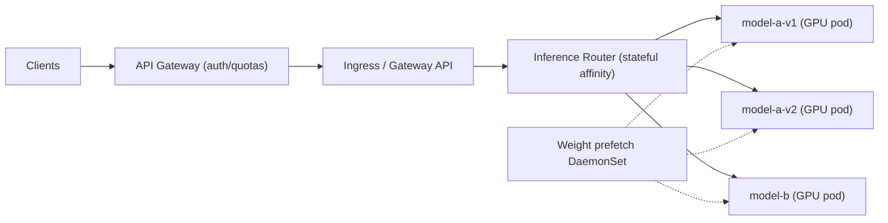
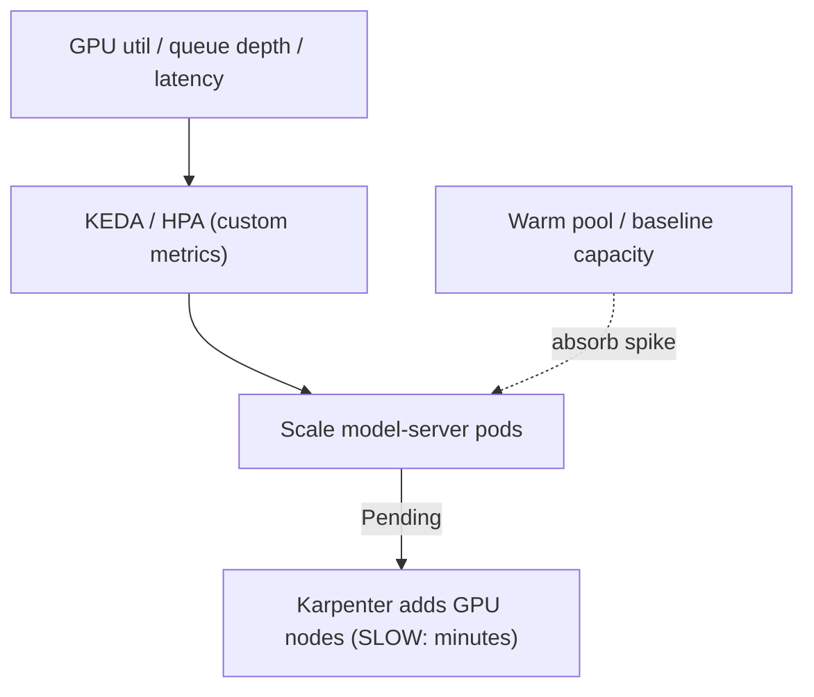

# LLM Inference on Kubernetes - Guide

> K8s for LLM inference is "a **GPU-aware serving platform**" where the hard problems are (1) scheduling expensive GPUs sanely, (2) keeping **tail latency** under control, and (3) scaling without **cold-start** pain. The architecture splits into layers: edge routing, model-serving pods on GPU nodes, model-artifact distribution, and a control plane of queue-aware autoscalers + observability. This is the reference architecture, on **AWS EKS** with NVIDIA GPUs.

See also: [02 - LLM Inference Scenarios & SRE Ops](02%20-%20LLM%20Inference%20Scenarios%20%26%20SRE%20Ops.md) · [01 - Autoscaling Guide](01%20-%20Autoscaling%20Guide.md) · [01 - Scheduling & Resources Guide](01%20-%20Scheduling%20%26%20Resources%20Guide.md) · [01 - Reliability Architectures Guide](01%20-%20Reliability%20Architectures%20Guide.md)

---

## Table of Contents

- [1. The Layered Architecture](#1-the-layered-architecture)
- [2. Request Path & the Inference Router](#2-request-path--the-inference-router)
- [3. Model Serving Layer (GPU Pods)](#3-model-serving-layer-gpu-pods)
- [4. GPU Node Pools & Scheduling](#4-gpu-node-pools--scheduling)
- [5. GPU Sharing: MIG vs Time-Slicing](#5-gpu-sharing-mig-vs-time-slicing)
- [6. Model Artifacts: Getting Weights onto Nodes](#6-model-artifacts-getting-weights-onto-nodes)
- [7. KV Cache, Batching & Tail Latency](#7-kv-cache-batching--tail-latency)
- [8. Autoscaling: HPA Isn't Enough](#8-autoscaling-hpa-isnt-enough)
- [9. Rollouts & Model Versioning](#9-rollouts--model-versioning)
- [10. Observability, Security, EKS Specifics](#10-observability-security-eks-specifics)
- [11. Best Practices](#11-best-practices)

---

---

## 1. The Layered Architecture

Four specialized layers: **edge routing** (gateway + ingress), **inference router** (queue/cache-aware steering), **model servers** (GPU pods), and **artifact distribution** (getting huge weights onto nodes fast). Plus a control plane of **queue/latency-aware autoscalers + GPU observability + policies**.

[⬆ Back to top](#table-of-contents)

---

## 2. Request Path & the Inference Router

`Clients → (API gateway) → Ingress/Gateway → router → model servers`

- **Ingress / Gateway API:** terminates TLS, basic limits, routes `/v1/chat/completions`.
- **API gateway** (common): auth (JWT/API keys), per-tenant quotas/limits, request logging, abuse protection.
- **Inference router** (highly recommended): a lightweight stateless service that decides _where_ to send a request:
  - picks model/version by endpoint/tenant,
  - does **load shedding, backpressure, retries** (carefully),
  - **sticky routing** for KV-cache affinity,
  - batching coordination if the backend needs it.

> Why this layer exists: Ingress only knows L7 rules - it doesn't understand GPU queue depth, model residency, or "this request must stick to the pod that already holds the KV cache." Do sticky routing at the **router**, not Ingress.

[⬆ Back to top](#table-of-contents)

---

## 3. Model Serving Layer (GPU Pods)

The heart. Common stacks: **vLLM** (high-throughput decoding, paged-attention KV cache), **NVIDIA Triton** (general, ensembles, + TensorRT-LLM), **TGI** (Hugging Face), **TensorRT-LLM** servers (max performance).

A serving pod typically has: the model-server process, an optional metrics/log sidecar, and an optional **model-loader init container** to stage weights locally.

> **Design choice: one model per pod** is the common reliability/perf choice for LLMs - GPU memory is the constraint and mixing models causes cache thrash.

[⬆ Back to top](#table-of-contents)

---

## 4. GPU Node Pools & Scheduling

Separate node pools, always:

- **gpu-inference** - dedicated GPU serving nodes.
- **system** - ingress, DNS, metrics, logging, controllers.
- **cpu-services** - routers, gateways, misc.
- **gpu-batch** (optional) - offline jobs / fine-tuning / embeddings.

Scheduling controls that matter:

| Control                                | Purpose                                       |
| :------------------------------------- | :-------------------------------------------- |
| **nodeAffinity**                       | Model pods only land on GPU nodes             |
| **taints/tolerations**                 | Keep non-GPU workloads _off_ GPU nodes        |
| **GPU requests** (`nvidia.com/gpu: 1`) | Reserve whole GPUs (or MIG slices)            |
| **anti-affinity / topology spread**    | Spread replicas across nodes/zones            |
| **PriorityClass**                      | Protect inference pods from eviction vs batch |

On EKS: install the **NVIDIA device plugin** (DaemonSet) so `nvidia.com/gpu` is schedulable; use GPU instance types (`p4d`, `p5`, `g5`, `g6`). Karpenter can provision GPU nodes per pending pods.

[⬆ Back to top](#table-of-contents)

---

## 5. GPU Sharing: MIG vs Time-Slicing

| Approach                     | What                                                               | Trade-off                                            |
| :--------------------------- | :----------------------------------------------------------------- | :--------------------------------------------------- |
| **MIG (Multi-Instance GPU)** | Slice a GPU into fixed hardware partitions, scheduled as resources | Predictable isolation; fixed slice sizes (A100/H100) |
| **Time-slicing / sharing**   | Multiple pods share a GPU by time                                  | More flexible; **unpredictable latency**             |

For latency-sensitive serving, MIG (or whole-GPU) beats time-slicing. Time-slicing suits dev/batch where tail latency doesn't matter.

[⬆ Back to top](#table-of-contents)

---

## 6. Model Artifacts: Getting Weights onto Nodes

LLM weights are huge (40–200GB+), so "just pull from S3 at startup" is a latency/reliability disaster.

| Pattern                                 | Notes                                                                                                                           |
| :-------------------------------------- | :------------------------------------------------------------------------------------------------------------------------------ |
| **Warm local NVMe cache** (recommended) | A DaemonSet prefetches weights to node-local disk; pods mount read-only. Startup = "load from local disk," not "download 100GB" |
| **Shared high-throughput storage**      | NFS/EFS often too slow for mmap reads; object store fine for distribution, not direct reads                                     |
| **Image baking**                        | Build weights into the image - usually too big/slow to distribute                                                               |

> **Pragmatic best practice:** prefetch to **node-local NVMe** + checksum + **versioned directories**. On EKS use instance-store NVMe (e.g., on `g5`/`p4d`) and pull from S3 once per node.

[⬆ Back to top](#table-of-contents)

---

## 7. KV Cache, Batching & Tail Latency

LLM performance is dominated by **prefill** (processing prompt tokens), **decode** (generating tokens), and **KV cache** (memory + reuse). Modern servers do **continuous batching** (dynamically batch during decode), **token-level scheduling** (fair sharing), and sometimes **prefill/decode separation**.

**Routing implications:**

- If you benefit from **KV-cache reuse** (a continuing conversation), use **session affinity** - pin a session to the same backend pod, or you re-pay prefill cost. Implement at the **router**.
- **Backpressure:** when the GPU queue is deep, don't keep accepting until everything times out - return explicit **429/503 with Retry-After**, or shed load per tenant.

[⬆ Back to top](#table-of-contents)

---

## 8. Autoscaling: HPA Isn't Enough

CPU is meaningless for GPU inference. Scale on: **in-flight requests, GPU utilization, tokens/sec, queue depth, p95/p99 latency, prefill/decode queue time**.

- **Pod scaling:** HPA on custom metrics or **KEDA** (queue-based).
- **Node scaling:** Karpenter/Cluster Autoscaler adds GPU nodes when pods are Pending.
- **Warm pools (critical):** GPU nodes are **slow to provision** (minutes) and scarce. Pure reactive scaling = "spike → 10-minute outage." Keep **baseline capacity + predictive/scheduled scaling**.

See [01 - Autoscaling Guide](01%20-%20Autoscaling%20Guide.md).

[⬆ Back to top](#table-of-contents)

---

## 9. Rollouts & Model Versioning

- **Blue/green or canary at the router level:** run v1 and v2 deployments side by side; router sends 1% → 5% → 25% to v2.
- Watch **latency distribution (p95/p99)**, output-quality metrics (if measured), GPU memory headroom + OOM rates.
- **Roll back by routing, not by deleting pods** - keep the old version warm.

[⬆ Back to top](#table-of-contents)

---

## 10. Observability, Security, EKS Specifics

**Metrics at three layers:**

- _Model server:_ tokens/sec (prefill+decode), queue time, batch sizes, GPU memory + OOM count, cancellations/timeouts.
- _Router:_ request rate per tenant/model, routing decisions, 429/503 + retries, end-to-end latency histograms.
- _Cluster:_ GPU utilization/memory/throttling (**DCGM exporter**), pod-pending reasons (insufficient GPUs), node provisioning time, network throughput (weight pulls saturate links).

Tracing `router → backend → streaming tokens` spans is gold.

**Security/multi-tenancy:** strong authN/authZ at gateway (tenant identity), per-tenant quotas + concurrency caps, default-deny NetworkPolicy, namespace per tenant/env, RBAC (no arbitrary secret reads), external secrets + IRSA, admission policies (require requests, disallow privileged on GPU nodes). See [01 - Security & RBAC Guide](01%20-%20Security%20%26%20RBAC%20Guide.md).

**EKS specifics:** GPU instances (`p5`/`p4d`/`g6`/`g5`); NVIDIA device plugin + DCGM via the GPU add-on; Bottlerocket GPU AMIs; **Karpenter** for GPU provisioning + spot for batch; instance-store NVMe for weight caches; S3 as weight source of truth; consider **EFA** for multi-GPU/multi-node.

[⬆ Back to top](#table-of-contents)

---

## 11. Best Practices

- **Make routing + caching explicit** (router with session affinity for KV reuse) - Ingress can't do it.
- **Make GPU scheduling strict**: dedicated GPU node pools, taints/tolerations, anti-affinity, PriorityClass; one model per pod.
- **Make scaling queue/latency-aware** (KEDA/custom metrics) + **warm baseline capacity** - GPUs provision slowly.
- **Prefetch weights to node-local NVMe** (versioned + checksummed); never cold-pull 100GB at startup.
- **Backpressure with 429/503 + Retry-After**; don't let queues melt into timeouts.
- **Canary models at the router; roll back by routing**, keeping old versions warm.
- **MIG/whole-GPU for latency-sensitive serving**; time-slicing only for dev/batch.
- **Instrument tokens/sec, queue time, GPU memory/OOM, p99** - CPU metrics are useless here.
- **Per-tenant quotas + concurrency caps**; secure the gateway (it's a juicy target).

[⬆ Back to top](#table-of-contents)

---

> Continue to [02 - LLM Inference Scenarios & SRE Ops](02%20-%20LLM%20Inference%20Scenarios%20%26%20SRE%20Ops.md).
