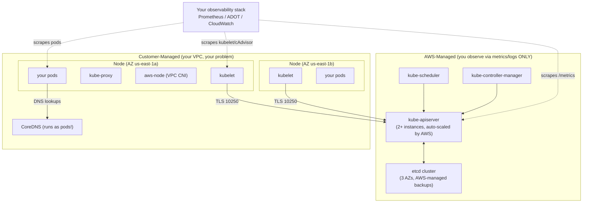
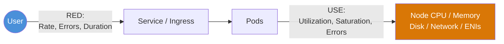
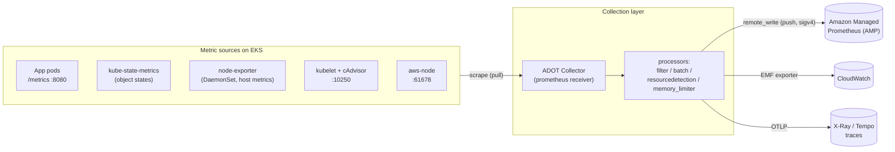
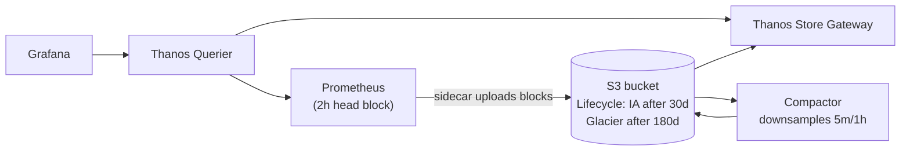
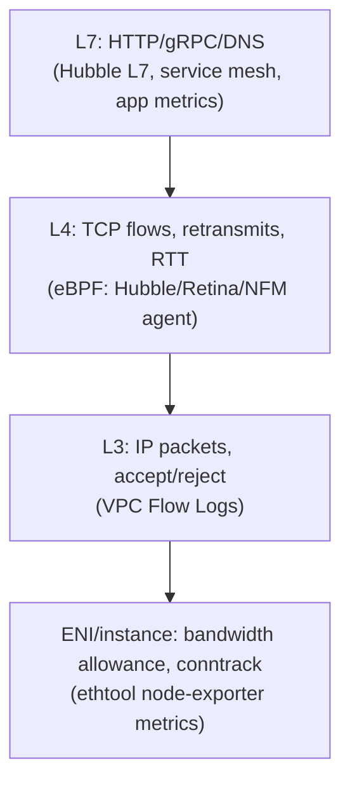
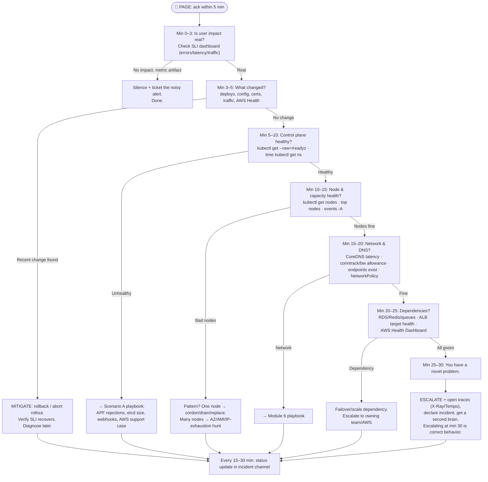

# AWS EKS Monitoring & Observability - The Zero-to-On-Call Study Guide

---

## Table of Contents

| Module | Topic                                                                 | Embedded Case Study                      |
| ------ | --------------------------------------------------------------------- | ---------------------------------------- |
| 1      | The SRE Mindset & AWS EKS Architecture                                | **Scenario A: The Silent Cluster Death** |
| 2      | The 4 Golden Signals + RED/USE                                        | -                                        |
| 3      | Data Collection Pipeline (ADOT, OTel, Prometheus Operator)            | -                                        |
| 4      | Storage Layer (AMP, CloudWatch, S3)                                   | -                                        |
| 5      | Visualization & Alerting (Grafana, Alertmanager)                      | **Scenario C: The Memory Leak Rollout**  |
| 6      | Container Network Observability (eBPF, VPC Flow Logs)                 | **Scenario B: The Noisy Neighbor**       |
| 7      | SLI/SLO/Error Budgets                                                 | -                                        |
| 8      | Cost Observability (Kubecost, CUR, Cross-AZ)                          | **Scenario D: The Cross-AZ Bill Shock**  |
| 9      | Auto-remediation & Proactive SRE                                      | **Scenario E: The Certificate Expiry**   |
| 10     | The On-Call Survival Guide                                            | Incident playbooks                       |
| A–D    | Appendices: PromQL, kubectl debug, IAM verification, Triage flowchart | -                                        |
| -      | Hands-on Exercises 1–3, Interview Prep                                | -                                        |

---

# Module 1: The SRE Mindset & AWS EKS Architecture

## 1.1 The SRE Mindset - Theory: The Detailed "Why"

Monitoring answers **"is it broken?"**. Observability answers **"why is it broken, even when I never anticipated this failure mode?"**

The distinction matters because of a hard truth: **in distributed systems, most outages are caused by failure modes nobody predicted.** A monitoring system built from a checklist ("alert if CPU > 80%") only catches failures you imagined in advance. An observability system lets you ask _arbitrary new questions_ of your system during an incident, using three pillars:

| Pillar      | What it answers                           | EKS-native tooling                        |
| ----------- | ----------------------------------------- | ----------------------------------------- |
| **Metrics** | "What is the rate/shape of the problem?"  | Prometheus, AMP, CloudWatch               |
| **Logs**    | "What exactly happened at 14:32:07?"      | Fluent Bit → CloudWatch Logs / OpenSearch |
| **Traces**  | "Where in the request path did 400ms go?" | ADOT → X-Ray / Tempo / Jaeger             |

Three mindset rules that separate SREs from "people who restart pods":

1. **Symptom-based alerting, cause-based dashboards.** Page on _user pain_ (error rate, latency). Dashboards exist to find _causes_ (CPU, queue depth, GC pauses). If you page on causes, you will burn out your team with non-actionable noise.
2. **Every alert must be actionable.** If the response to an alert is "watch it," delete the alert or downgrade it to a ticket.
3. **You cannot debug what you did not record.** Cardinality, retention, and scrape intervals are decisions you make _before_ the incident. The 3 AM version of you inherits whatever the 3 PM version of you configured.

## 1.2 EKS Architecture - What You Own vs. What AWS Owns

This is the single most important architectural fact on EKS: **the control plane is a managed black box.** You cannot SSH into the API server. You cannot run `etcdctl`. Your observability strategy must be designed around this constraint.



**Key observability consequences of this split:**

| Component                           | Can you scrape it?  | How                                                                                                                              |
| ----------------------------------- | ------------------- | -------------------------------------------------------------------------------------------------------------------------------- |
| kube-apiserver                      | ✅ Yes              | `https://<cluster-endpoint>/metrics` (it's exposed via the API endpoint)                                                         |
| etcd                                | ❌ Direct, ✅ Proxy | A _subset_ of etcd metrics is re-exposed by the API server (e.g. `etcd_db_total_size_in_bytes` → `apiserver_storage_size_bytes`) |
| kube-scheduler / controller-manager | ⚠️ Limited          | Only via **EKS control plane logging** to CloudWatch Logs; their `/metrics` endpoints are not reachable                          |
| kubelet, cAdvisor                   | ✅ Yes              | Port 10250 on each node, `/metrics` and `/metrics/cadvisor`                                                                      |
| CoreDNS                             | ✅ Yes              | It's a normal Deployment in `kube-system`, port 9153                                                                             |
| aws-node (VPC CNI)                  | ✅ Yes              | Port 61678, exposes ENI/IP-allocation metrics                                                                                    |

### Real-world AWS EKS example

Cluster `prod-payments-eks`, 60 nodes. The team enables only API server metrics scraping. One day, pods take 10 minutes to schedule. They have _zero_ scheduler metrics because they never enabled control plane logging. The fix that should have existed on day one:

```bash
aws eks update-cluster-config \
  --name prod-payments-eks \
  --logging '{"clusterLogging":[{"types":["api","audit","authenticator","controllerManager","scheduler"],"enabled":true}]}'
```

Now scheduler decisions appear in CloudWatch Logs group `/aws/eks/prod-payments-eks/cluster`, and a Logs Insights query reveals `FailedScheduling: 0/60 nodes available: insufficient pods` - they hit the **ENI-based max-pods-per-node limit** of the VPC CNI, not CPU/memory.

### The "Gotcha"

> **EKS control plane logging is OFF by default, and you cannot enable it retroactively for a past incident.** Many teams discover during their first major incident that they have no audit logs, no scheduler logs, and no authenticator logs for the event. Enable all five log types on day one - audit logs are the bulkiest, so set a CloudWatch Logs retention policy (e.g., 30 days) to control cost. **This will cause an un-debuggable outage if ignored.**

### Formula

API server health - the first PromQL you should ever run against a cluster:

```promql
# API server request error ratio (5xx) over 5m - the heartbeat of the cluster
sum(rate(apiserver_request_total{code=~"5.."}[5m]))
/
sum(rate(apiserver_request_total[5m]))
```

### Troubleshooting steps - "Is the control plane healthy?"

1. Check basic reachability and health endpoints:
   ```bash
   kubectl get --raw='/readyz?verbose'
   kubectl get --raw='/livez?verbose'
   ```
2. Check API server latency from your side:
   ```bash
   time kubectl get ns
   kubectl get --raw='/metrics' | grep apiserver_request_duration_seconds_count | head -20
   ```
3. Check EKS cluster status and health issues from AWS's side:
   ```bash
   aws eks describe-cluster --name prod-payments-eks \
     --query 'cluster.{status:status,health:health,version:version}'
   ```
4. Check control plane logs (last 15 min of API server errors):
   ```bash
   aws logs filter-log-events \
     --log-group-name /aws/eks/prod-payments-eks/cluster \
     --filter-pattern '"error"' \
     --start-time $(date -d '15 minutes ago' +%s)000 --max-items 50
   ```
5. Check etcd database size as proxied by the API server (limit is **8 GiB** on EKS):
   ```bash
   kubectl get --raw=/metrics | grep apiserver_storage_size_bytes
   ```

---

## 🔥 CASE STUDY - Scenario A: The Silent Cluster Death

**Symptoms:** `kubectl get pods` hangs and never returns. CI/CD deploys time out. Workloads that are already running keep serving traffic (this confuses everyone - "the app is up but kubectl is dead?").

**Why running workloads survive:** the data plane (kubelet, containers, kube-proxy/iptables rules, CoreDNS) does not need the API server to _keep serving_. It needs it to _change_ anything. A dead control plane is a slow-motion outage: nothing breaks until the first pod dies and can't be replaced.

**Root causes (in order of real-world frequency on EKS):**

1. **API server overload** - a controller, operator, or CI job hammering LIST/WATCH on large objects (the classic: an operator listing all 200k events every second without an informer cache).
2. **etcd database approaching/exceeding 8 GiB** - usually caused by event spam, huge ConfigMaps, or a CRD-heavy operator writing constantly. EKS will move the cluster to read-only behavior as etcd degrades.
3. **Webhook timeout cascade** - a failing ValidatingWebhook with `failurePolicy: Fail` and a 30s timeout makes every write request hang.

### Exact troubleshooting sequence

**Step 1 - Confirm it's the control plane, not your network/credentials:**

```bash
# Bypass kubectl entirely; hit the endpoint raw
aws eks describe-cluster --name prod-payments-eks --query 'cluster.endpoint' --output text
curl -k --max-time 5 https://<ENDPOINT>/healthz   # 401 = alive but unauthorized (GOOD); timeout = control plane problem
aws sts get-caller-identity                        # rule out expired credentials
```

**Step 2 - Check API server saturation metrics (if your Prometheus still has data):**

```promql
# In-flight requests vs limits - APF (API Priority & Fairness) rejection
sum(rate(apiserver_flowcontrol_rejected_requests_total[5m])) by (flow_schema, reason)

# Who is hammering the API server?
topk(10, sum(rate(apiserver_request_total[5m])) by (verb, resource, client))

# Request latency by verb - LIST blowing up is the classic signature
histogram_quantile(0.99,
  sum(rate(apiserver_request_duration_seconds_bucket{verb="LIST"}[5m])) by (le, resource))
```

**Step 3 - Check etcd size (the 8 GiB cliff):**

```bash
kubectl get --raw=/metrics 2>/dev/null | grep -E "apiserver_storage_size_bytes|etcd_request_duration"
# If kubectl is dead, check your last-scraped value in AMP/Grafana:
# query: apiserver_storage_size_bytes
```

**Step 4 - Check audit logs for the abuser (CloudWatch Logs Insights):**

```sql
fields @timestamp, user.username, verb, requestURI
| filter @logStream like /audit/
| stats count(*) as calls by user.username, verb, requestURI
| sort calls desc
| limit 20
```

**Step 5 - Mitigate:**

```bash
# If a webhook is the culprit (writes hang, reads work):
kubectl get validatingwebhookconfigurations,mutatingwebhookconfigurations
kubectl delete validatingwebhookconfiguration <broken-webhook>   # break glass

# If event spam is filling etcd - find and stop the spammer:
kubectl get events -A --sort-by=.metadata.creationTimestamp | tail -50
kubectl scale deploy <spamming-operator> -n <ns> --replicas=0

# If etcd is full: delete bulky objects (old events, orphaned ConfigMaps).
# AWS support can compact/defrag etcd - open a Sev-2 case; you CANNOT do it yourself on EKS.
```

**Post-incident must-do:** create alerts on `apiserver_storage_size_bytes > 6 GiB` (75% of limit) and `apiserver_flowcontrol_rejected_requests_total` rate > 0. AWS also publishes these via CloudWatch metric `apiserver_storage_size_bytes` when you enable EKS control plane monitoring in the console (Observability tab).

---

# Module 2: The 4 Golden Signals + RED/USE

## 2.1 Theory - Why these specific signals?

The Google SRE book's **4 Golden Signals** are the minimum set of measurements that, together, can detect _any_ user-impacting failure:

| Signal         | Definition                                                                       | Why it's irreplaceable                                                            |
| -------------- | -------------------------------------------------------------------------------- | --------------------------------------------------------------------------------- |
| **Latency**    | Time to serve a request - **separating success latency from error latency**      | A fast 500 is not "good latency." Mixing them hides outages.                      |
| **Traffic**    | Demand on the system (req/s, connections)                                        | Context for everything else. 100% error rate at 0 req/s is a non-event.           |
| **Errors**     | Rate of failed requests (explicit 5xx, wrong content, too-slow-counts-as-failed) | The most direct proxy for user pain.                                              |
| **Saturation** | How "full" the constrained resource is                                           | The only _leading_ indicator of the four - it predicts failure before it happens. |

Two derived methodologies tell you _which_ metrics to apply to _which_ things:

- **RED (Rate, Errors, Duration)** - for **request-driven services** (your microservices, ingresses, APIs). It's the golden signals minus saturation, applied per-service.
- **USE (Utilization, Saturation, Errors)** - for **resources** (nodes, disks, NICs, connection pools). Invented by Brendan Gregg for systems performance.

**The mental model:** RED looks at the system from the _outside_ (what the user experiences); USE looks from the _inside_ (what the hardware experiences). During an incident you start at RED (confirm and scope user impact) and descend to USE (find the bottleneck).



## 2.2 Mapping the signals to actual EKS metric names

This table is worth memorizing - these are the exact series names you will type during an incident:

| Signal                     | Layer     | Exact metric (Prometheus)                                                                           | Source                        |
| -------------------------- | --------- | --------------------------------------------------------------------------------------------------- | ----------------------------- |
| Latency                    | App       | `http_request_duration_seconds_bucket`                                                              | Your app's client lib         |
| Latency                    | Ingress   | `nginx_ingress_controller_request_duration_seconds_bucket` or ALB `TargetResponseTime` (CloudWatch) | ingress-nginx / ALB           |
| Traffic                    | App       | `rate(http_requests_total[5m])`                                                                     | Your app                      |
| Errors                     | App       | `rate(http_requests_total{status=~"5.."}[5m])`                                                      | Your app                      |
| Saturation (CPU)           | Container | `container_cpu_cfs_throttled_periods_total`                                                         | cAdvisor (kubelet)            |
| Saturation (Mem)           | Container | `container_memory_working_set_bytes` vs `kube_pod_container_resource_limits`                        | cAdvisor + kube-state-metrics |
| Saturation (Node)          | Node      | `node_load5` vs core count; `node_filesystem_avail_bytes`                                           | node-exporter                 |
| Saturation (EKS-specific!) | CNI       | `awscni_assigned_ip_addresses` vs `awscni_total_ip_addresses`                                       | aws-node :61678               |
| Errors                     | Node      | `node_network_transmit_errs_total`, `kubelet_runtime_operations_errors_total`                       | node-exporter / kubelet       |

### Real-world AWS EKS example

Service `checkout-api` in namespace `payments`, pods `checkout-api-7d9f8b-xxxxx`. Dashboards show:

- Rate: `sum(rate(http_requests_total{namespace="payments",service="checkout-api"}[5m]))` = **850 req/s** (normal: 800)
- Errors: 5xx ratio = **0.02%** (normal)
- Duration p99: jumped from **180ms → 1.4s**

Latency up, errors flat, traffic flat → not overload, not a bug throwing errors. Check saturation:

```promql
sum(rate(container_cpu_cfs_throttled_periods_total{namespace="payments", pod=~"checkout-api.*"}[5m]))
/
sum(rate(container_cpu_cfs_periods_total{namespace="payments", pod=~"checkout-api.*"}[5m]))
```

Result: **0.61** - the container is CPU-throttled 61% of its scheduler periods. Someone set `limits.cpu: 500m` on a service that bursts to 2 cores during TLS handshakes. Latency was a _saturation_ problem disguised as an application problem.

### The "Gotcha"

> **`container_memory_usage_bytes` includes page cache and will trigger false OOM panic.** The kernel reclaims page cache freely; the metric the OOM killer actually evaluates against the limit is **`container_memory_working_set_bytes`**. Alerting on `usage_bytes` makes you chase "memory leaks" that are just the kernel caching files. Always use `working_set_bytes` for limit-proximity alerts.

### Formulas - the canonical RED set

```promql
-- Rate
sum(rate(http_requests_total{service="checkout-api"}[5m]))

-- Errors (ratio)
sum(rate(http_requests_total{service="checkout-api", status=~"5.."}[5m]))
/
sum(rate(http_requests_total{service="checkout-api"}[5m]))

-- Duration (p99, from a histogram)
histogram_quantile(0.99,
  sum(rate(http_request_duration_seconds_bucket{service="checkout-api"}[5m])) by (le))
```

And the canonical USE set for a node:

```promql
-- Utilization (CPU, per node)
1 - avg by (instance) (rate(node_cpu_seconds_total{mode="idle"}[5m]))

-- Saturation (run-queue pressure: load per core > 1 means queueing)
node_load5 / count by (instance) (node_cpu_seconds_total{mode="idle"})

-- Errors
rate(node_network_transmit_errs_total[5m]) + rate(node_network_receive_errs_total[5m])
```

### Troubleshooting steps - "p99 latency is up, where do I look?"

1. Confirm scope - one service or many? One AZ or all?
   ```promql
   histogram_quantile(0.99, sum(rate(http_request_duration_seconds_bucket[5m])) by (le, service))
   ```
2. Split latency by pod - is it all pods or one bad pod?
   ```promql
   histogram_quantile(0.99, sum(rate(http_request_duration_seconds_bucket{service="checkout-api"}[5m])) by (le, pod))
   ```
3. Check throttling and memory pressure on the suspect pods:
   ```bash
   kubectl top pods -n payments --sort-by=cpu
   kubectl get pods -n payments -o wide   # note which NODES the slow pods share
   ```
4. Check the node those pods run on:
   ```bash
   kubectl describe node ip-10-0-43-117.ec2.internal | grep -A 10 "Allocated resources"
   kubectl get events --field-selector involvedObject.name=ip-10-0-43-117.ec2.internal
   ```
5. Check downstream dependencies (DB, Redis) - latency is contagious upstream:
   ```bash
   curl -s http://checkout-api.payments:8080/metrics | grep -E "db_query_duration|redis"
   ```

---

# Module 3: Data Collection Pipeline (ADOT, OpenTelemetry, Prometheus Operator)

## 3.1 Theory - the anatomy of a collection pipeline

Every observability pipeline, regardless of vendor, has four stages: **instrument → collect → process → export**. The architectural decisions that matter:

1. **Pull vs Push.** Prometheus _pulls_ (scrapes `/metrics` over HTTP). OTLP _pushes_. Pull gives you a free liveness check (`up == 0` means the target is unreachable - a metric you get for _not_ receiving data). Push is better for short-lived jobs and serverless. EKS reality: you'll run a pull-based scraper that _pushes_ the results to AMP via `remote_write`. Both models, one pipeline.

2. **Agent vs Gateway deployment.** Run collectors as a **DaemonSet** (one per node - scales naturally, scrape traffic stays node-local) or a **Deployment/StatefulSet gateway** (central, easier config, but a scaling bottleneck and a single blast radius). Production pattern: DaemonSet for node/kubelet/cAdvisor metrics + a small gateway StatefulSet for cluster-level scrapes (kube-state-metrics, API server) and trace aggregation.

3. **The collector is a processing pipeline, not a pipe.** Filtering, relabeling, and cardinality control happen _here_, because every label you let through costs money forever downstream.

### The three components you must be able to tell apart

| Component                               | What it actually is                           | What it does                                                                                                                           |
| --------------------------------------- | --------------------------------------------- | -------------------------------------------------------------------------------------------------------------------------------------- |
| **OpenTelemetry (OTel)**                | A CNCF _standard_ + SDKs + a collector binary | Vendor-neutral instrumentation for metrics, traces, logs                                                                               |
| **ADOT** (AWS Distro for OpenTelemetry) | AWS's hardened build of the OTel Collector    | Same collector + AWS-tested receivers/exporters (AMP, X-Ray, CloudWatch EMF) + an EKS add-on with IRSA support                         |
| **Prometheus Operator**                 | A Kubernetes operator + CRDs                  | Turns `ServiceMonitor`/`PodMonitor`/`PrometheusRule` CRDs into Prometheus scrape configs; manages Prometheus/Alertmanager StatefulSets |



## 3.2 The Prometheus Operator model - ServiceMonitors

Instead of hand-editing `prometheus.yml` (and reloading Prometheus for every new service), the operator watches CRDs. The flow: you label a `Service`, a `ServiceMonitor` selects it, the operator generates scrape config.

```yaml
apiVersion: monitoring.coreos.com/v1
kind: ServiceMonitor
metadata:
  name: checkout-api
  namespace: payments
  labels:
    release: kube-prometheus-stack # MUST match Prometheus's serviceMonitorSelector!
spec:
  selector:
    matchLabels:
      app: checkout-api # matches the SERVICE's labels (not the pod's)
  namespaceSelector:
    matchNames: ["payments"]
  endpoints:
    - port: metrics # the NAMED port on the Service
      interval: 30s
      path: /metrics
```

### Real-world AWS EKS example - ADOT as an EKS add-on with IRSA

Deploy the collector with the EKS add-on and give it an IAM role via IRSA (IAM Roles for Service Accounts) so it can `remote_write` to AMP without static keys:

```bash
# 1. Create the IRSA role bound to the collector's service account
eksctl create iamserviceaccount \
  --name adot-collector --namespace observability \
  --cluster prod-payments-eks \
  --attach-policy-arn arn:aws:iam::aws:policy/AmazonPrometheusRemoteWriteAccess \
  --approve

# 2. Install the ADOT add-on
aws eks create-addon --cluster-name prod-payments-eks --addon-name adot
```

Collector pipeline config (the part everyone gets wrong - note the sigv4 auth):

```yaml
extensions:
  sigv4auth:
    region: us-east-1
    service: aps
receivers:
  prometheus:
    config:
      scrape_configs:
        - job_name: kubernetes-pods
          kubernetes_sd_configs: [{ role: pod }]
          relabel_configs:
            - source_labels:
                [__meta_kubernetes_pod_annotation_prometheus_io_scrape]
              action: keep
              regex: "true"
processors:
  batch: { timeout: 30s, send_batch_size: 8192 }
  memory_limiter: { check_interval: 5s, limit_percentage: 80 }
  filter/drop-noise: # cardinality control AT THE SOURCE
    metrics:
      exclude:
        match_type: regexp
        metric_names: ["go_gc_.*", "go_memstats_.*"]
exporters:
  prometheusremotewrite:
    endpoint: https://aps-workspaces.us-east-1.amazonaws.com/workspaces/ws-abc123/api/v1/remote_write
    auth: { authenticator: sigv4auth }
service:
  extensions: [sigv4auth]
  pipelines:
    metrics:
      receivers: [prometheus]
      processors: [memory_limiter, filter/drop-noise, batch]
      exporters: [prometheusremotewrite]
```

### The "Gotcha"

> **The silent ServiceMonitor.** You create a ServiceMonitor, Prometheus shows nothing, no error anywhere. 90% of the time it's one of: (1) the ServiceMonitor's `labels` don't match the Prometheus CR's `serviceMonitorSelector` (with kube-prometheus-stack, you usually need `release: <helm-release-name>`); (2) the `port` name doesn't exist as a **named** port on the Service; (3) the selector matches the _pod's_ labels but not the _Service's_ labels. The operator only logs the mismatch at debug level - it fails completely silently at default verbosity.

### Formula - cardinality math (why you filter at the collector)

```text
series_count ≈ metrics_per_target × targets × label_combinations

Example: a 100-node cluster
  cAdvisor: ~400 series/pod × 30 pods/node × 100 nodes = 1,200,000 series
  AMP cost ≈ $0.30/10M samples ingested (first 2B)
  At 30s interval: 1.2M series × 2 samples/min × 43,200 min/month ≈ 104B samples/month
```

One unbounded label (e.g., `user_id`, `request_id`, raw URL paths) multiplies this without limit. **A single bad label can 100× your AMP bill.**

### Troubleshooting steps - "My target isn't being scraped"


1. Does Prometheus/ADOT even know about the target?
   ```bash
   kubectl port-forward -n observability svc/prometheus-operated 9090 &
   curl -s localhost:9090/api/v1/targets | jq '.data.activeTargets[] | {job: .labels.job, health: .health, lastError: .lastError}' | head -50
   ```

2. If the target is missing entirely - check the ServiceMonitor selector chain:
   ```bash
   kubectl get servicemonitor -n payments checkout-api -o yaml | grep -A5 "selector\|labels"
   kubectl get svc -n payments -l app=checkout-api -o yaml | grep -B2 -A5 "ports:"
   kubectl get prometheus -n observability -o jsonpath='{.items[0].spec.serviceMonitorSelector}'
   ```

3. If the target is `DOWN` - scrape it yourself from inside the cluster:
   ```bash
   kubectl run curl-debug --rm -it --image=curlimages/curl --restart=Never -- \
     curl -sv --max-time 5 http://checkout-api.payments:8080/metrics | head -20
   ```

4. Check for a NetworkPolicy blocking the scrape:
   ```bash
   kubectl get networkpolicy -n payments
   kubectl describe networkpolicy -n payments <policy-name>   # does ingress allow the observability namespace?
   ```

5. Check the collector's own health (it's a service too - it can OOM):
   ```bash
   kubectl logs -n observability -l app.kubernetes.io/name=adot-collector --tail=50 | grep -iE "error|drop|refused|429"
   kubectl top pods -n observability
   ```

6. Verify remote_write is actually delivering (look for 4xx/5xx from AMP):
   ```promql
   rate(prometheus_remote_storage_samples_failed_total[5m])
   prometheus_remote_storage_shards_desired   # rising = falling behind
   ```

---

# Module 4: Storage Layer (AMP, CloudWatch, S3 for long-term)

## 4.1 Theory - why metric storage is a hard problem

A time-series database (TSDB) workload is brutal: millions of tiny appends per second, queries that scan months, and data that's hot for 2 hours then cold forever. Self-hosting Prometheus on EKS gives you a single-node TSDB with **no HA story** (two replicas = two divergent databases, not a cluster) and **local-disk retention limits**. The decisions you must make:

1. **Retention tiers.** On-call queries hit the last 2–6 hours. Capacity planning hits 13 months. SLO reports hit 30 days. No single store does all three economically.
2. **Who pages you when the storage is down?** If your alerting Prometheus runs _inside_ the cluster it monitors, a cluster death takes your alerting with it. AMP moves that risk outside the blast radius.

| Dimension             | Self-hosted Prometheus    | **AMP** (Amazon Managed Prometheus)                | **CloudWatch** (Container Insights)                             |
| --------------------- | ------------------------- | -------------------------------------------------- | --------------------------------------------------------------- |
| Query language        | PromQL                    | PromQL (100% compatible)                           | CloudWatch syntax / Metrics Insights SQL                        |
| HA / durability       | DIY (none by default)     | Multi-AZ, AWS-managed (Cortex-based)               | AWS-managed                                                     |
| Retention             | Your disk                 | **150 days** (fixed)                               | 15 months (with downsampling: 1m→5m→1h)                         |
| Resolution            | Your scrape interval      | Your scrape interval                               | 1 min standard (1s for high-res custom)                         |
| Cost model            | EC2 + EBS                 | Per samples ingested + per query samples + storage | **Per metric per month** (~$0.30/metric ≤10k)                   |
| Cardinality tolerance | RAM-limited               | High (default quota 2M active series, raisable)    | **Terrible** - every label combo = a billed metric              |
| Alerting              | Alertmanager (you run it) | Managed Alertmanager + rules                       | CloudWatch Alarms                                               |
| Best for              | Dev/test, edge            | **Primary K8s metric store**                       | AWS service metrics (ALB, RDS, NAT), billing, EKS control plane |

**Production pattern:** ADOT → AMP for everything Kubernetes; CloudWatch for AWS-managed-service metrics (ALB `HTTPCode_Target_5XX_Count`, RDS `FreeableMemory`, NAT `BytesOutToDestination`); Grafana federates both. **Never route high-cardinality pod metrics into CloudWatch** - the per-metric pricing will detonate.

## 4.2 Long-term storage on S3 - the Thanos/Mimir pattern

When you outgrow 150 days (compliance, year-over-year capacity planning), object storage is the answer: Prometheus writes 2-hour TSDB blocks; a sidecar ships them to S3; a store-gateway serves old blocks at query time; a compactor downsamples (raw → 5m → 1h) so a 1-year query doesn't scan billions of raw samples.



**Decision rule:** if AMP's 150 days satisfies you (it does for ~90% of teams), skip Thanos entirely. Operating Thanos is a part-time job; AMP is a checkbox.

### Real-world AWS EKS example

Workspace `ws-abc123` for `prod-payments-eks` ingests 950k active series. Monthly cost back-of-envelope: 950k series × 2/min × 43,200 min ≈ 82B samples → roughly $2,400/mo at list pricing tiers - versus the same series shipped to CloudWatch as custom metrics, which (at per-metric pricing for ~950k metrics) would exceed **$100k/mo**. The same data. Storage choice _is_ a cost decision.

Verify what AMP is actually ingesting:

```bash
awscurl --service aps --region us-east-1 \
  "https://aps-workspaces.us-east-1.amazonaws.com/workspaces/ws-abc123/api/v1/query?query=count({__name__=~'.%2B'})"
```

### The "Gotcha"

> **AMP silently drops samples that violate limits, and your dashboards just have holes.** AMP enforces quotas (active series per workspace, samples/sec ingest, labels per series). When you exceed them, remote*write gets `429`s; the collector retries, falls behind, then drops. The data is gone forever and nothing pages you - unless you alert on the \_collector's* metrics: `rate(prometheus_remote_storage_samples_failed_total[5m]) > 0`. Also watch the AMP-side CloudWatch metric `DiscardedSamples` in namespace `AWS/Usage`/`AWS/Prometheus`. **Monitor the monitoring pipeline itself - this is non-negotiable.**

### Formula - retention sizing

```text
disk_bytes ≈ active_series × bytes_per_sample × (retention_seconds / scrape_interval)
            ≈ 950,000 × 1.7 B × (15d × 86,400 / 30s)  ≈ 70 GiB per 15 days (local Prometheus)

CloudWatch cost ≈ distinct_metric_count × $0.30 (first 10k tier)  ← why pods don't go to CloudWatch

AMP cost ≈ samples_ingested × tiered $/sample + query_samples_processed
```

### Troubleshooting steps - "Grafana shows gaps in my metrics"

1. Is the collector alive and exporting? (gaps usually start at collection, not storage)
   ```bash
   kubectl get pods -n observability -o wide | grep -E "adot|prometheus"
   kubectl logs -n observability <collector-pod> --previous --tail=30   # did it OOM-restart?
   ```

2. Is remote_write failing or backlogged?
   ```promql
   rate(prometheus_remote_storage_samples_failed_total[5m])
   prometheus_remote_storage_highest_timestamp_in_vs_sent_seconds   # lag in seconds
   ```

3. Did AMP throttle you? Check service quotas:
   ```bash
   aws service-quotas list-service-quotas --service-code aps \
     --query "Quotas[?contains(QuotaName,'series') || contains(QuotaName,'ingestion')].{name:QuotaName,value:Value}"
   aws amp describe-workspace --workspace-id ws-abc123 --query 'workspace.status'
   ```

4. Query AMP directly to bisect "storage problem vs Grafana problem":
   ```bash
   awscurl --service aps --region us-east-1 \
     "https://aps-workspaces.us-east-1.amazonaws.com/workspaces/ws-abc123/api/v1/query?query=up" | jq '.data.result | length'
   ```

5. Check whether a deploy of the _collector_ coincides with the gap start:
   ```bash
   kubectl rollout history deploy/adot-collector -n observability
   ```

---

# Module 5: Visualization & Alerting (Grafana, Alertmanager)

## 5.1 Theory - dashboards are for diagnosis, alerts are for waking humans

**Dashboard design principles** (the difference between a wall of noise and a diagnostic tool):

1. **Top-down hierarchy:** Row 1 = user-facing SLIs (RED). Row 2 = resource saturation (USE). Row 3 = dependencies. An on-call engineer should be able to answer "are users hurting, and roughly why?" in 30 seconds without scrolling.
2. **Every graph answers a question.** If you can't phrase the question, delete the panel.
3. **Template variables** (`$namespace`, `$service`, `$pod`) so one dashboard serves 50 services - but beware: a variable backed by a high-cardinality query makes the dashboard itself a load problem.
4. **Link, don't crowd:** dashboard → drill-down dashboard → trace/log links (Grafana data links with `${__value.time}` carrying the time range).

**Alerting design principles:**

- **Page** (wake a human) only for symptom-based, user-impacting, _actionable_ conditions. Everything else is a **ticket**.
- Every alert needs `for:` duration (debounce flapping), a severity label, and a runbook URL annotation. An alert without a runbook is a riddle at 3 AM.
- **Alertmanager's job** is the unglamorous plumbing: grouping (1 notification for 40 pods of the same outage), inhibition (suppress "pod down" when "node down" already fired), silences (planned maintenance), and routing (severity=critical → PagerDuty; severity=warning → Slack).

```yaml
# Alertmanager routing skeleton
route:
  receiver: slack-default
  group_by: [alertname, namespace]
  group_wait: 30s # wait to batch initial alerts
  group_interval: 5m
  repeat_interval: 4h
  routes:
    - matchers: [severity="critical"]
      receiver: pagerduty
      continue: false
inhibit_rules:
  - source_matchers: [alertname="KubeNodeNotReady"]
    target_matchers: [alertname="KubePodNotReady"]
    equal: [node] # node down inhibits its pods' alerts
```

### Grafana on AWS: AMG vs self-hosted

|                                   | **Amazon Managed Grafana (AMG)**             | Self-hosted on EKS              |
| --------------------------------- | -------------------------------------------- | ------------------------------- |
| Auth                              | IAM Identity Center / SAML built in          | DIY (OAuth proxy, etc.)         |
| AMP/CloudWatch/X-Ray data sources | Native, sigv4 handled for you                | Configure sigv4 + IRSA yourself |
| Cost                              | Per active user/month ($9 editor, $5 viewer) | Pod cost only                   |
| Plugins                           | Curated list (Enterprise plugins extra)      | Anything                        |
| Survives cluster outage           | ✅ Yes - **this is the killer argument**     | ❌ Dies with the cluster        |

**Rule: your alerting path and your primary dashboards must survive the death of the cluster they observe.** AMG + AMP + managed Alertmanager achieve this; an in-cluster Grafana+Prometheus stack does not.

### Real-world AWS EKS example - a production-grade alert rule

```yaml
apiVersion: monitoring.coreos.com/v1
kind: PrometheusRule
metadata:
  name: checkout-api-slo
  namespace: payments
  labels: { release: kube-prometheus-stack }
spec:
  groups:
    - name: checkout-api.rules
      rules:
        - alert: CheckoutHighErrorRate
          expr: |
            sum(rate(http_requests_total{service="checkout-api", status=~"5.."}[5m]))
            /
            sum(rate(http_requests_total{service="checkout-api"}[5m])) > 0.01
          for: 5m
          labels: { severity: critical, team: payments }
          annotations:
            summary: "checkout-api 5xx ratio is {{ $value | humanizePercentage }}"
            runbook_url: "https://wiki.internal/runbooks/checkout-5xx"
            dashboard: "https://g-abc.grafana-workspace.us-east-1.amazonaws.com/d/checkout"
```

### The "Gotcha"

> **`absent()` blindness - your alert can't fire on data that doesn't exist.** If the app stops reporting entirely (pod crash-looping, scrape broken), `rate(http_requests_total{status=~"5.."}) > 0.01` evaluates against _no data_ and stays silent. The outage where _everything_ is down produces _zero_ alerts. Pair every critical ratio alert with a deadman: `absent(up{job="checkout-api"}) == 1`, and configure a **Dead Man's Snitch** (an always-firing `vector(1)` alert routed to a service that pages when the heartbeat _stops_ - proving the whole pipeline end-to-end).

### Formula - alert math worth memorizing

```promql
# Always-firing watchdog (route to a heartbeat service)
- alert: Watchdog
  expr: vector(1)

# Deadman for a scrape target
absent(up{job="checkout-api"}) == 1

# "Will fill in 4h" - predictive disk alert (better than a static 85% threshold)
predict_linear(node_filesystem_avail_bytes{mountpoint="/"}[1h], 4*3600) < 0
```

### Troubleshooting steps - "My alert didn't fire / fired late"

1. Is the rule loaded and healthy?
   ```bash
   curl -s localhost:9090/api/v1/rules | jq '.data.groups[].rules[] | select(.name=="CheckoutHighErrorRate") | {state, lastError, lastEvaluation}'
   ```
2. Evaluate the expression by hand at the incident timestamp:
   ```bash
   curl -sG localhost:9090/api/v1/query --data-urlencode 'query=<expr>' --data-urlencode 'time=2026-06-12T03:14:00Z'
   ```
3. Did it fire but get stuck in Alertmanager (grouping/silence/inhibition)?
   ```bash
   kubectl port-forward -n observability svc/alertmanager-operated 9093 &
   curl -s localhost:9093/api/v2/alerts | jq '.[] | {name: .labels.alertname, status: .status.state, silencedBy: .status.silencedBy}'
   curl -s localhost:9093/api/v2/silences | jq '.[] | select(.status.state=="active")'
   ```
4. Did Alertmanager fail to deliver (check the notification log)?
   ```bash
   kubectl logs -n observability alertmanager-kube-prometheus-stack-alertmanager-0 | grep -iE "notify|error" | tail -20
   ```

---

## 🔥 CASE STUDY - Scenario C: The Memory Leak Rollout

**Symptoms:** Version `v2.4.0` of `checkout-api` deploys at 10:00. All green. At ~14:00 pods start OOMKilling one by one (`kubectl get pods` shows `OOMKilled`, restart counts climbing). Each restart resets the leak, so the service mostly limps along - a **sawtooth** pattern that hides total failure but degrades latency and pages you every few hours forever.

**Root cause family:** a code-level leak (unbounded in-process cache, goroutine leak holding buffers) - or no memory limit at all, in which case the pod grows until the _node_ runs out and the kernel OOM killer executes something semi-random (possibly your neighbor's pod, or kubelet itself).

### Detection with PromQL `rate()`/`deriv()` - catch it at hour 1, not hour 4

```promql
-- The sawtooth view (plot this; each tooth-drop is an OOM kill)
container_memory_working_set_bytes{namespace="payments", pod=~"checkout-api.*"}

-- Leak slope: bytes/second of sustained growth (deriv over a long window smooths GC noise)
deriv(container_memory_working_set_bytes{namespace="payments", pod=~"checkout-api.*"}[30m]) > 0

-- THE proactive alert: "at this slope, this pod hits its memory limit within 2 hours"
predict_linear(container_memory_working_set_bytes{namespace="payments", pod=~"checkout-api.*"}[30m], 2*3600)
  >
on(pod, namespace) (kube_pod_container_resource_limits{resource="memory", namespace="payments"} * 0.95)

-- Confirm OOM kills are actually happening
increase(kube_pod_container_status_restarts_total{namespace="payments", pod=~"checkout-api.*"}[1h]) > 0
  and on(pod)
kube_pod_container_status_last_terminated_reason{reason="OOMKilled"} == 1
```

### Exact triage sequence

1. Confirm OOM, not crash:
   ```bash
   kubectl get pods -n payments -l app=checkout-api \
     -o custom-columns='NAME:.metadata.name,RESTARTS:.status.containerStatuses[0].restartCount,LASTSTATE:.status.containerStatuses[0].lastState.terminated.reason'
   kubectl describe pod -n payments <pod> | grep -A3 "Last State"   # look for: Reason: OOMKilled, Exit Code: 137
   ```

2. Correlate start-of-leak with the rollout:
   ```bash
   kubectl rollout history deploy/checkout-api -n payments
   kubectl get rs -n payments -l app=checkout-api -o custom-columns='NAME:.metadata.name,REVISION:.metadata.annotations.deployment\.kubernetes\.io/revision,CREATED:.metadata.creationTimestamp'
   ```

3. Compare leak slope old-vs-new (if canary/old pods still exist):
   ```promql
   avg by (pod) (deriv(container_memory_working_set_bytes{pod=~"checkout-api.*"}[30m]))
   ```

4. Mitigate now, debug later:
   ```bash
   kubectl rollout undo deploy/checkout-api -n payments
   kubectl rollout status deploy/checkout-api -n payments
   ```

5. Capture evidence before the leaking pods are gone (language-specific profile, e.g. Go):
   ```bash
   kubectl port-forward -n payments <leaking-pod> 6060 &
   curl -s localhost:6060/debug/pprof/heap > heap-$(date +%s).pprof
   ```

> **The deeper lesson:** memory limits are not optional. `requests` = scheduling promise, `limits` = blast-radius containment. A pod without a memory limit converts an app bug into a _node-level_ incident.

---

# Module 6: Container Network Observability (eBPF, VPC Flow Logs)

## 6.1 Theory - why network observability on EKS is special

On EKS with the **AWS VPC CNI**, pods get _real VPC IP addresses_ from your subnets (no overlay network). This has two huge observability consequences:

1. **VPC-native tooling works on pods.** VPC Flow Logs see pod-to-pod traffic, because pod IPs are ENI secondary IPs. (But flow logs are IP-level, 1-minute-aggregated, and pods churn IPs - so flow logs alone can't reliably tell you _which workload_ talked.)
2. **You inherit VPC-level failure modes:** subnet IP exhaustion, ENI limits per instance type, security-group interactions, and **cross-AZ data charges** for pod traffic.

**eBPF** closes the "which workload" gap. eBPF programs run sandboxed in the kernel, attached to socket/network hooks, and observe **every connection with zero app changes and near-zero overhead** - no sidecars, no library injection. On EKS you get this through:

| Tool                                                                                       | What it gives you                                                        | Effort             |
| ------------------------------------------------------------------------------------------ | ------------------------------------------------------------------------ | ------------------ |
| **CloudWatch Container Insights with enhanced observability + Network Flow Monitor agent** | AWS-native per-workload TCP flow metrics, retransmits, RTT               | Low (add-on)       |
| **Cilium + Hubble** (replaces/augments VPC CNI)                                            | Full L3–L7 flow visibility, DNS-aware, service map, `hubble observe` CLI | High (CNI surgery) |
| **Retina / Inspektor Gadget / Pixie**                                                      | eBPF observation on top of the existing VPC CNI (no CNI replacement)     | Medium             |

**Layered model - where each tool sees:**



### The EKS-specific metrics almost nobody monitors (until the outage)

EC2 instances have **per-instance network allowances** (bandwidth, PPS, conntrack entries). When exceeded, packets are _silently queued or dropped_ - no error in your app, just mysterious latency. The ENA driver exposes shaping counters that node-exporter can pick up via ethtool collection:

```text
node_ethtool_bw_in_allowance_exceeded      # inbound bandwidth shaping events
node_ethtool_bw_out_allowance_exceeded     # outbound shaping
node_ethtool_pps_allowance_exceeded        # packets-per-second cap hit
node_ethtool_conntrack_allowance_exceeded  # conntrack table full → NEW CONNECTIONS DROPPED
node_ethtool_linklocal_allowance_exceeded  # DNS to VPC resolver (169.254.169.253) throttled
```

**If `conntrack_allowance_exceeded` is rising, you are dropping new connections right now.**

### Real-world AWS EKS example - VPC Flow Logs for pod traffic

```bash
aws ec2 create-flow-logs \
  --resource-type VPC --resource-ids vpc-0abc123 \
  --traffic-type ALL \
  --log-destination-type s3 \
  --log-destination arn:aws:s3:::prod-flowlogs/eks/ \
  --log-format '${srcaddr} ${dstaddr} ${srcport} ${dstport} ${protocol} ${bytes} ${action} ${flow-direction} ${az-id} ${pkt-src-aws-service}'
```

Then in Athena, "top talkers between pod subnets":

```sql
SELECT srcaddr, dstaddr, sum(bytes)/1e9 AS gb
FROM vpc_flow_logs
WHERE action='ACCEPT' AND day='2026-06-12'
GROUP BY srcaddr, dstaddr ORDER BY gb DESC LIMIT 20;
```

Map an IP back to a pod (the join flow logs can't do for you):

```bash
kubectl get pods -A -o wide --field-selector status.podIP=10.0.43.117
```

### The "Gotcha"

> **VPC Flow Logs cannot see _why_ a packet was rejected, and they miss intra-node pod-to-pod traffic.** Two pods on the **same node** often talk over local veth pairs without traversing an ENI in a way flow logs capture, so your "traffic map" from flow logs alone is systematically incomplete - and `REJECT` lines don't tell you _which_ security group or NACL did it (use VPC Reachability Analyzer for that). For workload-truth, you need eBPF; for AWS-config-truth, you need Reachability Analyzer; flow logs are the cheap wide-angle lens.

### Troubleshooting steps - "Pod A can't reach Pod B"

1. DNS first - ~50% of "network" issues are DNS:
   ```bash
   kubectl exec -n payments deploy/checkout-api -- nslookup inventory-api.inventory.svc.cluster.local
   kubectl get pods -n kube-system -l k8s-app=kube-dns -o wide        # CoreDNS healthy?
   ```
2. Raw connectivity from inside the source pod:
   ```bash
   kubectl exec -n payments deploy/checkout-api -- sh -c 'nc -zv -w3 inventory-api.inventory 8080 || wget -qO- --timeout=3 http://inventory-api.inventory:8080/healthz'
   ```
3. Does the Service have endpoints at all?
   ```bash
   kubectl get endpointslices -n inventory -l kubernetes.io/service-name=inventory-api
   ```
4. NetworkPolicy in either namespace?
   ```bash
   kubectl get networkpolicy -n payments
   kubectl get networkpolicy -n inventory   # remember: policies are DEFAULT-DENY once any policy selects the pod
   ```
5. Security groups (especially if using Security Groups for Pods or custom node SGs):
   ```bash
   aws ec2 describe-instances --filters "Name=private-ip-address,Values=10.0.43.117" \
     --query 'Reservations[].Instances[].SecurityGroups'
   ```
6. ENA shaping / conntrack on both nodes:
   ```promql
   rate(node_ethtool_conntrack_allowance_exceeded[5m]) > 0
   ```
7. CNI IP exhaustion (pods stuck `ContainerCreating` is the tell):
   ```bash
   kubectl logs -n kube-system -l k8s-app=aws-node --tail=30 | grep -iE "no available IP|error"
   curl -s http://<node-ip>:61678/metrics | grep -E "awscni_assigned_ip|awscni_total_ip"
   ```

---

## 🔥 CASE STUDY - Scenario B: The Noisy Neighbor

**Symptoms:** Multiple unrelated services on node `ip-10-0-43-117` show p99 latency 3–8× normal. Each team investigates their own app and finds nothing. The only common factor: **the node**.

**Root cause families:** (1) one pod with no CPU limit (or huge limit) starving others / blowing past its share so others get throttled; (2) one pod saturating the _instance's_ network or PPS allowance - which is **per-instance, shared by all pods**, and invisible to per-pod CPU/memory dashboards.

### Identification - cgroup CPU evidence

```promql
-- Which pods on the suspect node are throttled? (the VICTIMS)
sum by (pod) (
  rate(container_cpu_cfs_throttled_periods_total{instance="ip-10-0-43-117.ec2.internal"}[5m]))
/
sum by (pod) (
  rate(container_cpu_cfs_periods_total{instance="ip-10-0-43-117.ec2.internal"}[5m])) > 0.25

-- Who is actually EATING the CPU? (the AGGRESSOR)
topk(5, sum by (pod) (
  rate(container_cpu_usage_seconds_total{instance="ip-10-0-43-117.ec2.internal", image!=""}[5m])))

-- Node-level run-queue saturation (USE method)
node_load5{instance="ip-10-0-43-117.ec2.internal"}
/ count(node_cpu_seconds_total{instance="ip-10-0-43-117.ec2.internal", mode="idle"}) > 1.5
```

### Identification - network bandwidth evidence (Container Network Observability)

```promql
-- Is the INSTANCE being shaped? If yes, every pod on it suffers
rate(node_ethtool_bw_out_allowance_exceeded{instance="ip-10-0-43-117.ec2.internal"}[5m]) > 0
rate(node_ethtool_pps_allowance_exceeded{instance="ip-10-0-43-117.ec2.internal"}[5m]) > 0

-- Which pod is the bandwidth hog?
topk(5, sum by (pod) (
  rate(container_network_transmit_bytes_total{instance="ip-10-0-43-117.ec2.internal"}[5m])))
```

With eBPF tooling (Hubble), get flow-level truth in one command:

```bash
hubble observe --node ip-10-0-43-117.ec2.internal --last 1000 -o json \
  | jq -r '.flow.source.pod_name' | sort | uniq -c | sort -rn | head
```

### Exact triage sequence

1. Confirm co-location is the pattern:
   ```bash
   kubectl get pods -A -o wide --field-selector spec.nodeName=ip-10-0-43-117.ec2.internal
   ```

2. Live resource view (cAdvisor truth, not requests):
   ```bash
   kubectl top pods -A --sort-by=cpu | head -15
   kubectl top node ip-10-0-43-117.ec2.internal
   ```

3. On-node cgroup inspection (via a debug pod, since you can't SSH by default):
   ```bash
   kubectl debug node/ip-10-0-43-117.ec2.internal -it --image=ubuntu -- bash
   # inside: chroot /host
   cat /sys/fs/cgroup/kubepods.slice/*/*/cpu.stat | grep -E "nr_throttled|throttled_usec"
   ```

4. Evict the aggressor (fastest mitigation) and keep the node for forensics:
   ```bash
   kubectl cordon ip-10-0-43-117.ec2.internal
   kubectl delete pod -n batch <aggressor-pod>   # reschedules elsewhere
   ```

5. Permanent fixes: enforce `LimitRange`/`ResourceQuota` in every namespace; give the batch workload a dedicated node group with taints:
   ```bash
   kubectl taint nodes -l workload=batch dedicated=batch:NoSchedule
   ```

> **The "Gotcha" inside the gotcha:** CPU throttling happens **even when the node has idle CPU** - CFS quota throttles a container against _its own limit_ per 100ms period. A multi-threaded app with `limits.cpu: 1` that briefly runs 8 threads burns its 100ms quota in 12ms and sleeps 88ms - **latency spikes on an idle node.** For latency-critical services, consider removing CPU limits (keep requests!) or using static CPU policy.

---

# Module 7: SLI / SLO / Error Budgets

## 7.1 Theory - the contract that makes reliability an engineering decision

- **SLI (Service Level Indicator):** a _measurement_ - a ratio of good events to total events. "Proportion of requests served successfully in < 300ms."
- **SLO (Service Level Objective):** a _target_ on an SLI over a window. "99.9% over a rolling 30 days."
- **Error budget:** `1 − SLO` - the amount of failure you are _allowed_. At 99.9%/30d, you may fail **0.1% of requests ≈ 43.2 minutes of full outage** per month.
- **SLA:** a _contract with financial penalties._ SLOs are internal and stricter than SLAs - your SLO is the tripwire that protects the SLA.

**Why error budgets change behavior:** they convert the eternal "ship features vs. be careful" argument into arithmetic. Budget healthy → ship aggressively, run chaos experiments. Budget exhausted → feature freeze, reliability work only. The budget de-politicizes the decision; nobody argues with a number both sides agreed to in advance.

**Choosing SLIs - the rule of thumb:** measure as close to the user as possible (load balancer beats pod-level; client-side beats server-side), and pick 2–4 SLIs max per service: typically **availability** and **latency**, sometimes freshness/durability for pipelines.

### The availability table you should know cold

| SLO    | Downtime / 30 days | Downtime / year |
| ------ | ------------------ | --------------- |
| 99%    | 7.2 hours          | 3.65 days       |
| 99.9%  | 43.2 min           | 8.76 hours      |
| 99.95% | 21.6 min           | 4.38 hours      |
| 99.99% | 4.32 min           | 52.6 min        |

(Each nine costs roughly 10× the engineering effort of the previous one. EKS's own control plane SLA is 99.95% - **you cannot honestly offer 99.99% on a single dependency that offers 99.95%** without multi-cluster architecture.)

## 7.2 Formulas - SLIs and multi-window burn-rate alerting

```promql
-- Availability SLI (ratio of good requests, 5m window)
sum(rate(http_requests_total{service="checkout-api", status!~"5.."}[5m]))
/
sum(rate(http_requests_total{service="checkout-api"}[5m]))

-- Latency SLI ("good" = under 300ms) - histogram bucket trick
sum(rate(http_request_duration_seconds_bucket{service="checkout-api", le="0.3"}[5m]))
/
sum(rate(http_request_duration_seconds_count{service="checkout-api"}[5m]))

-- Error budget remaining over the 30d window (SLO = 99.9%)
1 - (
  (1 - (sum(increase(http_requests_total{service="checkout-api", status!~"5.."}[30d]))
        / sum(increase(http_requests_total{service="checkout-api"}[30d]))))
  / (1 - 0.999)
)
```

**Burn rate** = how fast you consume budget relative to the "even" pace.
`burn_rate = error_rate / (1 − SLO)` - burn rate 1 means you exhaust the budget exactly at window's end; burn rate 14.4 exhausts a 30-day budget in 2 days.

The Google SRE Workbook **multi-window multi-burn-rate** pattern (the industry standard - fast detection AND low noise):

```promql
-- PAGE: 14.4x burn (2% of 30d budget in 1 hour), confirmed by 5m window to dodge blips
(
  sum(rate(http_requests_total{service="checkout-api",status=~"5.."}[1h]))
  / sum(rate(http_requests_total{service="checkout-api"}[1h]))
) > (14.4 * 0.001)
and
(
  sum(rate(http_requests_total{service="checkout-api",status=~"5.."}[5m]))
  / sum(rate(http_requests_total{service="checkout-api"}[5m]))
) > (14.4 * 0.001)

-- TICKET: 1x slow burn over 3 days (budget on track to exhaust; not 3AM-worthy)
... same shape with [3d]/[6h] windows and threshold (1 * 0.001)
```

| Alert  | Long window | Short window | Burn rate | Budget consumed | Action            |
| ------ | ----------- | ------------ | --------- | --------------- | ----------------- |
| Page   | 1h          | 5m           | 14.4      | 2% in 1h        | Wake up           |
| Page   | 6h          | 30m          | 6         | 5% in 6h        | Wake up           |
| Ticket | 1d          | 2h           | 3         | 10% in 1d       | Next business day |
| Ticket | 3d          | 6h           | 1         | 10% in 3d       | Backlog           |

### Real-world AWS EKS example - CloudWatch Application Signals SLO tracking

AWS now has native SLO objects. Create one tracking an ALB-fronted EKS service:

```bash
aws application-signals create-service-level-objective \
  --name checkout-availability \
  --sli-config '{
    "SliMetricConfig": {
      "MetricDataQueries": [
        {"Id":"errors","MetricStat":{"Metric":{"Namespace":"AWS/ApplicationELB","MetricName":"HTTPCode_Target_5XX_Count","Dimensions":[{"Name":"LoadBalancer","Value":"app/checkout-alb/abc123"}]},"Period":60,"Stat":"Sum"},"ReturnData":false},
        {"Id":"total","MetricStat":{"Metric":{"Namespace":"AWS/ApplicationELB","MetricName":"RequestCount","Dimensions":[{"Name":"LoadBalancer","Value":"app/checkout-alb/abc123"}]},"Period":60,"Stat":"Sum"},"ReturnData":false},
        {"Id":"sli","Expression":"(total-errors)/total*100","ReturnData":true}
      ]
    },
    "MetricThreshold": 99.9,
    "ComparisonOperator": "GreaterThanOrEqualTo"
  }' \
  --goal '{"Interval":{"RollingInterval":{"DurationUnit":"DAY","Duration":30}},"AttainmentGoal":99.9}'
```

CloudWatch then computes attainment and budget-remaining, and you can alarm on its burn-rate metrics - useful when leadership lives in AWS consoles rather than Grafana.

### The "Gotcha"

> **Averaging your SLI over time instead of over events.** `avg_over_time(success_ratio[30d])` weights a 3 AM minute (10 req/s) the same as a Black Friday minute (50k req/s). You can "meet" a time-averaged SLO while failing millions of peak-hour users. Always compute SLIs as **sum(good events) / sum(total events)** over the window - `increase()` of counters, never `avg_over_time()` of ratios.

### Troubleshooting steps - "We're burning error budget, find the source"

1. Quantify the burn rate now:
   ```promql
   (sum(rate(http_requests_total{service="checkout-api",status=~"5.."}[1h])) / sum(rate(http_requests_total{service="checkout-api"}[1h]))) / 0.001
   ```

2. Slice the errors - by code, pod, node, AZ:
   ```promql
   sum by (status) (rate(http_requests_total{service="checkout-api",status=~"5.."}[15m]))
   sum by (pod)    (rate(http_requests_total{service="checkout-api",status=~"5.."}[15m]))
   ```

3. Correlate with deploys:
   ```bash
   kubectl rollout history deploy/checkout-api -n payments
   kubectl get events -n payments --sort-by=.lastTimestamp | tail -20
   ```

4. Check the ALB side (errors your pods never saw - target connection failures):
   ```bash
   aws cloudwatch get-metric-statistics --namespace AWS/ApplicationELB \
     --metric-name TargetConnectionErrorCount \
     --dimensions Name=LoadBalancer,Value=app/checkout-alb/abc123 \
     --start-time 2026-06-12T02:00:00Z --end-time 2026-06-12T04:00:00Z \
     --period 300 --statistics Sum
   ```

5. Decide: rollback (deploy-correlated), scale (saturation-correlated), or dependency escalation (downstream-correlated).

---

# Module 8: Cost Observability (Kubecost, AWS CUR, Cross-AZ traffic)

## 8.1 Theory - why Kubernetes destroys cost visibility

Your AWS bill says: "EC2: $84,000." It cannot say which _team, namespace, or deployment_ spent it, because **EC2 bills instances, and Kubernetes multiplexes many workloads onto each instance.** Cost allocation requires joining two datasets:

```text
cost_per_pod = Σ over time (
    pod_resource_share(t) × instance_price(t)
)
where pod_resource_share = max(requests, usage) / node_allocatable   # per resource, blended
```

This is exactly what **Kubecost** (and the AWS-native **Split Cost Allocation Data** feature in the CUR) computes - pod-level resource consumption (from cAdvisor/kube-state-metrics) joined with real prices (on-demand/spot/RI/Savings-Plan-aware via the CUR).

**The three cost killers on EKS, in observed order of magnitude:**

1. **Over-requesting ("slack"):** teams set `requests.cpu: 2` for apps using 100m. The scheduler packs by _requests_, so the cluster autoscaler buys nodes for phantom load. Slack of 60–80% is _normal_ in unmanaged clusters.
2. **Cross-AZ data transfer:** $0.01/GB _each direction_ ($0.02/GB effective) for pod-to-pod traffic across AZs - invisible in any CPU/memory dashboard. (Scenario D below.)
3. **Orphaned/idle capacity:** unmounted EBS volumes (gp3 ~$0.08/GB-mo), idle load balancers, over-replicated dev environments running 24/7.

### Key Kubecost / OpenCost metrics (they're Prometheus metrics - query them!)

```promql
-- Cluster-wide CPU slack: requested but unused cores
sum(kube_pod_container_resource_requests{resource="cpu"})
- sum(rate(container_cpu_usage_seconds_total{image!=""}[24h]))

-- Cost-efficiency per namespace (usage/requests; < 0.3 = badly over-provisioned)
sum by (namespace) (rate(container_cpu_usage_seconds_total{image!=""}[24h]))
/
sum by (namespace) (kube_pod_container_resource_requests{resource="cpu"})

-- OpenCost's node hourly cost (joined with AWS pricing)
node_total_hourly_cost
```

### Real-world AWS EKS example - the CUR + Athena view

Enable Split Cost Allocation Data for EKS (Billing console → Cost Management preferences), then per-pod costs land in CUR rows with `splitLineItem/*` columns. Athena query - cost by namespace last 30 days:

```sql
SELECT
  resource_tags_user_namespace AS ns,
  round(sum(split_line_item_split_cost + split_line_item_unused_cost), 2) AS usd
FROM cur_table
WHERE line_item_usage_start_date > now() - interval '30' day
  AND split_line_item_split_usage > 0
GROUP BY 1 ORDER BY usd DESC;
```

### The "Gotcha"

> **Kubecost defaults to _requests-based_ allocation - an idle pod with huge requests shows as expensive, and teams "optimize" by cutting requests without changing usage, which fixes the bill _report_ while creating OOM/throttle risk.** Understand which allocation policy (requests vs usage vs max(requests, usage)) your numbers use before you act on them. `max(requests, usage)` is the honest default: you pay for what you reserve OR what you burn, whichever is greater.

### Troubleshooting steps - "Which namespace is burning money?"

1. Slack per namespace (the #1 lever):
   ```promql
   topk(10, sum by (namespace) (kube_pod_container_resource_requests{resource="cpu"})
            - sum by (namespace) (rate(container_cpu_usage_seconds_total{image!=""}[7d])))
   ```
2. Right-size with real percentiles (set requests ≈ p95 usage):
   ```promql
   quantile_over_time(0.95, rate(container_cpu_usage_seconds_total{namespace="payments",image!=""}[5m])[7d:5m])
   ```
3. Find orphaned EBS volumes:
   ```bash
   aws ec2 describe-volumes --filters Name=status,Values=available \
     --query 'Volumes[].{id:VolumeId,gb:Size,created:CreateTime}' --output table
   ```
4. Check spot adoption for stateless workloads:
   ```bash
   kubectl get nodes -L karpenter.sh/capacity-type,eks.amazonaws.com/capacityType
   ```

---

## 🔥 CASE STUDY - Scenario D: The Cross-AZ Bill Shock

**Symptoms:** Monthly bill jumps from $48k to $96k. Cost Explorer shows the delta is almost entirely **"EC2-Other" → DataTransfer-Regional-Bytes**. No deploy obviously correlates. CPU/memory dashboards are all normal - _because this failure mode is invisible to them._

**Root cause:** A scale-up event (or a rebalance by the cluster autoscaler/Karpenter) redistributed pods, and now `checkout-api` pods in `us-east-1a` chat constantly with `inventory-api` pods in `us-east-1b`. Kubernetes Services load-balance across _all_ endpoints by default, **AZ-blind**. At $0.01/GB each way, a chatty 5 Gbps internal flow ≈ **$1,000+/day**.

### Detection - three lenses, cheapest first

**Lens 1 - Cost Explorer / CUR (confirm the category):**

```bash
aws ce get-cost-and-usage \
  --time-period Start=2026-05-01,End=2026-06-01 \
  --granularity DAILY --metrics UnblendedCost \
  --filter '{"Dimensions":{"Key":"USAGE_TYPE","Values":["USE1-DataTransfer-Regional-Bytes"]}}'
```

**Lens 2 - VPC Flow Logs with `az-id` (find the flows):**

```sql
-- Athena: top cross-AZ talker pairs
SELECT srcaddr, dstaddr, sum(bytes)/1e9 AS gb
FROM vpc_flow_logs
WHERE day >= '2026-06-05'
  AND az_id_src != az_id_dst        -- requires ${az-id} + custom enrichment, or join subnets→AZ
GROUP BY srcaddr, dstaddr ORDER BY gb DESC LIMIT 20;
```

**Lens 3 - Container Network Observability (name the workloads):** cAdvisor gives per-pod bytes; join pod→node→AZ with kube-state-metrics labels:

```promql
-- Per-pod transmit rate, labeled by the AZ of the node it runs on
sum by (pod, namespace, label_topology_kubernetes_io_zone) (
  rate(container_network_transmit_bytes_total{image!=""}[5m])
  * on(node) group_left(label_topology_kubernetes_io_zone)
    kube_node_labels
)
```

With Hubble/Cilium it's direct: `hubble observe --label app=checkout-api -o json | jq` and aggregate by source/destination node zones. Kubecost's network-costs DaemonSet also itemizes cross-AZ ("network egress, zone") dollars per workload.

### Remediation - Topology Aware Routing

Tell kube-proxy to prefer same-zone endpoints (EndpointSlice hints):

```bash
kubectl annotate service inventory-api -n inventory \
  service.kubernetes.io/topology-mode=Auto
```

Verify hints were actually applied (they are conditional - see gotcha):

```bash
kubectl get endpointslices -n inventory -l kubernetes.io/service-name=inventory-api \
  -o jsonpath='{range .items[*].endpoints[*]}{.addresses[0]}{" zone="}{.zone}{" hints="}{.hints}{"\n"}{end}'
```

For mesh users: Istio `localityLbSetting` / `failoverPriority` does the same at L7. Also ensure deployments spread evenly so each AZ _has_ local endpoints:

```yaml
topologySpreadConstraints:
  - maxSkew: 1
    topologyKey: topology.kubernetes.io/zone
    whenUnsatisfiable: ScheduleAnyway
    labelSelector: { matchLabels: { app: inventory-api } }
```

Then prove the fix with the same PromQL from Lens 3 - cross-AZ bytes should collapse within minutes.

> **The "Gotcha":** Topology Aware Routing **silently disables itself** when endpoints per zone are too few or too imbalanced (the safeguard prevents overloading one zone's pods). The annotation will sit there _looking_ enabled while routing stays AZ-blind, and there's no event - you must check the EndpointSlice `hints` field, and you must keep replicas ≥ AZ count with spread constraints. **Also: never trade an AZ-cost optimization for a single-AZ availability risk - keep replicas in every AZ; topology hints only steer traffic, they don't remove redundancy.**

---

# Module 9: Auto-remediation & Proactive SRE

## 9.1 Theory - closing the loop, carefully

The remediation maturity ladder:

```text
L0  Human reads alert, ssh/kubectl by hand
L1  Alert links to a runbook (copy-paste commands)
L2  One-click remediation (script attached to the alert)
L3  Auto-remediation with human-visible audit trail   ← target for known failure modes
L4  Self-healing design (the failure mode is engineered away)
```

**The iron rule of auto-remediation:** automate only actions that are (1) **idempotent**, (2) **bounded in blast radius**, (3) for failure modes you have **diagnosed at least 3 times manually** with the same fix. Auto-remediation of a _mis-diagnosed_ problem is an outage generator with superhuman speed. Every automated action must emit an event/log/notification - silent automation is how you get "the cluster has been mysteriously restarting nodes for 3 weeks."

### Pattern 1 - Progressive delivery: Argo Rollouts + Prometheus analysis

The highest-ROI auto-remediation isn't fixing incidents - it's **refusing to ship them.** Argo Rollouts runs canary steps and queries Prometheus between steps; if the SLI degrades, it rolls back automatically. This converts Scenario C (memory-leak rollout) from a 4-hour pager into a 10-minute non-event.

```yaml
apiVersion: argoproj.io/v1alpha1
kind: AnalysisTemplate
metadata: { name: slo-check, namespace: payments }
spec:
  args: [{ name: service }]
  metrics:
    - name: error-ratio
      interval: 1m
      failureLimit: 2 # 2 bad samples → abort + rollback
      provider:
        prometheus:
          address: http://prometheus-operated.observability:9090
          query: |
            sum(rate(http_requests_total{service="{{args.service}}",status=~"5.."}[2m]))
            / sum(rate(http_requests_total{service="{{args.service}}"}[2m]))
      successCondition: result[0] < 0.01
    - name: memory-slope # the Scenario C killer
      interval: 5m
      failureLimit: 1
      provider:
        prometheus:
          address: http://prometheus-operated.observability:9090
          query: |
            max(deriv(container_memory_working_set_bytes{pod=~"{{args.service}}.*"}[15m]))
      successCondition: result[0] < 50000 # < 50 KB/s sustained growth
---
apiVersion: argoproj.io/v1alpha1
kind: Rollout
metadata: { name: checkout-api, namespace: payments }
spec:
  strategy:
    canary:
      steps:
        - setWeight: 10
        - analysis:
            {
              templates: [{ templateName: slo-check }],
              args: [{ name: service, value: checkout-api }],
            }
        - setWeight: 50
        - pause: { duration: 10m }
        - analysis:
            {
              templates: [{ templateName: slo-check }],
              args: [{ name: service, value: checkout-api }],
            }
  # template/selector as per a normal Deployment
```

### Pattern 2 - Event-driven remediation: Alertmanager webhook → Lambda/EventBridge

```text
Prometheus alert → Alertmanager → webhook receiver →
  EventBridge → Lambda (assumes scoped IAM role) → bounded action → SNS notification + audit log
```

Good candidates: restart a deployment stuck in a _known_ bad state, cordon a node failing NVMe health checks, clear a full PVC's temp dir, scale up a queue consumer on backlog depth. Bad candidates: anything touching data, anything whose diagnosis isn't mechanical.

### Pattern 3 - Native Kubernetes self-healing you should max out first

| Mechanism                                             | What it auto-fixes                              |
| ----------------------------------------------------- | ----------------------------------------------- |
| Liveness/readiness/startup probes                     | Hung process, slow boot, not-ready-yet traffic  |
| PodDisruptionBudgets                                  | Over-aggressive drains during upgrades          |
| HPA (with custom Prometheus metrics via KEDA/adapter) | Load-driven scaling on _your_ SLI, not just CPU |
| Karpenter consolidation + node expiry                 | Bin-packing drift, stale AMIs                   |
| `descheduler`                                         | Pod distribution drift after node churn         |

### The "Gotcha"

> **Remediation loops.** Lambda restarts a deployment on alert → restart causes brief 5xx blip → blip re-triggers the same alert → restart loop forever, at machine speed. Every auto-remediation needs: a **cooldown** (don't act twice within N minutes), a **circuit breaker** (after 3 actions/hour, stop and page a human), and **action metrics** (`remediation_actions_total` - alert when _it_ spikes). Treat the remediator as a service with its own SLO.

---

## 🔥 CASE STUDY - Scenario E: The Certificate Expiry

**Symptoms:** Sudden cascade: webhooks failing with `x509: certificate has expired or is not yet valid`, metrics-server queries failing, some operator reconciles erroring. AWS-managed certs (API server endpoint) are fine - these are **internal cluster certificates**: webhook serving certs, aggregated API service certs (`v1beta1.metrics.k8s.io`), operator-managed TLS, kubelet serving certs.

**Why this recurs everywhere:** EKS rotates _its_ certs, cert-manager rotates _its_ certs - but every cluster accumulates certs created by `openssl` in an install script three years ago, with a 365-day default, owned by nobody.

### Monitoring - make expiry a metric, never a surprise

```promql
-- 1. If you run cert-manager (exposes its own metrics):
(certmanager_certificate_expiration_timestamp_seconds - time()) / 86400 < 14

-- 2. Webhook/aggregated-API certs NOT managed by cert-manager: scrape them with
--    blackbox-exporter or x509-certificate-exporter (DaemonSet reading secrets/files):
(x509_cert_not_after - time()) / 86400 < 14

-- 3. kubelet serving certs (exposed by kubelet itself):
kubelet_certificate_manager_server_ttl_seconds / 86400 < 14

-- 4. API-server's view of failing webhooks (the symptom-side alert):
rate(apiserver_admission_webhook_rejection_count[5m]) > 0
```

> Note: the commonly-cited `kube_certificate_expiry_timestamp` style metrics come from such exporters - kube-state-metrics itself does **not** read cert contents from secrets; deploy **x509-certificate-exporter** with a secret-watcher to get per-secret expiry series like `x509_cert_not_after{secret_name="webhook-tls", secret_namespace="kyverno"}`.

### Exact triage sequence

1. Find which cert is the one failing (the error message names the caller, not the cert):
   ```bash
   kubectl get events -A --field-selector reason=FailedDiscoveryCheck
   kubectl get apiservices | grep -v Local | grep False        # broken aggregated APIs
   kubectl get validatingwebhookconfigurations,mutatingwebhookconfigurations -o name
   ```

2. Inspect the suspect cert directly from its Secret:
   ```bash
   kubectl get secret -n kyverno webhook-tls -o jsonpath='{.data.tls\.crt}' \
     | base64 -d | openssl x509 -noout -enddate -subject
   ```

3. Check a live endpoint's served cert (what clients actually see):
   ```bash
   kubectl run tlscheck --rm -it --image=alpine/openssl --restart=Never -- \
     s_client -connect kyverno-svc.kyverno:443 -servername kyverno-svc.kyverno.svc 2>/dev/null \
     | openssl x509 -noout -enddate
   ```

4. Immediate mitigation if a `failurePolicy: Fail` webhook is blocking all deploys:
   ```bash
   kubectl patch validatingwebhookconfiguration kyverno-policy --type merge \
     -p '{"webhooks":[{"name":"validate.kyverno.svc","failurePolicy":"Ignore"}]}'   # break glass, time-boxed!
   ```

5. Rotate: if cert-manager owns it, force renewal; if not, regenerate and restart consumers:
   ```bash
   kubectl annotate certificate webhook-tls -n kyverno cert-manager.io/issue-temporary-certificate="true" --overwrite
   cmctl renew webhook-tls -n kyverno          # cert-manager CLI
   kubectl rollout restart deploy -n kyverno   # pick up the new secret
   ```

### Automation - never page on this again

1. **Adopt everything into cert-manager** (self-signed `Issuer` for internal CAs is fine) so renewal is continuous at 2/3 lifetime.

2. **CronJob audit** for unmanaged certs - list every TLS secret and its expiry weekly:
   ```bash
   kubectl get secrets -A --field-selector type=kubernetes.io/tls -o json | \
     jq -r '.items[] | [.metadata.namespace, .metadata.name] | @tsv' | \
     while read ns name; do
       end=$(kubectl get secret -n "$ns" "$name" -o jsonpath='{.data.tls\.crt}' | base64 -d | openssl x509 -noout -enddate | cut -d= -f2)
       echo -e "$ns\t$name\t$end"
     done
   ```

3. **Alert at 30/14/7 days** (ticket → warning → page) on the exporter metrics above.

4. Don't forget the EKS-level one: the cluster's **platform version / control-plane cert** is AWS's job, but **kubeconfig client certs** (if anyone generated static ones instead of `aws eks get-token`) are yours - audit for them and kill them.

---

# Module 10: The On-Call Survival Guide

## 10.1 Theory - incident response is a protocol, not improvisation

Under adrenaline you lose ~20 IQ points. The protocol exists so you don't need them:

1. **Acknowledge** (stop the escalation timer) → 2. **Assess user impact** (SLI dashboards - is this real?) → 3. **Declare severity** and open an incident channel → 4. **Mitigate first, diagnose later** (rollback/scale/failover beats root-causing at 3 AM) → 5. **Communicate** every 15–30 min → 6. **Blameless postmortem** within 48h with action items that get _staffed_.

**The mitigation-first mindset:** your job during the incident is to stop user pain, not to understand the bug. The five universal mitigations, in order of preference: **rollback** the most recent change, **scale up**, **failover/shift traffic**, **disable the feature** (flag), **restart** (last - it destroys evidence).

**The first three questions for ANY page:**

1. _What changed?_ (deploys, config, infra, certs, traffic - ~70% of incidents follow a change)
2. _What is the actual user impact?_ (sets severity, urgency, and whether to wake others)
3. _Is it getting worse, stable, or recovering?_ (slope decides whether you have time to think)

## 10.2 Playbook: "Pods are CrashLooping"

1. ```bash
   kubectl get pods -n payments -l app=checkout-api -o wide   # all pods or some? one node? one AZ?
   ```
   
2. ```bash
   kubectl logs -n payments <pod> --previous --tail=100        # the PREVIOUS container's death note
   kubectl describe pod -n payments <pod> | sed -n '/Events/,$p'
   ```

3. Decode the exit code: `137` = OOM/SIGKILL (→ Scenario C playbook), `1` = app error (read the stack trace), `0` + restarting = bad liveness probe or process exiting "successfully," `CreateContainerConfigError` = missing Secret/ConfigMap, `ImagePullBackOff` = registry/IRSA/tag issue.

4. If probe-killed (`Liveness probe failed` in events) - is the probe wrong or the app slow?
   ```bash
   kubectl get deploy -n payments checkout-api -o jsonpath='{.spec.template.spec.containers[0].livenessProbe}'
   ```

5. Mitigate: `kubectl rollout undo` if change-correlated; bump probe `initialDelaySeconds`/`failureThreshold` if probe-flap under load.

## 10.3 Playbook: "Node NotReady"

1. ```bash
   kubectl get nodes -o wide | grep -v " Ready"
   kubectl describe node <node> | sed -n '/Conditions/,/Addresses/p'   # MemoryPressure? DiskPressure? PLEG?
   ```

2. Check from AWS's side - is the instance even alive?
   ```bash
   aws ec2 describe-instance-status --instance-ids i-0abc123 \
     --query 'InstanceStatuses[].{sys:SystemStatus.Status,inst:InstanceStatus.Status}'
   ```

3. Kubelet's last words (no SSH needed - use SSM):
   ```bash
   aws ssm start-session --target i-0abc123
   # inside: journalctl -u kubelet --since "30 min ago" | tail -50
   ```

4. **Decision: cattle, not pets.** If one node and no pattern - cordon, drain, terminate (ASG/Karpenter replaces it). If _many_ nodes - STOP. A pattern (same AZ? same AMI? same time?) means a systemic cause: AZ incident, bad launch template rollout, IP exhaustion, expired node IAM role.
   ```bash
   kubectl cordon <node> && kubectl drain <node> --ignore-daemonsets --delete-emptydir-data --force
   aws ec2 terminate-instances --instance-ids i-0abc123
   ```

## 10.4 Playbook: "Everything is slow" (no single obvious failure)

1. Start at the SLI dashboard: which services breached, when exactly did the slope start?
2. `kubectl get events -A --sort-by=.lastTimestamp | tail -30` - evictions? OOM? rescheduling storms?
3. Check the shared dependencies in dependency order: **DNS → network → datastore**:
   ```promql
   histogram_quantile(0.99, sum(rate(coredns_dns_request_duration_seconds_bucket[5m])) by (le))   -- DNS slow?
   rate(node_ethtool_conntrack_allowance_exceeded[5m])                                            -- conntrack full?
   ```
   ```bash
   aws cloudwatch get-metric-statistics --namespace AWS/RDS --metric-name DatabaseConnections \
     --dimensions Name=DBInstanceIdentifier,Value=prod-payments-db \
     --start-time $(date -u -d '1 hour ago' +%FT%TZ) --end-time $(date -u +%FT%TZ) --period 300 --statistics Maximum
   ```
4. Check for a throttling cascade: one slow downstream → upstream threadpools fill → everything upstream is "slow." Traces (X-Ray/Tempo) shine here - sort by duration, read the critical path.

## 10.5 What "on-call ready" actually means - the checklist

- [ ] You can find the SLI dashboard for every service you cover in < 30 seconds
- [ ] You know the rollback command for each deploy mechanism (`kubectl rollout undo`, Argo `abort`, Helm `rollback`)
- [ ] You have AWS console + CLI access _verified this week_ (`aws sts get-caller-identity`)
- [ ] You know how to reach AWS Support and what your support tier's response SLA is
- [ ] You've read the last 5 postmortems for this system
- [ ] You know the escalation chain and are not ashamed to use it - **escalating early is senior behavior, not weakness**
- [ ] Your laptop can reach the cluster from home (VPN tested, kubeconfig fresh)

---

# Appendix A: 10 PromQL Queries Every SRE Must Memorize

**1. Is anything down right now?** (the universal first query)

```promql
up == 0
```

`up` is generated by the scraper itself - 0 means "I could not reach this target." Works even when the target's own metrics are gone.

**2. Error ratio for a service** (the RED "E")

```promql
sum(rate(http_requests_total{service="$svc", status=~"5.."}[5m]))
/ sum(rate(http_requests_total{service="$svc"}[5m]))
```

Always a _ratio_, never a raw count - 50 errors/s means nothing without knowing total traffic.

**3. p99 latency from a histogram**

```promql
histogram_quantile(0.99, sum(rate(http_request_duration_seconds_bucket{service="$svc"}[5m])) by (le))
```

You must `sum by (le)` _before_ `histogram_quantile`, and you can only aggregate histograms with identical bucket boundaries.

**4. CPU throttling ratio** (the hidden latency killer)

```promql
sum by (pod) (rate(container_cpu_cfs_throttled_periods_total[5m]))
/ sum by (pod) (rate(container_cpu_cfs_periods_total[5m])) > 0.25
```

Throttling > 25% of periods = visible latency impact, even on an idle node.

**5. Memory headroom to OOM**

```promql
container_memory_working_set_bytes{image!=""}
/ on(pod, namespace, container) kube_pod_container_resource_limits{resource="memory"} > 0.9
```

`working_set_bytes` is what the OOM killer judges - not `usage_bytes`.

**6. Pods restarting recently**

```promql
increase(kube_pod_container_status_restarts_total[1h]) > 3
```

`increase()` not raw counter - counters only ever grow; you care about the delta.

**7. Predictive disk-full**

```promql
predict_linear(node_filesystem_avail_bytes{mountpoint="/", fstype!="tmpfs"}[6h], 4*3600) < 0
```

Linear regression over 6h, extrapolated 4h out. Pages you _before_ the cliff, with time to act.

**8. Deployment replica drift** (desired ≠ actual = something's wrong)

```promql
kube_deployment_spec_replicas != kube_deployment_status_replicas_available
```

Catches stuck rollouts, unschedulable pods, and crash loops in one expression.

**9. API server p99 latency by verb** (control plane health)

```promql
histogram_quantile(0.99,
  sum(rate(apiserver_request_duration_seconds_bucket{verb!~"WATCH|CONNECT"}[5m])) by (le, verb))
```

LIST blowing up while GET stays flat = someone is paginating the world (Scenario A signature).

**10. Top series-count offenders** (cardinality forensics - protects your AMP bill)

```promql
topk(10, count by (__name__) ({__name__=~".+"}))
```

Run weekly. Any metric with >100k series gets investigated or filtered at the collector.

---

# Appendix B: kubectl Debug Commands for Observability Failures

**"Prometheus can't scrape my pod"**

```bash
# 1. Is the endpoint actually serving metrics? Test from inside the cluster:
kubectl run curl-debug --rm -it --image=curlimages/curl --restart=Never -- \
  curl -sv --max-time 5 http://<pod-ip>:8080/metrics | head

# 2. Is the port named correctly on the Service (ServiceMonitors match NAMED ports)?
kubectl get svc <svc> -n <ns> -o jsonpath='{.spec.ports}'

# 3. Does the ServiceMonitor's label selector actually match the Service?
kubectl get svc -n <ns> --show-labels
kubectl get servicemonitor <sm> -n <ns> -o jsonpath='{.spec.selector}'

# 4. Does Prometheus's serviceMonitorSelector match the ServiceMonitor's labels?
kubectl get prometheus -A -o jsonpath='{.items[0].spec.serviceMonitorSelector}'

# 5. What does Prometheus itself say?
kubectl port-forward -n observability svc/prometheus-operated 9090 &
curl -s 'localhost:9090/api/v1/targets?state=any' | jq '.data.activeTargets[] | select(.health!="up") | {job:.labels.job, err:.lastError}'
```

**"The collector/Prometheus pod itself is unhealthy"**

```bash
kubectl logs -n observability <pod> --previous --tail=50          # why did it die last time?
kubectl describe pod -n observability <pod> | sed -n '/Events/,$p'
kubectl top pod -n observability                                   # OOM about to happen?
kubectl get pvc -n observability                                   # TSDB volume full?
kubectl exec -n observability prometheus-...-0 -- df -h /prometheus
```

**"Metrics exist but look wrong / have gaps"**

```bash
# Scrape duration approaching the interval = timeouts = gaps
curl -s localhost:9090/api/v1/query --data-urlencode \
  'query=scrape_duration_seconds > 10' | jq '.data.result'

# Prometheus dropping samples due to memory pressure / WAL issues
kubectl logs -n observability prometheus-...-0 | grep -iE "out of order|dropped|corrupt"

# Time sync - out-of-order samples often mean node clock skew
kubectl get nodes -o wide   # then via SSM: chronyc tracking
```

**"kube-state-metrics shows stale object states"**

```bash
kubectl logs -n observability -l app.kubernetes.io/name=kube-state-metrics --tail=30
kubectl auth can-i list deployments --as=system:serviceaccount:observability:kube-state-metrics
```

**"I need node-level truth and there's no node-exporter"**

```bash
kubectl debug node/<node> -it --image=nicolaka/netshoot -- bash
# inside: chroot /host; then top, df -h, ss -s, conntrack -C, journalctl -u kubelet
```

---

# Appendix C: AWS CLI Commands to Verify IAM for AMP/CloudWatch

**Step 1 - Which IAM role does the collector actually run as? (IRSA chain)**

```bash
# The service account's role annotation:
kubectl get sa adot-collector -n observability \
  -o jsonpath='{.metadata.annotations.eks\.amazonaws\.com/role-arn}'

# Confirm the running pod received the projected token + env vars:
kubectl exec -n observability deploy/adot-collector -- env | grep -E "AWS_ROLE_ARN|AWS_WEB_IDENTITY_TOKEN_FILE"
```

**Step 2 - Verify the role's trust policy points at THIS cluster's OIDC provider**

```bash
aws eks describe-cluster --name prod-payments-eks \
  --query 'cluster.identity.oidc.issuer' --output text
# e.g. https://oidc.eks.us-east-1.amazonaws.com/id/EXAMPLED539D4633E53DE1B7

aws iam get-role --role-name adot-collector-role \
  --query 'Role.AssumeRolePolicyDocument' | jq .
# The Federated principal must contain the SAME OIDC id, and the Condition must match
# "system:serviceaccount:observability:adot-collector"  ← namespace AND name must be exact
```

**Step 3 - Verify the permissions policy**

```bash
aws iam list-attached-role-policies --role-name adot-collector-role
# Expect: AmazonPrometheusRemoteWriteAccess (or a scoped equivalent with aps:RemoteWrite)

# Simulate the exact API call without sending data:
aws iam simulate-principal-policy \
  --policy-source-arn arn:aws:iam::123456789012:role/adot-collector-role \
  --action-names aps:RemoteWrite aps:QueryMetrics \
  --query 'EvaluationResults[].{action:EvalActionName,decision:EvalDecision}'
```

**Step 4 - End-to-end test from inside the pod (the only test that proves everything)**

```bash
# Whoami - proves the token exchange works:
kubectl exec -n observability deploy/adot-collector -- aws sts get-caller-identity
# Expect: "arn:aws:sts::123456789012:assumed-role/adot-collector-role/..."

# Live write-path check - look for 200 vs 403 in collector logs:
kubectl logs -n observability deploy/adot-collector --tail=100 | grep -iE "403|AccessDenied|signature"
```

**Step 5 - Same checks for CloudWatch (Container Insights agent)**

```bash
aws iam simulate-principal-policy \
  --policy-source-arn arn:aws:iam::123456789012:role/cloudwatch-agent-role \
  --action-names cloudwatch:PutMetricData logs:PutLogEvents logs:CreateLogStream \
  --query 'EvaluationResults[].{action:EvalActionName,decision:EvalDecision}'

# Verify data is actually arriving:
aws cloudwatch list-metrics --namespace ContainerInsights \
  --dimensions Name=ClusterName,Value=prod-payments-eks --query 'Metrics[0:5].MetricName'
```

> **Decode ring for failures:** `sts get-caller-identity` returns the _node's_ role instead of the IRSA role → SA annotation missing or pod started before the annotation (restart it). `AccessDenied` on `sts:AssumeRoleWithWebIdentity` → trust-policy OIDC id or `system:serviceaccount:<ns>:<name>` condition mismatch. `403` on remote_write with correct identity → permissions policy or wrong workspace ARN/region.

---

# Appendix D: The 30-Minute On-Call Triage Flowchart



**As text (for when you're reading this on a phone at 3 AM):**

1. **Min 0–3 - Confirm impact:** SLI dashboard. Errors? Latency? Traffic cliff? If users aren't hurting, it's a ticket, not a fire.
2. **Min 3–5 - What changed:** `kubectl rollout history` on suspect deploys, CI/CD timeline, AWS Health Dashboard, cert expiry dates. A correlated change → **rollback first, ask questions later.**
3. **Min 5–10 - Control plane:** `kubectl get --raw='/readyz?verbose'`, `time kubectl get ns`. Hanging → Scenario A sequence.
4. **Min 10–15 - Nodes:** `kubectl get nodes`, `kubectl top nodes`, `kubectl get events -A --sort-by=.lastTimestamp | tail -30`. One bad node → replace. Many → find the pattern before touching anything.
5. **Min 15–20 - Network/DNS:** CoreDNS p99, `node_ethtool_*_allowance_exceeded`, EndpointSlices non-empty, NetworkPolicy diffs.
6. **Min 20–25 - Dependencies:** RDS connections/CPU, Redis evictions, ALB `UnHealthyHostCount`, SQS depth.
7. **Min 25–30 - Escalate.** You've eliminated the known. Novel problems deserve two brains and traces. Escalating now is the _senior_ move.

---

# Hands-On Exercises

## Exercise 1: Deploy ADOT, scrape a sample app, query AMP

**Goal:** stand up the full pipeline: app `/metrics` → ADOT → AMP → PromQL query.

```bash
# 0. Prereqs: an EKS cluster + OIDC provider
eksctl utils associate-iam-oidc-provider --cluster lab-eks --approve

# 1. Create the AMP workspace
WS_ID=$(aws amp create-workspace --alias lab --query workspaceId --output text)
echo $WS_ID

# 2. IRSA for the collector
eksctl create iamserviceaccount --name adot-collector --namespace adot \
  --cluster lab-eks \
  --attach-policy-arn arn:aws:iam::aws:policy/AmazonPrometheusRemoteWriteAccess \
  --approve

# 3. Install cert-manager (ADOT add-on dependency) + the add-on
kubectl apply -f https://github.com/cert-manager/cert-manager/releases/latest/download/cert-manager.yaml
aws eks create-addon --cluster-name lab-eks --addon-name adot

# 4. Deploy a sample app that exposes Prometheus metrics
kubectl create ns demo
kubectl apply -n demo -f - <<'EOF'
apiVersion: apps/v1
kind: Deployment
metadata: {name: sample-app}
spec:
  replicas: 2
  selector: {matchLabels: {app: sample-app}}
  template:
    metadata:
      labels: {app: sample-app}
      annotations: {prometheus.io/scrape: "true", prometheus.io/port: "8080"}
    spec:
      containers:
        - name: app
          image: quay.io/brancz/prometheus-example-app:v0.5.0
          ports: [{containerPort: 8080}]
EOF

# 5. Deploy the OpenTelemetryCollector CR (fill in $WS_ID and region)
kubectl apply -f - <<EOF
apiVersion: opentelemetry.io/v1beta1
kind: OpenTelemetryCollector
metadata: {name: amp, namespace: adot}
spec:
  mode: deployment
  serviceAccount: adot-collector
  config:
    extensions:
      sigv4auth: {region: us-east-1, service: aps}
    receivers:
      prometheus:
        config:
          scrape_configs:
            - job_name: demo-pods
              kubernetes_sd_configs: [{role: pod, namespaces: {names: [demo]}}]
              relabel_configs:
                - source_labels: [__meta_kubernetes_pod_annotation_prometheus_io_scrape]
                  action: keep
                  regex: "true"
    processors: {batch: {}}
    exporters:
      prometheusremotewrite:
        endpoint: https://aps-workspaces.us-east-1.amazonaws.com/workspaces/$WS_ID/api/v1/remote_write
        auth: {authenticator: sigv4auth}
    service:
      extensions: [sigv4auth]
      pipelines:
        metrics: {receivers: [prometheus], processors: [batch], exporters: [prometheusremotewrite]}
EOF

# 6. Generate some traffic
kubectl run load --rm -it --image=curlimages/curl --restart=Never -n demo -- \
  sh -c 'for i in $(seq 1 100); do curl -s sample-app.demo:8080/ > /dev/null; done'
# (expose sample-app with a ClusterIP service first: kubectl expose deploy sample-app -n demo --port 8080)

# 7. Query AMP - THE moment of truth
pip install awscurl
awscurl --service aps --region us-east-1 \
  "https://aps-workspaces.us-east-1.amazonaws.com/workspaces/$WS_ID/api/v1/query?query=rate(http_requests_total[5m])"
```

**Success criteria:** the query returns series with `job="demo-pods"`. **If it returns empty:** work Appendix B top-to-bottom (target discovered? scrape succeeding? remote_write 200?) - debugging this IS the exercise.

## Exercise 2: PromQL alert for high 5xx rate + failure injection

**Goal:** write a real alert, then _prove_ it fires by injecting errors. (The sample app from Ex. 1 has an `/err` endpoint that returns 500.)

```bash
# 1. Install kube-prometheus-stack for a local rule-evaluation + Alertmanager loop
helm repo add prometheus-community https://prometheus-community.github.io/helm-charts
helm install kps prometheus-community/kube-prometheus-stack -n observability --create-namespace

# 2. Create the alert rule
kubectl apply -f - <<'EOF'
apiVersion: monitoring.coreos.com/v1
kind: PrometheusRule
metadata:
  name: demo-5xx
  namespace: observability
  labels: {release: kps}
spec:
  groups:
    - name: demo
      rules:
        - alert: DemoHigh5xxRate
          expr: |
            sum(rate(http_requests_total{code=~"5.."}[2m]))
            / sum(rate(http_requests_total[2m])) > 0.05
          for: 2m
          labels: {severity: critical}
          annotations:
            summary: "5xx ratio {{ $value | humanizePercentage }} on sample-app"
            runbook_url: "https://example.com/runbook"
EOF

# 3. Add a ServiceMonitor so kps's Prometheus scrapes the demo app
kubectl label svc sample-app -n demo app=sample-app --overwrite
kubectl apply -f - <<'EOF'
apiVersion: monitoring.coreos.com/v1
kind: ServiceMonitor
metadata: {name: sample-app, namespace: demo, labels: {release: kps}}
spec:
  selector: {matchLabels: {app: sample-app}}
  endpoints: [{port: "8080", interval: 15s}]   # if unnamed, name the port "metrics" on the svc
EOF

# 4. INJECT FAILURES - drive ~50% errors
kubectl run chaos --rm -it --image=curlimages/curl --restart=Never -n demo -- \
  sh -c 'while true; do curl -s sample-app:8080/err > /dev/null; curl -s sample-app:8080/ > /dev/null; sleep 0.1; done'

# 5. Watch the alert progress: inactive → pending (for: 2m) → firing
kubectl port-forward -n observability svc/kps-kube-prometheus-stack-prometheus 9090 &
watch -n 5 "curl -s 'localhost:9090/api/v1/alerts' | jq '.data.alerts[] | {name:.labels.alertname,state:.state}'"

# 6. Confirm in Alertmanager
kubectl port-forward -n observability svc/kps-kube-prometheus-stack-alertmanager 9093 &
curl -s localhost:9093/api/v2/alerts | jq '.[].labels.alertname'

# 7. Stop the chaos pod (Ctrl-C) and watch the alert RESOLVE - resolution behavior
#    (group_interval, repeat_interval) matters as much as firing behavior.
```

**Stretch:** convert the alert to the multi-window burn-rate form from Module 7 and observe how it ignores a 30-second error blip that the naive alert would page on.

## Exercise 3: Map cross-namespace traffic with eBPF, generate a NetworkPolicy

**Goal:** observe real traffic between two namespaces, then write the _minimal_ NetworkPolicy that permits exactly that traffic. (Uses kind + Cilium for a free local lab; the same works on EKS with Cilium chained or installed as CNI.)

```bash
# 1. Local cluster with default CNI disabled
kind create cluster --config - <<'EOF'
kind: Cluster
apiVersion: kind.x-k8s.io/v1alpha4
networking: {disableDefaultCNI: true}
nodes: [{role: control-plane}, {role: worker}]
EOF

# 2. Install Cilium + Hubble (the eBPF observation layer)
cilium install --set hubble.relay.enabled=true --set hubble.ui.enabled=true
cilium status --wait
cilium hubble port-forward &

# 3. Two namespaces, a client and a server
kubectl create ns frontend; kubectl create ns backend
kubectl create deploy api --image=nginx -n backend --port 80
kubectl expose deploy api -n backend --port 80
kubectl create deploy web --image=curlimages/curl -n frontend -- sleep infinity
kubectl exec -n frontend deploy/web -- sh -c \
  'while true; do curl -s api.backend > /dev/null; sleep 2; done' &

# 4. OBSERVE the flows with hubble - this is your traffic map
hubble observe --namespace frontend --last 20
# Example output line:
# frontend/web-xxxxx:43210 -> backend/api-yyyyy:80 to-endpoint FORWARDED (TCP Flags: SYN)

# Aggregate it into a who-talks-to-whom table:
hubble observe --namespace frontend -o json --last 200 | \
  jq -r '[.flow.source.namespace+"/"+.flow.source.pod_name, .flow.destination.namespace+"/"+.flow.destination.pod_name, (.flow.l4.TCP.destination_port|tostring)] | @tsv' | \
  sort | uniq -c | sort -rn

# 5. GENERATE the NetworkPolicy from what you observed (frontend→backend:80 only)
kubectl apply -f - <<'EOF'
apiVersion: networking.k8s.io/v1
kind: NetworkPolicy
metadata: {name: api-allow-frontend, namespace: backend}
spec:
  podSelector: {matchLabels: {app: api}}
  policyTypes: [Ingress]
  ingress:
    - from:
        - namespaceSelector:
            matchLabels: {kubernetes.io/metadata.name: frontend}
      ports: [{protocol: TCP, port: 80}]
EOF

# 6. PROVE it: allowed traffic still flows, everything else is DROPPED
hubble observe --namespace backend --verdict DROPPED -f &
kubectl create deploy intruder --image=curlimages/curl -n default -- sleep infinity
kubectl exec -n default deploy/intruder -- curl -s --max-time 3 api.backend && echo BREACH || echo BLOCKED
# Expect: BLOCKED, and a DROPPED flow line from hubble naming the intruder pod
```

**Success criteria:** you produced the policy _from observed flows_, not from guessing - which is exactly how you'd safely introduce default-deny into a production EKS namespace (observe first in audit mode, then enforce).

---

# Interview Prep: 5 Real SRE Interview Questions (with depth)

### Q1. "kubectl commands are timing out on your EKS cluster, but applications are still serving traffic. Walk me through your investigation."

**Weak answer:** "I'd check if the API server is down and contact AWS."

**Strong answer:** "Running workloads don't need the API server, so this is consistent with a control-plane-only failure - and it's urgent anyway, because the first pod that dies can't be replaced. First I'd bisect _my_ path from the control plane: `aws sts get-caller-identity` for credentials, then `curl -k https://<endpoint>/healthz` raw - a fast 401 means the API server is alive and my problem is auth/network; a timeout means the control plane itself. Then causes in order of likelihood: API server overload - check `apiserver_flowcontrol_rejected_requests_total` and `topk` of `apiserver_request_total` by client to find who's hammering LIST; etcd approaching the 8 GiB EKS limit - `apiserver_storage_size_bytes`, usually event spam or an operator writing in a loop; and webhook cascade - if reads work but writes hang, a `failurePolicy: Fail` webhook with a dead backend blocks every mutation, which I'd confirm in audit logs and break-glass by deleting the webhook config. On EKS I can't touch etcd or restart the API server, so in parallel I'd open a Sev-2 with AWS. Afterward: alerts on storage size at 75% and on APF rejections, because this failure has a long quiet ramp that's cheap to catch early."

### Q2. "How would you design the monitoring stack for a new production EKS cluster from scratch? Justify each component."

**Strong answer hits these beats:** Collection - ADOT (or Prometheus Operator + remote*write) scraping kubelet/cAdvisor, kube-state-metrics, node-exporter (with ethtool/ENA collectors enabled - instance network allowances are a real EKS failure mode), aws-node CNI metrics, and app `/metrics` via ServiceMonitors. Storage - AMP, \_because the metric store must survive the cluster it monitors*; CloudWatch only for AWS-managed services (ALB/RDS/NAT) and the EKS control-plane metrics; no pod-level metrics into CloudWatch (per-metric pricing). Visualization/alerting - Amazon Managed Grafana federating AMP+CloudWatch, AMP managed rules + Alertmanager for paging - again, outside the blast radius. Control plane logging all five types on, with retention set. Cardinality governance from day one: filter processors at the collector, weekly `topk` cardinality reviews. SLOs defined per service with multi-window burn-rate alerts, plus a Watchdog/deadman through the entire pipeline to PagerDuty. **The differentiating sentence:** "the design principle is that every component that pages a human must not share fate with the thing it monitors."

### Q3. "A node shows 40% CPU utilization but applications on it report high latency. What's happening?"

**Strong answer:** "Node-level utilization is the wrong lens - the three usual culprits are per-_container_ CFS throttling, run-queue saturation, and network shaping. First, throttling: `rate(container_cpu_cfs_throttled_periods_total) / rate(container_cpu_cfs_periods_total)` per pod - a container with `limits.cpu: 1` and 8 runnable threads exhausts its 100ms quota in ~12ms and sleeps 88ms, so it stalls _while the node looks idle_. Second, `node_load5` vs core count - load 3× cores with 40% 'utilization' means tasks queueing (often iowait or many short-lived processes). Third, ENA allowances: `node_ethtool_pps_allowance_exceeded` and `conntrack_allowance_exceeded` - instance-level network caps that silently queue/drop packets and manifest purely as latency. Fix depends on which: raise/remove CPU limits for latency-critical services (keep requests), rebalance pods, or move network-heavy workloads to instances with bigger allowances. I'd also check steal time if these were burstable instances."

### Q4. "Your error-budget burn alert fired at 2 AM. The 5-minute error rate is 0.2% against a 99.9% SLO. Do you roll back the release from 6 hours ago? Walk through the decision."

**Strong answer:** "0.2% against a 0.1% budget is a 2× burn rate - at that pace the monthly budget lasts ~15 days, which is why my paging alert should be multi-window (14.4× over 1h _and_ 5m) rather than a single 5m spike; if only the 5m window is hot, it may be a blip and I'd verify the 1-hour window first. Assuming sustained: scope it - `sum by (status, pod, node)` of the error rate. If errors concentrate in pods from the new ReplicaSet, that's deploy correlation and I roll back immediately; rollback of a 6-hour-old release is cheap, debugging at 2 AM is not - mitigate first, diagnose at 10 AM from traces and the preserved bad pods (I'd scale the old RS up rather than delete evidence if the platform allows). If errors are uniform across old/new pods, rollback would do nothing - then it's a dependency or infrastructure shift and I follow the triage tree instead. The meta-point I'd make: the decision is mechanical _because_ the SLO and burn thresholds were agreed in advance - that's the entire purpose of error budgets."

### Q5. "How do you keep observability costs under control on a large EKS fleet without losing coverage?"

**Strong answer:** "Cost scales with cardinality × resolution × retention, so I attack in that order. Cardinality: filter at the collector (drop `go_*`/`go_memstats_*`, histogram buckets nobody queries), forbid unbounded labels (user IDs, raw paths) via relabel rules and PR review of instrumentation, run a weekly `topk(10, count by (__name__)({__name__=~'.+'}))` report with owners for the top offenders. Resolution: 30–60s scrape for most targets; high-res only where an SLO needs it. Retention: AMP's 150 days for operational data; recording rules to pre-aggregate what dashboards actually query (which also cuts query-sample costs); S3/Thanos only if compliance truly demands more than 150 days. Routing: pod-level metrics never go to CloudWatch - per-metric pricing makes a million-series workload cost six figures there versus thousands in AMP. Logs are usually the bigger bill than metrics: sample debug logs, set CloudWatch retention policies on day one, route audit-class logs to S3+Athena instead of hot storage. And the coverage guarantee: SLI metrics and the alerting path are exempt from every cost rule - you can lose `go_gc_duration_seconds`, you can't lose `http_requests_total`."

---

## Closing - Your 30-Day Path to On-Call Ready

| Week | Do this                                                                                                          |
| ---- | ---------------------------------------------------------------------------------------------------------------- |
| 1    | Modules 1–3 + Exercise 1. You can explain the EKS control-plane split and stand up a pipeline.                   |
| 2    | Modules 4–5 + Exercise 2. You can store, dashboard, alert - and you've watched an alert fire and resolve.        |
| 3    | Modules 6–8 + Exercise 3. You can chase latency to a node, a flow, or a dollar.                                  |
| 4    | Modules 9–10 + all appendices. Run the triage flowchart against your last 3 team postmortems as tabletop drills. |

Then shadow one on-call rotation with this guide open. The cluster is always trying to fail. Now you'll see it first.
