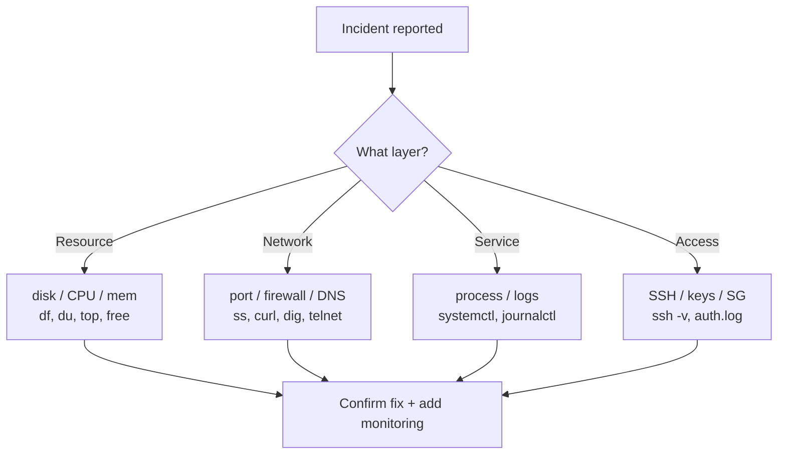

# Linux Interview Scenarios & Troubleshooting - DevOps Deep Dive

> Real-world Linux + AWS EC2 troubleshooting scenarios with the exact commands, flags, the **system thinking** behind each step, and the debugging order. Built for SRE/DevOps interviews and on-call muscle memory.

See also: [Linux Commands Cheatsheet](Linux%20Commands%20Cheatsheet.md) · [AWS EC2](AWS%20EC2.md) · [Bash Scripting](Bash%20Scripting.md)

---

## Table of Contents

- [1. 10 Commands I Use Day to Day](#1-10-commands-i-use-day-to-day)
- [2. Can You Restore a Lost PEM File? If Not, How Do You Access the Instance?](#2-can-you-restore-a-lost-pem-file-if-not-how-do-you-access-the-instance)
- [3. /var Is Almost 90% Full - Next Steps](#3-var-is-almost-90-full---next-steps)
- [4. Server Slow Due to High CPU - How to Fix](#4-server-slow-due-to-high-cpu---how-to-fix)
- [5. Nginx App Returns Connection Refused - How to Fix](#5-nginx-app-returns-connection-refused---how-to-fix)
- [6. SSH Stopped Working - How to Troubleshoot](#6-ssh-stopped-working---how-to-troubleshoot)
- [7. Find and List Log Files Older Than 7 Days in /var/log](#7-find-and-list-log-files-older-than-7-days-in-varlog)
- [8. Find and Remove Log Files Older Than 30 Days](#8-find-and-remove-log-files-older-than-30-days)
- [9. Cronjob + Shell Script for Advanced Log Rotation](#9-cronjob--shell-script-for-advanced-log-rotation)
- [10. Bulk Creation of Linux Users From a CSV File](#10-bulk-creation-of-linux-users-from-a-csv-file)
- [11. Service Health Monitor Script in Bash](#11-service-health-monitor-script-in-bash)
- [12. Find and Delete Files Over 100MB](#12-find-and-delete-files-over-100mb)
- [13. List Users Who Logged In Today (Packages Deleted Scenario)](#13-list-users-who-logged-in-today-packages-deleted-scenario)
- [14. Website Doesn't Load - How to Investigate](#14-website-doesnt-load---how-to-investigate)
- [15. Using sed to Remove the First and Last Line of a File](#15-using-sed-to-remove-the-first-and-last-line-of-a-file)
- [16. Different Types of Variables in Linux](#16-different-types-of-variables-in-linux)
- [17. kill vs kill -9 in Linux](#17-kill-vs-kill--9-in-linux)

---



---

## 1. 10 Commands I Use Day to Day

These are the commands that come up in almost every shift, with the flags that actually matter.

| #   | Command         | Daily use                 | Key flags                                                                                         |
| :-- | :-------------- | :------------------------ | :------------------------------------------------------------------------------------------------ |
| 1   | `ls`            | List/inspect files        | `-l` long, `-a` hidden, `-h` human sizes, `-t` sort by mtime, `-S` sort by size                   |
| 2   | `grep`          | Search inside files/logs  | `-i` ignore case, `-r` recursive, `-n` line numbers, `-v` invert, `-E` extended regex, `-c` count |
| 3   | `find`          | Locate files by attribute | `-name`, `-type f/d`, `-mtime`, `-size`, `-exec`, `-delete`                                       |
| 4   | `tail` / `head` | Watch / peek logs         | `tail -f` follow, `-n N` lines, `-F` follow + reopen on rotate                                    |
| 5   | `df`            | Disk usage by filesystem  | `-h` human, `-i` inodes, `-T` fs type                                                             |
| 6   | `du`            | Disk usage by directory   | `-sh` summary+human, `-a` all files, `--max-depth=1`                                              |
| 7   | `top` / `htop`  | Live CPU/mem/process view | `top -o %CPU`, press `M` mem, `P` cpu, `1` per-core                                               |
| 8   | `ps`            | Snapshot of processes     | `aux`, `-ef`, `--sort=-%cpu`, `-o pid,ppid,cmd`                                                   |
| 9   | `systemctl`     | Manage services (systemd) | `status`, `start/stop/restart`, `enable`, `is-active`                                             |
| 10  | `journalctl`    | Read systemd logs         | `-u svc`, `-f` follow, `--since`, `-p err`, `-b` this boot                                        |

**Honourable mentions I reach for constantly:** `ss -tulpn` (sockets/ports), `curl -I` (HTTP headers), `chmod`/`chown`, `awk`/`sed`, `scp`/`rsync`, `free -h`, `vmstat`, `dig`/`nslookup`, `tar`.

**System thinking:** I group commands by what question they answer - _"is it full?"_ (`df`/`du`), _"what's hot?"_ (`top`/`ps`), _"is it listening?"_ (`ss`/`curl`), _"why did it die?"_ (`journalctl`/`tail`). Interviewers want to see that you map a symptom to the right diagnostic, not that you memorised a list.

[⬆ Back to top](#table-of-contents)

---

## 2. Can You Restore a Lost PEM File? If Not, How Do You Access the Instance?

**Short answer: No.** AWS only stores the **public** key (it's injected into `~/.ssh/authorized_keys` on first boot via cloud-init). The **private** key (`.pem`) is shown to you **once** at key-pair creation and never stored by AWS. If you lose it, it cannot be regenerated or downloaded again.

So the question becomes: **how do I regain access to a running instance whose private key is gone?**

### Option A - EC2 Instance Connect (fastest, no key needed)

For supported AMIs (Amazon Linux 2/2023, Ubuntu 16.04+) the EC2 Instance Connect agent lets the console push a **temporary** SSH key for 60 seconds.

```bash
# From CLI - pushes a one-time public key, then connects
aws ec2-instance-connect send-ssh-public-key \
  --instance-id i-0abc123 \
  --instance-os-user ec2-user \
  --ssh-public-key file://my_new_key.pub
```

Or just click **Connect → EC2 Instance Connect** in the console. Requirements: instance has a public IP, Security Group allows port 22 from AWS IP range (or 0.0.0.0/0 temporarily), and the agent is installed.

### Option B - SSM Session Manager (best practice, no port 22 at all)

If the SSM agent is running and the instance has an IAM role with `AmazonSSMManagedInstanceCore`:

```bash
aws ssm start-session --target i-0abc123
```

No SSH key, no open inbound port, fully logged in CloudTrail. This is the **preferred** modern answer in interviews.

### Option C - Replace the key via a new key pair + user data / rescue

The classic "stop, detach, fix, reattach" recovery when A and B aren't available:

1. **Create a new key pair** and download the new `.pem`.

   ```bash
   aws ec2 create-key-pair --key-name newkey \
     --query 'KeyMaterial' --output text > newkey.pem
   chmod 400 newkey.pem
   ```

2. **Stop** the instance (note: stopping an instance-store-backed instance loses data - only do this on EBS-backed).
3. **Detach the root EBS volume** and attach it to a temporary "rescue" instance (one you _can_ log into) as a secondary volume.
4. Mount it and edit `authorized_keys`:

   ```bash
   sudo mount /dev/xvdf1 /mnt
   sudo vi /mnt/home/ec2-user/.ssh/authorized_keys   # paste new public key
   sudo umount /mnt
   ```

5. **Re-attach** the volume to the original instance as `/dev/xvda` and **start** it. SSH with the new key.

### Option D - User data injection on next boot

Stop the instance, edit **User data** to append your new public key, start it (user data scripts run on boot for some configs):

```bash
#!/bin/bash
echo "ssh-rsa AAAA...new_public_key user" >> /home/ec2-user/.ssh/authorized_keys
```

**System thinking:** The whole problem exists because AWS never had your private key. So recovery = _get a public key you control onto the box_ by any out-of-band channel (Instance Connect, SSM, mounting the disk, user data). **Prevention:** use SSM Session Manager so you never depend on `.pem` files; tag and back up key pairs; use IAM-based access.

[⬆ Back to top](#table-of-contents)

---

## 3. /var Is Almost 90% Full - Next Steps

`/var` fills up from logs, package caches, Docker layers, mail spools, and core dumps. **Don't blindly delete** - find the culprit first.

### Step 1 - Confirm it's really disk, not inodes

```bash
df -h /var        # blocks used
df -i /var        # inodes used - "No space left" with df -h showing free = inode exhaustion
```

### Step 2 - Find the big directories (the command in the prompt)

```bash
cd /var
sudo du -sh *                 # summarise each top-level dir, human-readable
sudo du -sh * | sort -rh | head    # biggest first
sudo du -ah /var | sort -rh | head -20   # drill down to individual files
```

- `-s` summary (one line per arg, not every subfile)
- `-h` human-readable (K/M/G)
- `-a` include files (for the drill-down)
- `sort -rh` reverse + human-numeric sort

Usual suspects: `/var/log`, `/var/lib/docker`, `/var/cache`, `/var/lib/mysql`, `/var/spool`.

### Step 3 - Fix by cause

```bash
# Logs - truncate without deleting the file handle (safe while service runs)
sudo truncate -s 0 /var/log/huge.log
sudo journalctl --vacuum-size=200M     # cap systemd journal
sudo journalctl --vacuum-time=7d

# Package cache
sudo apt clean        # Debian/Ubuntu
sudo yum clean all    # RHEL/CentOS

# Docker bloat
docker system df            # see what's using space
docker system prune -af --volumes
```

### Step 4 - Catch the deleted-but-held file trap

If `du` reports far less than `df`, a process is holding a **deleted** file open (space not reclaimed until the fd closes):

```bash
sudo lsof +L1 | grep /var      # files with link count 0 still open
# Fix: restart the offending process, don't just rm
```

**System thinking:** disk-full triage = _(1) blocks or inodes? (2) which dir? (3) which file? (4) is the space actually reclaimable or held open?_ Never `rm` a live log - `truncate -s 0` or restart the writer. Then add logrotate + monitoring (see [9. Cronjob + Shell Script for Advanced Log Rotation](#9-cronjob--shell-script-for-advanced-log-rotation)) so it doesn't recur.

[⬆ Back to top](#table-of-contents)

---

## 4. Server Slow Due to High CPU - How to Fix

### Step 1 - Identify the hog

```bash
top                       # then press P (sort CPU), 1 (per-core), M (mem)
top -b -n1 -o %CPU | head -20    # batch snapshot for scripting/logging
ps -eo pid,ppid,user,%cpu,%mem,cmd --sort=-%cpu | head
htop                      # nicer interactive view
uptime                    # load avg 1/5/15 min - compare against core count
```

Load average > number of CPU cores = saturation. Check cores with `nproc`.

### Step 2 - Understand _why_ it's high

```bash
vmstat 1 5      # 'us'=user, 'sy'=system, 'wa'=IO-wait, 'r'=run queue
mpstat -P ALL 1 # per-core breakdown
pidstat 1       # per-process CPU over time
```

High `wa` (iowait) means it's **disk**, not CPU-bound. High `sy` means kernel/syscalls. High `us` means application code.

### Step 3 - De-prioritise or kill

```bash
# Lower priority of a running process (nice value -20 highest..19 lowest priority)
renice +10 -p 12345           # be NICER (less CPU) - needs no root to raise niceness
sudo renice -5 -p 12345       # raise priority - needs root

# Start a new process already de-prioritised
nice -n 15 ./batch_job.sh

# Kill if runaway
kill 12345                    # SIGTERM - graceful
kill -9 12345                 # SIGKILL - force (last resort, see section 17)
pkill -f "stuck_script"       # by name/pattern
```

### Step 4 - Other levers

- **CPU affinity:** pin a process to specific cores - `taskset -cp 0,1 12345`.
- **cgroups / systemd limits:** `systemctl set-property svc.service CPUQuota=50%` to cap a service.
- **Scale out / up:** if it's legitimately busy load, add instances behind a load balancer or resize the EC2 type (vertical).
- **Find the root cause:** runaway cron job, a fork bomb, an infinite loop, a missing index causing CPU-heavy queries, or a stuck `<defunct>` parent.

**System thinking:** _measure → attribute → mitigate → prevent._ `nice`/`renice` change scheduling priority (don't free CPU, just yield it); `kill` removes the load. But the real fix is usually upstream - bad code, no autoscaling, or a job that should be rate-limited. Add alerting on load average so you're paged before users complain.

[⬆ Back to top](#table-of-contents)

---

## 5. Nginx App Returns Connection Refused - How to Fix

"Connection refused" specifically means a TCP SYN reached the host but **nothing is listening on that port** (or a firewall sent an RST). It is _not_ a timeout (that's a firewall dropping packets) and _not_ a 5xx (that's the app erroring).

### Step 1 - Is Nginx even running?

```bash
sudo systemctl status nginx
sudo systemctl start nginx
journalctl -u nginx --no-pager -n 50    # why it failed to start
```

### Step 2 - Is it listening on the expected port?

```bash
sudo ss -tulpn | grep nginx      # or grep ':80' / ':443'
sudo netstat -tulpn | grep 80
```

If nothing is listening → config/start problem. If listening on `127.0.0.1:80` only → it's bound to localhost, not `0.0.0.0`, so external clients are refused.

### Step 3 - Validate config (a bad config blocks restart)

```bash
sudo nginx -t                    # test config syntax
sudo nginx -s reload             # apply if OK
```

### Step 4 - Check the firewall / Security Group

```bash
sudo ufw status                  # Ubuntu firewall
sudo iptables -L -n              # raw rules
sudo firewall-cmd --list-all     # RHEL firewalld
```

On AWS: confirm the **Security Group** allows inbound 80/443, and the **NACL** isn't blocking. SELinux can also block ports: `sudo semanage port -l | grep http`.

### Step 5 - Is the upstream/backend up?

If Nginx is a reverse proxy and the app (e.g. on `:3000`) is down, you'd see `502 Bad Gateway`, not "refused" - but verify:

```bash
curl -I http://localhost:80
curl -I http://localhost:3000     # backend directly
tail -f /var/log/nginx/error.log
```

**System thinking:** "Connection refused" = listener problem, so walk the path _client → SG/NACL → host firewall → is the process up → is it bound to the right interface/port → is the backend up_. Each step narrows the layer. The most common real causes: Nginx crashed on a bad config, bound to `127.0.0.1` instead of `0.0.0.0`, or the Security Group port isn't open.

[⬆ Back to top](#table-of-contents)

---

## 6. SSH Stopped Working - How to Troubleshoot

### Step 1 - Get verbose client output first

```bash
ssh -v ec2-user@<ip>      # -vvv for max verbosity
```

The `-v` output tells you _which stage_ fails: TCP connect, key exchange, or authentication. That alone usually localises the problem.

### Layer-by-layer checklist

| Symptom in `ssh -v`                | Likely cause                   | Check / Fix                                                          |
| :--------------------------------- | :----------------------------- | :------------------------------------------------------------------- |
| `Connection timed out`             | Network/firewall drops packets | Security Group inbound 22, NACL, route table, instance has public IP |
| `Connection refused`               | sshd not running or wrong port | Instance Connect/SSM in, then `systemctl status sshd`                |
| `Permission denied (publickey)`    | Wrong key / wrong user / perms | Right `.pem`, right user (`ec2-user`/`ubuntu`), `chmod 400 key.pem`  |
| `Too many authentication failures` | Agent offering many keys       | `ssh -i key.pem -o IdentitiesOnly=yes`                               |
| Hangs after banner                 | Disk full / DNS / PAM          | Check `/var` full, `UseDNS no`                                       |

### Common root causes & fixes

```bash
# Local key permissions too open (SSH refuses to use them)
chmod 400 ~/.ssh/my-key.pem

# Right username per AMI
#   Amazon Linux -> ec2-user, Ubuntu -> ubuntu, CentOS -> centos, Debian -> admin

# On the box (via SSM/Instance Connect if SSH is dead):
sudo systemctl status sshd
sudo systemctl restart sshd
sudo journalctl -u sshd -n 50
sudo tail -f /var/log/auth.log        # Debian   (/var/log/secure on RHEL)

# Disk full breaks SSH login (can't write to /var, ~/.ssh)
df -h

# Broken authorized_keys perms
ls -ld ~ ~/.ssh; ls -l ~/.ssh/authorized_keys
chmod 700 ~/.ssh; chmod 600 ~/.ssh/authorized_keys
```

### AWS-specific

- **Security Group**: inbound TCP 22 from your IP.
- **Disk full** is a classic - `/` or `/var` at 100% blocks login; recover via SSM and clean up.
- If totally locked out, use **EC2 Instance Connect**, **SSM Session Manager**, or the **EC2 Serial Console**, or mount the volume on a rescue instance (see [2. Can You Restore a Lost PEM File? If Not, How Do You Access the Instance?](#2-can-you-restore-a-lost-pem-file-if-not-how-do-you-access-the-instance)).

**System thinking:** SSH failure is a stack - _network reachability → port open → sshd alive → authentication → post-auth (disk/PAM)_. `ssh -v` tells you which layer broke so you stop guessing. Always keep an out-of-band path (SSM) so a broken sshd doesn't mean a rebuild.

[⬆ Back to top](#table-of-contents)

---

## 7. Find and List Log Files Older Than 7 Days in /var/log

```bash
find /var/log -type f -name "*.log" -mtime +7
```

- `-type f` - files only (not directories)
- `-name "*.log"` - only log files (drop this to match all)
- `-mtime +7` - **modification** time more than 7×24h ago. `+7` = strictly older than 7 days; `7` = exactly the 7th day; `-7` = within the last 7 days.

Make it readable with details:

```bash
find /var/log -type f -mtime +7 -exec ls -lh {} \;
# or, faster (one ls invocation):
find /var/log -type f -mtime +7 -ls
find /var/log -type f -mtime +7 -printf "%TY-%Tm-%Td  %s bytes  %p\n"
```

**Note on time flags:** `-mtime` = content modified, `-atime` = last accessed, `-ctime` = inode/metadata changed. Use `-mmin +N` for minutes. For "newer than a reference file" use `-newer file`.

[⬆ Back to top](#table-of-contents)

---

## 8. Find and Remove Log Files Older Than 30 Days

**Always dry-run first** (list before you delete):

```bash
# 1. Preview
find /path/to/logs -type f -name "*.log" -mtime +30

# 2. Delete - two equivalent ways
find /path/to/logs -type f -name "*.log" -mtime +30 -delete
find /path/to/logs -type f -name "*.log" -mtime +30 -exec rm -f {} \;
# Faster for many files (batches args):
find /path/to/logs -type f -name "*.log" -mtime +30 -exec rm -f {} +
find /path/to/logs -type f -name "*.log" -mtime +30 -print0 | xargs -0 rm -f
```

**Flag notes & gotchas:**

- `-delete` is built into `find` (no `rm` fork) but **must come after** the filters, and `find` evaluates left-to-right - putting `-delete` early can wipe more than intended.
- `-exec rm {} +` is faster than `\;` because it passes many files per `rm` call.
- `-print0 | xargs -0` is safe for filenames with spaces/newlines.
- Add `-mindepth 1` to protect the top directory, and consider `-name "*.log"` so you don't nuke non-log files.

**System thinking:** destructive `find` = _preview with the same predicates, then swap the action_. Scope tightly (`-type f`, `-name`, a specific path) so the delete can't escape its intended target. For recurring cleanup, move this into logrotate or a cron job rather than running it by hand.

[⬆ Back to top](#table-of-contents)

---

## 9. Cronjob + Shell Script for Advanced Log Rotation

**Scenario:** An app writes to `/var/app/logs/app.log` with no built-in rotation. Requirement: nightly, compress yesterday's log, keep 14 days, delete older, and don't break the running app's open file handle.

### The script - `/usr/local/bin/rotate_app_logs.sh`

```bash
#!/usr/bin/env bash
set -euo pipefail

LOG_DIR="/var/app/logs"
LOG_FILE="$LOG_DIR/app.log"
ARCHIVE_DIR="$LOG_DIR/archive"
RETENTION_DAYS=14
TIMESTAMP="$(date +%F)"          # e.g. 2026-06-11

mkdir -p "$ARCHIVE_DIR"

# 1. Nothing to do if log is missing or empty
[-s "$LOG_FILE"](-s%20%22%24LOG_FILE%22.md) || { echo "No log to rotate"; exit 0; }

# 2. Copy then TRUNCATE (not move) so the app's open fd keeps writing
cp "$LOG_FILE" "$ARCHIVE_DIR/app-$TIMESTAMP.log"
truncate -s 0 "$LOG_FILE"        # in-place empty - app never loses its handle

# 3. Compress the archived copy
gzip -f "$ARCHIVE_DIR/app-$TIMESTAMP.log"

# 4. Enforce retention - delete archives older than N days
find "$ARCHIVE_DIR" -type f -name "app-*.log.gz" -mtime +"$RETENTION_DAYS" -delete

# 5. (If the app holds the fd and you must signal it to reopen instead of truncate)
# systemctl reload app  ||  kill -USR1 "$(cat /var/run/app.pid)"

echo "Rotated $LOG_FILE -> app-$TIMESTAMP.log.gz at $(date)"
```

Why **`truncate -s 0`** and not `mv`? If you `mv` the live log, the app keeps writing to the **old inode** (now the moved file) and the new `app.log` never gets data until the app reopens. Copy-then-truncate (or `mv` + signal the app to reopen, the `copytruncate`/`postrotate` pattern) keeps logging unbroken.

### Schedule it with cron

```bash
sudo chmod +x /usr/local/bin/rotate_app_logs.sh
crontab -e
```

```cron
# ┌─ min ┌─ hour ┌─ day ┌─ month ┌─ weekday
  30      0       *      *        *   /usr/local/bin/rotate_app_logs.sh >> /var/log/logrotate-app.log 2>&1
```

Runs every day at **00:30**. Redirect both stdout+stderr to a log so cron failures are visible (cron is silent otherwise - or emails root).

### Production alternative - let `logrotate` do it

For real systems, prefer the built-in tool - `/etc/logrotate.d/app`:

```
/var/app/logs/app.log {
    daily
    rotate 14
    compress
    delaycompress
    missingok
    notifempty
    copytruncate          # same safe trick as above
}
```

`logrotate` already runs via `/etc/cron.daily/logrotate`. Roll your own script only when you need logic logrotate can't express.

**System thinking:** log rotation has three hard parts - _don't break the writer's fd_ (copytruncate or signal-to-reopen), _enforce retention_ (`find -mtime -delete`), and _make it observable_ (cron output to a log). Reach for `logrotate` first; hand-rolled scripts are for special cases.

[⬆ Back to top](#table-of-contents)

---

## 10. Bulk Creation of Linux Users From a CSV File

**Input** `users.csv` (format: `username,group,shell`):

```csv
alice,developers,/bin/bash
bob,developers,/bin/bash
carol,admins,/bin/zsh
```

### The script - `bulk_users.sh`

```bash
#!/usr/bin/env bash
set -euo pipefail

CSV="${1:-users.csv}"
[-f "$CSV"](-f%20%22%24CSV%22.md) || { echo "CSV not found: $CSV"; exit 1; }
[$EUID -eq 0](%24EUID%20-eq%200.md) || { echo "Run as root"; exit 1; }

while IFS=',' read -r username group shell; do
    # Skip blank lines and header
    [| "$username" == "username"](-z%20%22%24username%22.md) && continue

    # Create group if missing
    getent group "$group" >/dev/null || groupadd "$group"

    # Skip if user already exists (idempotent)
    if id "$username" &>/dev/null; then
        echo "SKIP: $username already exists"
        continue
    fi

    # Create user with home dir, group, and shell
    useradd -m -g "$group" -s "$shell" "$username"

    # Set a random temp password and force change on first login
    password="$(openssl rand -base64 12)"
    echo "$username:$password" | chpasswd
    chage -d 0 "$username"        # expire now -> must reset at first login

    echo "CREATED: $username (group=$group) temp_pw=$password"
done < "$CSV"
```

**Flags explained:**

- `IFS=','` - split each line on commas into `$username $group $shell`.
- `read -r` - raw read (don't mangle backslashes).
- `useradd -m` - create home dir, `-g` primary group, `-s` login shell.
- `getent group` - check existence without erroring.
- `chpasswd` - set password from `user:pass` on stdin (scriptable).
- `chage -d 0` - set last-change date to epoch so the user **must** change the password at first login.
- `id "$user" &>/dev/null` - idempotency guard so re-running is safe.

Run: `sudo ./bulk_users.sh users.csv`. Capture the printed temp passwords securely and distribute out-of-band (better: use SSH keys instead of passwords).

**System thinking:** bulk provisioning must be **idempotent** (safe to re-run), **secure** (random pw + forced reset, or keys), and **observable** (print what it did). Parsing CSV with `IFS` + `while read` is the canonical Bash pattern.

[⬆ Back to top](#table-of-contents)

---

## 11. Service Health Monitor Script in Bash

**Goal:** check a service is running and its port responds; restart + alert if not. Suitable for cron every minute or a systemd timer.

```bash
#!/usr/bin/env bash
set -uo pipefail

SERVICE="nginx"
PORT=80
URL="http://localhost:${PORT}/health"
LOG="/var/log/health-monitor.log"
MAX_RESTARTS=3

log() { echo "$(date '+%F %T') $*" >> "$LOG"; }

# 1. Is the systemd unit active?
if ! systemctl is-active --quiet "$SERVICE"; then
    log "DOWN: $SERVICE not active - attempting restart"
    systemctl restart "$SERVICE" && log "RESTARTED $SERVICE" || log "RESTART FAILED"
fi

# 2. Is the port accepting connections?
if ! ss -tulpn | grep -q ":${PORT}\b"; then
    log "WARN: nothing listening on port $PORT"
fi

# 3. Does the HTTP health endpoint return 2xx?
code="$(curl -s -o /dev/null -w '%{http_code}' --max-time 5 "$URL" || echo 000)"
if [| "$code" -ge 400](%22%24code%22%20-lt%20200.md); then
    log "UNHEALTHY: $URL returned $code - restarting $SERVICE"
    systemctl restart "$SERVICE"
    # Optional alert (Slack webhook / email / SNS)
    # curl -s -X POST -d "{\"text\":\"$SERVICE unhealthy ($code)\"}" "$SLACK_WEBHOOK"
else
    log "OK: $SERVICE healthy ($code)"
fi
```

**Flags explained:**

- `systemctl is-active --quiet` - exit code 0 if active, no output (perfect for `if`).
- `ss -tulpn` - `-t` tcp, `-u` udp, `-l` listening, `-p` process, `-n` numeric.
- `curl -s -o /dev/null -w '%{http_code}'` - silent, discard body, print just the HTTP status; `--max-time 5` prevents hangs.

Schedule (cron): `* * * * * /usr/local/bin/health_monitor.sh`

**Better-than-cron option:** a **systemd service with `Restart=on-failure`** plus a **systemd timer** for the health probe, or use the built-in `WatchdogSec=`. Cron is fine for simple shops; systemd/Prometheus blackbox-exporter for production.

**System thinking:** real health = _process up_ **and** _port listening_ **and** _app responds_. Checking only `systemctl status` misses a hung process that's "running" but not serving. Always log + alert, and bound restart attempts so you don't crash-loop silently.

[⬆ Back to top](#table-of-contents)

---

## 12. Find and Delete Files Over 100MB

```bash
# 1. Find and list (preview), biggest first
find / -type f -size +100M -exec ls -lh {} \; 2>/dev/null | sort -k5 -rh
find /path -type f -size +100M -printf "%s\t%p\n" | sort -rn   # bytes, sortable

# 2. Delete after reviewing
find /path -type f -size +100M -exec rm -f {} +
find /path -type f -size +100M -print0 | xargs -0 rm -f
```

**Flag notes:**

- `-size +100M` - larger than 100 MiB. Units: `c`=bytes, `k`=KiB, `M`=MiB, `G`=GiB. `+` = greater than, `-` = less than, none = exactly.
- `2>/dev/null` - suppress "Permission denied" noise when scanning `/`.
- Always **list before deleting** - large files are often databases, backups, or VM images you don't want gone.

**System thinking:** size-based deletion is dangerous because big ≠ junk. Scope the path tightly, preview, and confirm what each file is (`file <name>`, check it's not a live DB/`lsof`) before removing.

[⬆ Back to top](#table-of-contents)

---

## 13. List Users Who Logged In Today (Packages Deleted Scenario)

### Normal answer

```bash
who                 # users currently logged in
w                   # logged-in users + what they're doing + load
last                # login history from /var/log/wtmp (most recent first)
last -s today       # logins since start of today
last | grep "$(date '+%b %e')"   # filter today's date
lastlog             # last login time per account
```

### The twist - "some packages were deleted"

If `who`, `w`, `last`, or `lastlog` are **missing** (the `coreutils`/`util-linux`/`procps` packages got removed), fall back to the raw data sources they read:

```bash
# last/who read these binary logs:
#   /var/log/wtmp  (logins/logouts), /var/log/btmp (failed), /run/utmp (current)

# Parse auth logs directly (text - always there):
grep "$(date '+%b %e')" /var/log/auth.log | grep -i "accepted"   # Debian/Ubuntu
grep "$(date '+%b %e')" /var/log/secure   | grep -i "accepted"   # RHEL/CentOS

# Or via journald (systemd) - independent of those packages:
journalctl _COMM=sshd --since today | grep -i accepted
journalctl --since today | grep -i "session opened"

# Reinstall the missing tools if you can:
sudo apt-get install --reinstall coreutils util-linux   # Debian
sudo yum reinstall  coreutils util-linux                # RHEL
```

**System thinking:** commands are just readers over underlying data (`/var/log/wtmp`, `auth.log`, journald). If a tool is gone, go to its **data source**. `who`/`w`/`last` → utmp/wtmp; `journalctl` and `auth.log` are the resilient fallbacks because sshd writes auth events there regardless of which user-space tools are installed.

[⬆ Back to top](#table-of-contents)

---

## 14. Website Doesn't Load - How to Investigate

Walk the request path **outside-in**, layer by layer. "Doesn't load" is vague - first pin down _which_ failure: DNS? connection? TLS? slow? 4xx/5xx?

### Layer 1 - DNS

```bash
dig example.com +short        # does it resolve? to the right IP?
nslookup example.com
dig example.com @8.8.8.8       # rule out local resolver issues
```

### Layer 2 - Network reachability

```bash
ping example.com              # ICMP (may be blocked, not conclusive)
curl -v https://example.com   # the single most useful command - shows DNS, TCP, TLS, headers
traceroute example.com        # where packets die
telnet example.com 443        # is the port open end-to-end?
nc -zv example.com 443        # same, scriptable
```

### Layer 3 - TLS

```bash
curl -vI https://example.com               # cert + handshake details
openssl s_client -connect example.com:443  # expiry, chain, SNI issues
```

Expired/mismatched/self-signed certs are a very common "won't load."

### Layer 4 - The server itself (if you have access)

```bash
sudo systemctl status nginx          # web server up?
sudo ss -tulpn | grep -E ':80|:443'  # listening?
sudo nginx -t                        # config valid?
curl -I http://localhost             # does it serve locally? (isolates network vs app)
tail -f /var/log/nginx/{access,error}.log
df -h; free -h; uptime               # disk full / OOM / overloaded?
```

### Layer 5 - Application / backend

```bash
curl -I http://localhost:3000        # backend directly (bypass proxy)
journalctl -u myapp -n 100           # app logs / stack traces
# DB reachable? credentials? upstream API down?
```

### Interpreting what you see

| Symptom              | Layer     | Likely cause                                 |
| :------------------- | :-------- | :------------------------------------------- |
| Doesn't resolve      | DNS       | Bad/missing record, expired domain, resolver |
| Connection timed out | Network   | Firewall/SG dropping, host down, wrong route |
| Connection refused   | Host      | Web server not running / not listening       |
| TLS error            | TLS       | Expired/mismatched cert, protocol mismatch   |
| 502/504              | App/proxy | Backend down/slow, upstream timeout          |
| 500                  | App       | Application bug, check app logs              |
| Slow                 | Any       | High load, slow DB query, large payload      |

**System thinking:** _DNS → TCP → TLS → web server → app → DB._ Test each hop and the first failing layer is your fix target. `curl -v` collapses the first four layers into one output, so it's almost always my first command. Then `curl localhost` on the box splits "is it the network or the app?"

[⬆ Back to top](#table-of-contents)

---

## 15. Using sed to Remove the First and Last Line of a File

```bash
sed '1d;$d' file.txt
```

- `1d` - delete line **1** (first)
- `$d` - delete the **last** line (`$` = last line address)
- `;` - chain both commands

This prints to stdout. To edit in place:

```bash
sed -i '1d;$d' file.txt           # GNU sed, modifies file directly
sed -i.bak '1d;$d' file.txt       # keep a .bak backup (also required syntax on macOS/BSD)
```

**Variations:**

```bash
sed '1d'  file        # remove only the first line
sed '$d'  file        # remove only the last line
sed '1,3d' file       # remove first three lines
sed -i '1d;$d' file   # in place
```

Equivalent with other tools: `tail -n +2 file | head -n -1` (GNU `head -n -1` = all but last).

**System thinking:** `sed` addresses lines by number or symbol (`$`=last, `1`=first), and `d` deletes. Chaining with `;` applies multiple edits in one pass. Always test without `-i` first; `-i` is irreversible, so use `-i.bak` when unsure.

[⬆ Back to top](#table-of-contents)

---

## 16. Different Types of Variables in Linux

### By scope / visibility

| Type                        | Set how                 | Visible to child processes?     | Example                     |
| :-------------------------- | :---------------------- | :------------------------------ | :-------------------------- |
| **Local (shell) variable**  | `name=value`            | **No** - only the current shell | `x=5`                       |
| **Environment variable**    | `export name=value`     | **Yes** - inherited by children | `export PATH=...`           |
| **Shell/internal variable** | Set by the shell itself | Shell-only                      | `PS1`, `PWD`, `HOME`, `UID` |

```bash
greeting="hello"          # local - dies with this shell, not seen by scripts you run
export greeting           # promote to environment - now child processes see it
env | grep greeting       # list environment variables
set                       # list ALL variables (local + env + functions)
unset greeting            # remove it
```

### Special / automatic variables (inside scripts)

| Variable    | Meaning                                         |
| :---------- | :---------------------------------------------- |
| `$0`        | Script name                                     |
| `$1 $2 …`   | Positional arguments                            |
| `$#`        | Number of arguments                             |
| `$@` / `$*` | All arguments (`"$@"` = each quoted separately) |
| `$?`        | Exit status of last command (0 = success)       |
| `$$`        | PID of current shell                            |
| `$!`        | PID of last background process                  |
| `$_`        | Last argument of previous command               |

### System/environment classics

`PATH`, `HOME`, `USER`, `SHELL`, `PWD`, `LANG`, `TERM`, `HOSTNAME`, `PS1`.

### Persistence

- **Session-only:** set in the terminal - gone on logout.
- **Per-user persistent:** add `export VAR=...` to `~/.bashrc` / `~/.bash_profile` / `~/.profile`.
- **System-wide:** `/etc/environment` or `/etc/profile.d/*.sh`.

**System thinking:** the key distinction interviewers probe is **local vs environment** - a plain assignment stays in the current shell; `export` pushes it into the environment so child processes (your scripts, programs) inherit it. That's _why_ a variable set in your shell "disappears" inside a script you launch unless exported.

[⬆ Back to top](#table-of-contents)

---

## 17. kill vs kill -9 in Linux

`kill` sends a **signal** to a process. By default it sends `SIGTERM (15)`; `kill -9` sends `SIGKILL (9)`.

|                 | `kill` / `kill -15` (SIGTERM)                            | `kill -9` (SIGKILL)                                |
| :-------------- | :------------------------------------------------------- | :------------------------------------------------- |
| **Signal**      | 15 - terminate                                           | 9 - kill                                           |
| **Catchable?**  | **Yes** - process can trap it                            | **No** - kernel kills it directly                  |
| **Graceful?**   | Yes - lets it flush buffers, close files, finish cleanup | No - instant, no cleanup                           |
| **Risk**        | Process may ignore/delay                                 | Data corruption, orphaned locks, leaked temp files |
| **When to use** | **Default / first choice**                               | Only when SIGTERM is ignored                       |

```bash
kill 1234           # SIGTERM (15) - polite, ask it to shut down
kill -15 1234       # explicit SIGTERM
kill -9 1234        # SIGKILL - force, cannot be blocked
kill -l             # list all signals
kill -SIGHUP 1234   # -1 / SIGHUP - often "reload config"
pkill -f pattern    # by name/command pattern
killall nginx       # all processes by exact name
```

**Why prefer plain `kill` first:** SIGTERM gives the app a chance to _gracefully_ close DB connections, flush writes, remove PID/lock files, and let children exit. `SIGKILL` is removed by the kernel with **no chance to clean up**, which can corrupt data or leave stale locks.

**When `kill -9` is justified:** the process is hung, ignoring SIGTERM, or in an uninterruptible state. Note: a process stuck in **`D` (uninterruptible sleep)** - usually blocked on I/O - **cannot be killed even with -9** until the I/O completes; that's a kernel/storage issue, not a signal problem.

**System thinking:** escalate gently - `kill` (SIGTERM) → wait a few seconds → `kill -9` only if it won't die. `-9` is a sledgehammer that skips the app's shutdown handlers; reaching for it first is a habit that causes data-loss incidents.

[⬆ Back to top](#table-of-contents)

---

> **Interview meta-tip:** for every scenario the panel is really testing the _order of reasoning_ - measure before you mutate, scope before you delete, identify the layer before you fix it, and always mention prevention (monitoring, automation, least-privilege access). The exact flags matter, but the **system thinking** is what gets you hired.
