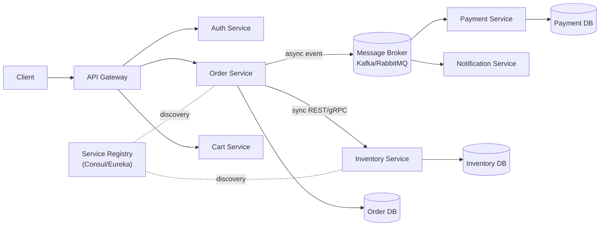

# Microservices Interview Questions - Architecture & Scenario Deep Dive

> The questions interviewers actually ask about microservices - core architecture concepts **and** the messy real-world scenarios (failures, data consistency, deployments). Each answer gives the reasoning, the trade-off, and the pattern name so you can speak like an architect, not recite definitions.

See also: [Kubernetes](Kubernetes.md) · [System Design](System%20Design.md) · [Linux Interview Scenarios & Troubleshooting](Linux%20Interview%20Scenarios%20%26%20Troubleshooting.md)

---

## Table of Contents

**Part A - Architecture & Concepts**

- [1. What Are Microservices? Why Use Them Over a Monolith?](#1-what-are-microservices-why-use-them-over-a-monolith)
- [2. Monolith vs Microservices - When NOT to Use Microservices](#2-monolith-vs-microservices---when-not-to-use-microservices)
- [3. How Do Microservices Communicate?](#3-how-do-microservices-communicate)
- [4. Synchronous vs Asynchronous Communication](#4-synchronous-vs-asynchronous-communication)
- [5. What Is an API Gateway? Why Do You Need One?](#5-what-is-an-api-gateway-why-do-you-need-one)
- [6. Service Discovery - How Do Services Find Each Other?](#6-service-discovery---how-do-services-find-each-other)
- [7. How Do You Handle Data? Database per Service](#7-how-do-you-handle-data-database-per-service)
- [8. Distributed Transactions - The Saga Pattern](#8-distributed-transactions---the-saga-pattern)
- [9. CQRS and Event Sourcing](#9-cqrs-and-event-sourcing)
- [10. Resilience Patterns - Circuit Breaker, Retry, Bulkhead, Timeout](#10-resilience-patterns---circuit-breaker-retry-bulkhead-timeout)
- [11. Observability - Logging, Metrics, Tracing](#11-observability---logging-metrics-tracing)
- [12. Config Management & Secrets](#12-config-management--secrets)
- [13. Deployment Strategies - Blue-Green, Canary, Rolling](#13-deployment-strategies---blue-green-canary-rolling)
- [14. Security in Microservices](#14-security-in-microservices)
- [15. Microservices Design Principles & Anti-Patterns](#15-microservices-design-principles--anti-patterns)

**Part B - Scenario-Based Questions**

- [S1. A Downstream Service Is Slow - The Whole System Degrades](#s1-a-downstream-service-is-slow---the-whole-system-degrades)
- [S2. Order Service Saved, Payment Failed - Data Inconsistency](#s2-order-service-saved-payment-failed---data-inconsistency)
- [S3. Duplicate Messages - How Do You Ensure Idempotency?](#s3-duplicate-messages---how-do-you-ensure-idempotency)
- [S4. How Do You Split a Monolith into Microservices?](#s4-how-do-you-split-a-monolith-into-microservices)
- [S5. One Service Needs Another's Data - Do You Call or Duplicate?](#s5-one-service-needs-anothers-data---do-you-call-or-duplicate)
- [S6. A Deployment Broke Production - How Do You Roll Back?](#s6-a-deployment-broke-production---how-do-you-roll-back)
- [S7. Debugging a Request Across 8 Services](#s7-debugging-a-request-across-8-services)
- [S8. Versioning a Breaking API Change Without Downtime](#s8-versioning-a-breaking-api-change-without-downtime)
- [S9. Cascading Failure - One Service Takes Down Everything](#s9-cascading-failure---one-service-takes-down-everything)
- [S10. Handling Traffic Spikes / Black Friday Scaling](#s10-handling-traffic-spikes--black-friday-scaling)

---



---

# Part A - Architecture & Concepts

## 1. What Are Microservices? Why Use Them Over a Monolith?

**Microservices** are an architectural style where an application is built as a suite of **small, independently deployable services**, each owning a single business capability, communicating over the network (HTTP/gRPC/messaging), and each managing its **own data**.

**Why teams adopt them:**

| Driver                        | Benefit                                                          |
| :---------------------------- | :--------------------------------------------------------------- |
| **Independent deployability** | Ship one service without redeploying the whole app               |
| **Independent scaling**       | Scale only the hot service (e.g. checkout), not everything       |
| **Technology heterogeneity**  | Each service can use the best language/DB for its job            |
| **Team autonomy**             | Small teams own services end-to-end ("you build it, you run it") |
| **Fault isolation**           | One service failing shouldn't take the whole system down         |

**The honest trade-off:** you trade _code complexity_ for _operational and distributed-systems complexity_ - network failures, eventual consistency, distributed tracing, more infra. Microservices solve an **organisational/scaling** problem, not a code-quality one.

[⬆ Back to top](#table-of-contents)

---

## 2. Monolith vs Microservices - When NOT to Use Microservices

| Aspect                 | Monolith                                  | Microservices                      |
| :--------------------- | :---------------------------------------- | :--------------------------------- |
| Deployment             | One unit                                  | Many independent units             |
| Scaling                | Whole app                                 | Per service                        |
| Data                   | Shared DB                                 | DB per service                     |
| Communication          | In-process calls                          | Network calls                      |
| Failure blast radius   | Whole app                                 | Isolated (if done right)           |
| Operational complexity | Low                                       | High                               |
| Best for               | Small teams, new products, simple domains | Large orgs, high scale, many teams |

**When NOT to use microservices (a strong senior answer):**

- **Early-stage startup / unclear domain** - you don't yet know the right service boundaries; premature splitting creates a _distributed monolith_.
- **Small team** - you'll spend more time on infra than features.
- **Low scale** - a well-structured monolith ("modular monolith") is simpler and faster.

**Best practice:** start with a **modular monolith**, then extract services along proven seams once boundaries and scaling needs are clear. (Martin Fowler's "MonolithFirst.")

[⬆ Back to top](#table-of-contents)

---

## 3. How Do Microservices Communicate?

Two broad styles:

1. **Synchronous (request/response):** REST over HTTP, **gRPC** (HTTP/2 + protobuf, fast/typed), GraphQL. Caller waits for a reply.
2. **Asynchronous (messaging/events):** a message broker - **Kafka**, **RabbitMQ**, AWS SQS/SNS, NATS. Producer fires an event and doesn't wait.

|          | REST                | gRPC                              | Messaging                  |
| :------- | :------------------ | :-------------------------------- | :------------------------- |
| Coupling | Temporal (both up)  | Temporal                          | Decoupled                  |
| Latency  | Higher              | Low                               | Async                      |
| Use when | Public APIs, simple | Internal service-to-service, perf | Events, fan-out, buffering |

[⬆ Back to top](#table-of-contents)

---

## 4. Synchronous vs Asynchronous Communication

**Synchronous** = caller blocks until callee responds. Simple, immediate consistency, easy to reason about - **but** creates temporal coupling (callee must be up) and risks **cascading failures**.

**Asynchronous** = caller publishes a message/event and moves on; consumers process later. Gives **loose coupling, resilience, buffering, and scalability** - at the cost of **eventual consistency** and harder debugging.

**Rule of thumb:**

- Need an answer _now_ to continue (e.g. "is this item in stock?") → **sync**.
- Fire-and-forget / notify others of something that happened (e.g. "OrderPlaced") → **async events**.
- Prefer async for cross-service workflows to avoid coupling and cascading failures.

[⬆ Back to top](#table-of-contents)

---

## 5. What Is an API Gateway? Why Do You Need One?

An **API Gateway** is the single entry point that sits between clients and the backend services. (e.g. Kong, AWS API Gateway, NGINX, Spring Cloud Gateway.)

**Responsibilities it offloads from every service:**

- **Routing** requests to the right service
- **Authentication / authorization** (validate JWT once at the edge)
- **Rate limiting & throttling**
- **TLS termination**
- **Request aggregation** (combine several service calls into one client response)
- **Caching, logging, metrics, CORS**

**Why you need it:** without it, clients must know every service's address, and every service must re-implement auth, rate limiting, etc. The gateway centralises cross-cutting concerns. **Watch out:** don't put business logic in it (anti-pattern), and don't let it become a single point of failure - run it HA. The **BFF (Backend-for-Frontend)** pattern is a per-client variant (one gateway tailored to web vs mobile).

[⬆ Back to top](#table-of-contents)

---

## 6. Service Discovery - How Do Services Find Each Other?

In dynamic environments, service IPs change constantly (containers restart, autoscale). **Service discovery** lets a service find healthy instances of another by name.

- **Client-side discovery:** client queries a **service registry** (Consul, Eureka, etcd) and load-balances itself.
- **Server-side discovery:** client hits a load balancer / DNS name; the platform resolves it (e.g. **Kubernetes Services** + kube-dns - `http://order-service` resolves to healthy pods).

**Kubernetes answer:** you rarely run Eureka/Consul - K8s `Service` objects + DNS + `kube-proxy` provide discovery and load balancing natively; a service mesh (Istio/Linkerd) adds mTLS, retries, and traffic splitting on top.

[⬆ Back to top](#table-of-contents)

---

## 7. How Do You Handle Data? Database per Service

**Core principle: each service owns its data and its database. No shared database, no cross-service DB access.** A service may only touch another's data via its API/events.

**Why:** a shared DB recreates tight coupling (schema changes break everyone) and destroys independent deployability - it's the #1 microservices anti-pattern.

**Consequences you must handle:**

- **No cross-service JOINs** - you compose data via API calls or keep a local read-replica/projection.
- **No ACID transactions across services** - you need **Sagas** (see next).
- **Data duplication is acceptable** - services keep local copies of the data they need, kept in sync via events (eventual consistency).

[⬆ Back to top](#table-of-contents)

---

## 8. Distributed Transactions - The Saga Pattern

Since you can't use a single ACID transaction across services, a **Saga** models a business transaction as a **sequence of local transactions**, each publishing an event that triggers the next. If a step fails, **compensating transactions** undo the prior steps.

**Two flavours:**

|              | Choreography                                             | Orchestration                                            |
| :----------- | :------------------------------------------------------- | :------------------------------------------------------- |
| Coordination | Services react to each other's events (no central brain) | A central **orchestrator** tells each service what to do |
| Coupling     | Looser, but logic is scattered                           | Centralised, easier to follow/monitor                    |
| Best for     | Simple flows (2-4 steps)                                 | Complex flows, explicit control                          |

**Example (order):** `Order created → reserve inventory → charge payment → ship`. If **payment fails**, compensations run: _release inventory_ and _cancel order_.

```
OrderService:    create order (PENDING)         --OrderCreated-->
InventoryService: reserve stock                 --StockReserved-->
PaymentService:  charge card  ──FAIL──> emit PaymentFailed
  → InventoryService: release stock (compensation)
  → OrderService: cancel order (compensation)
```

**Key insight for interviews:** Sagas give you **eventual consistency**, not atomicity. You accept temporary inconsistency and design compensations. Pair with the **Outbox pattern** (write the event to an outbox table in the same local transaction, then publish) to avoid the "DB committed but event lost" dual-write problem.

[⬆ Back to top](#table-of-contents)

---

## 9. CQRS and Event Sourcing

**CQRS (Command Query Responsibility Segregation):** separate the **write model** (commands) from the **read model** (queries). Writes go to one model; reads come from a denormalised, query-optimised projection. Useful when read and write loads differ wildly, or reads need to aggregate many services' data.

**Event Sourcing:** instead of storing current state, store the **append-only log of events** that produced it. Current state = replay of events. Gives a full audit trail and time-travel, pairs naturally with CQRS and Kafka.

**Interview nuance:** these are **powerful but heavy** - only introduce them when the domain justifies it (audit requirements, complex read patterns). Don't propose event sourcing for a CRUD app.

[⬆ Back to top](#table-of-contents)

---

## 10. Resilience Patterns - Circuit Breaker, Retry, Bulkhead, Timeout

The network _will_ fail. These patterns keep one failure from spreading:

| Pattern                             | What it does                                                                                                                        | Tool                         |
| :---------------------------------- | :---------------------------------------------------------------------------------------------------------------------------------- | :--------------------------- |
| **Timeout**                         | Never wait forever on a call; fail fast                                                                                             | Every client                 |
| **Retry (with backoff + jitter)**   | Retry transient failures, exponentially spaced                                                                                      | Resilience4j, Polly          |
| **Circuit Breaker**                 | After N failures, "open" the circuit and fail fast for a cooldown instead of hammering a dead service; "half-open" to test recovery | Resilience4j, Hystrix, Istio |
| **Bulkhead**                        | Isolate resources (thread pools/connections) per dependency so one slow dependency can't exhaust all threads                        | Resilience4j                 |
| **Fallback / graceful degradation** | Return cached/default data when a dependency is down                                                                                | -                            |
| **Rate limiting**                   | Cap inbound load to protect the service                                                                                             | Gateway                      |

**Circuit breaker states:** `Closed` (normal) → too many failures → `Open` (reject immediately) → after timeout → `Half-Open` (allow a trial request) → success → `Closed`.

**Why it matters:** without a circuit breaker, retries against a slow service pile up threads and cause **cascading failure** (see [S9. Cascading Failure - One Service Takes Down Everything](#s9-cascading-failure---one-service-takes-down-everything)).

[⬆ Back to top](#table-of-contents)

---

## 11. Observability - Logging, Metrics, Tracing

The "three pillars," essential because a single user request now spans many services:

1. **Centralised logging** - ship all logs to one place (ELK/EFK, Loki, CloudWatch). Use **structured logs** with a **correlation ID** per request so you can stitch a request across services.
2. **Metrics** - Prometheus + Grafana. Track the **RED** method (Rate, Errors, Duration) per service and the **USE** method (Utilization, Saturation, Errors) for resources. Alert on SLOs.
3. **Distributed tracing** - OpenTelemetry + Jaeger/Zipkin. A **trace ID** propagates through every hop so you see the full request waterfall and find the slow span.

**The senior point:** in microservices you can't SSH into "the app" and read one log - observability is **not optional**, it's foundational. Correlation/trace IDs are the thread that makes a distributed request debuggable.

[⬆ Back to top](#table-of-contents)

---

## 12. Config Management & Secrets

- **Externalise config** from code (12-Factor: config in the environment). Don't bake env-specific values into the image.
- **Centralised config:** Spring Cloud Config, Consul, **Kubernetes ConfigMaps**.
- **Secrets:** never in code or images. Use **Vault**, **AWS Secrets Manager / SSM Parameter Store**, or **K8s Secrets** (ideally encrypted at rest + sealed-secrets/external-secrets).
- Support **dynamic refresh** where possible so config changes don't require redeploys.

[⬆ Back to top](#table-of-contents)

---

## 13. Deployment Strategies - Blue-Green, Canary, Rolling

| Strategy          | How                                                                          | Pros                                         | Cons                                  |
| :---------------- | :--------------------------------------------------------------------------- | :------------------------------------------- | :------------------------------------ |
| **Rolling**       | Replace instances batch by batch                                             | No extra cost, default in K8s                | Mixed versions briefly; slow rollback |
| **Blue-Green**    | Stand up full new env (green), switch traffic, keep blue as instant rollback | Instant rollback, zero downtime              | 2× infra cost                         |
| **Canary**        | Route a small % of traffic to the new version, watch metrics, ramp up        | Limits blast radius, real-traffic validation | Needs good metrics + traffic routing  |
| **Feature flags** | Ship code dark, enable per-user at runtime                                   | Decouples deploy from release                | Flag debt                             |

**Interview tip:** mention **backward-compatible changes** as the enabler - rolling/canary require that old and new versions coexist (and old/new DB schema coexist), which is why you do **expand-contract** migrations (see [S8. Versioning a Breaking API Change Without Downtime](#s8-versioning-a-breaking-api-change-without-downtime)).

[⬆ Back to top](#table-of-contents)

---

## 14. Security in Microservices

- **Edge auth at the gateway** - validate JWT/OAuth2 token once; pass identity downstream.
- **Service-to-service auth** - **mTLS** (mutual TLS), often via a **service mesh** (Istio/Linkerd) so each call is encrypted and authenticated.
- **Zero-trust** - never trust the network; every hop authenticates and authorizes.
- **Least privilege** - each service has only the IAM/DB permissions it needs.
- **Secrets management** - Vault/Secrets Manager, rotation.
- **Token propagation** - pass the user context (claims) downstream; don't re-auth the password at each hop.

[⬆ Back to top](#table-of-contents)

---

## 15. Microservices Design Principles & Anti-Patterns

**Principles:**

- **Single Responsibility / bounded context** (Domain-Driven Design) - split by business capability, not technical layer.
- **Loose coupling, high cohesion.**
- **Decentralised data** (DB per service).
- **Design for failure** (resilience patterns).
- **Smart endpoints, dumb pipes** - logic in services, not the messaging layer.
- **Automate everything** (CI/CD, IaC).

**Anti-patterns to call out:**

- **Distributed monolith** - services that must be deployed together / share a DB. Worst of both worlds.
- **Shared database** across services.
- **Chatty services / nano-services** - too fine-grained, network overhead dominates.
- **Synchronous call chains** - A→B→C→D sync, where one slow link fails everything.
- **No observability / no API versioning.**

[⬆ Back to top](#table-of-contents)

---

# Part B - Scenario-Based Questions

## S1. A Downstream Service Is Slow - The Whole System Degrades

**Scenario:** Service A calls Service B synchronously. B becomes slow (not down). Soon A's threads are all blocked waiting on B, A stops responding, and callers of A pile up too.

**Answer:**

1. **Diagnose** - distributed tracing shows the slow span is B; A's thread pool / connection pool is saturated waiting on B.
2. **Immediate mitigation** - apply a **timeout** on the call to B so A fails fast instead of blocking; **circuit breaker** opens after repeated slow/failed calls and returns a **fallback** (cached or degraded response).
3. **Isolate** - **bulkhead**: give B's calls a dedicated, bounded thread pool so they can't exhaust all of A's threads.
4. **Decouple** - if the call doesn't need an immediate answer, make it **asynchronous** (queue the work).
5. **Fix root cause in B** - scale B, add caching, optimise the slow query/dependency.

**Key phrase:** "A slow dependency is more dangerous than a dead one" - a dead service fails fast; a slow one ties up resources. Timeouts + circuit breaker + bulkhead are the standard defense.

[⬆ Back to top](#table-of-contents)

---

## S2. Order Service Saved, Payment Failed - Data Inconsistency

**Scenario:** Order is created and saved, but the payment step fails. Now you have an order with no payment. There's no distributed ACID transaction across the two services.

**Answer - use a Saga with compensation:**

- Model the flow as a saga. On `PaymentFailed`, run a **compensating transaction**: cancel/void the order and release any reserved inventory.
- Order starts in a `PENDING` state and only becomes `CONFIRMED` after payment succeeds - so a failed payment leaves it cancellable, never in a bad "paid-but-not-really" state.
- Use the **Outbox pattern** so the "OrderCreated" event is published atomically with the DB write (avoids the dual-write problem where the DB commits but the event is lost).
- Make everything **idempotent** and **retryable** so transient failures self-heal.

**Summary:** accept **eventual consistency**, design explicit compensations, use state machines + outbox + idempotency.

[⬆ Back to top](#table-of-contents)

---

## S3. Duplicate Messages - How Do You Ensure Idempotency?

**Scenario:** Your message broker guarantees **at-least-once** delivery, so a consumer may receive the same "charge payment" message twice. How do you avoid double-charging?

**Answer:**

- **Idempotency key** - every message carries a unique ID (e.g. `paymentRequestId`). The consumer records processed IDs in a DB; if it sees a known ID, it **skips** (no-op) and acks.
- **Idempotent operations by design** - e.g. `SET balance = X` instead of `balance = balance - 10`, or an upsert keyed by the business ID.
- **Dedup at the store** - a unique constraint on `(orderId)` makes a duplicate insert fail harmlessly.
- **Exactly-once is mostly a myth** across systems - you achieve **effectively-once** = at-least-once delivery + idempotent consumers.

[⬆ Back to top](#table-of-contents)

---

## S4. How Do You Split a Monolith into Microservices?

**Scenario:** "We have a large monolith. How would you decompose it?"

**Answer (the Strangler Fig pattern):**

1. **Don't big-bang rewrite.** Wrap the monolith behind a façade/gateway and **incrementally** extract services, routing new functionality to new services while the monolith shrinks - the _Strangler Fig_.
2. **Find seams via Domain-Driven Design** - identify **bounded contexts** (e.g. Catalog, Orders, Payments, Shipping). Split by **business capability**, not by technical layer.
3. **Extract the easiest / highest-value piece first** - typically a loosely-coupled, high-change, or independently-scaling module.
4. **Tackle the data** - split the schema, give the new service its own DB, sync via events during transition.
5. **Repeat**, measuring, until the monolith is gone or reduced to a stable core.

**What to avoid:** splitting by technical tier, premature fine-grained services, and the rewrite-everything-at-once trap.

[⬆ Back to top](#table-of-contents)

---

## S5. One Service Needs Another's Data - Do You Call or Duplicate?

**Scenario:** Order Service needs customer name/address owned by Customer Service for every order display.

**Answer - it depends on coupling vs freshness:**

- **Synchronous API call** when data must be **fresh** and the call is occasional. Simple, but adds coupling + latency and a failure dependency.
- **Data duplication via events** when you need **resilience/performance**: Customer Service publishes `CustomerUpdated` events; Order Service keeps a **local read-model** (just the fields it needs). No runtime dependency, but **eventually consistent**.
- **CQRS / materialised view** for read-heavy aggregation across services.

**Rule:** avoid chatty synchronous calls in hot paths - prefer **replicating the few fields you need** via events. Never reach into the other service's database directly.

[⬆ Back to top](#table-of-contents)

---

## S6. A Deployment Broke Production - How Do You Roll Back?

**Answer:**

- **If blue-green:** flip traffic back to **blue** instantly - the old version is still running. Near-zero rollback time.
- **If canary:** stop the ramp and **route 100% back to the stable version**; only a small % of users were affected.
- **If rolling (K8s):** `kubectl rollout undo deployment/<name>` reverts to the previous ReplicaSet.
- **Database changes are the hard part:** never ship a migration that's incompatible with the previous app version. Use **expand-contract** (backward-compatible) migrations so you can roll back the app without rolling back the schema.
- **Prevent recurrence:** automated health checks + **automatic rollback** on failed canary metrics, plus good observability to catch it before full rollout.

[⬆ Back to top](#table-of-contents)

---

## S7. Debugging a Request Across 8 Services

**Scenario:** A user reports a slow/failed checkout. The request touches 8 services. Where do you start?

**Answer:**

1. **Distributed tracing** (Jaeger/Zipkin + OpenTelemetry) - find the trace by **trace ID** and read the waterfall; the slow or erroring **span** points to the culprit service immediately.
2. **Correlation ID in logs** - the same ID is in every service's structured logs; query centralised logging (ELK/Loki) for that ID to see the full story.
3. **Metrics/dashboards** - check the RED metrics per service to spot the one with elevated latency/errors.
4. Drill into that service's logs/DB/dependencies.

**The point:** you _cannot_ debug distributed systems by reading one log file. Trace IDs + correlation IDs + centralised observability are what make it tractable - which is why you instrument from day one.

[⬆ Back to top](#table-of-contents)

---

## S8. Versioning a Breaking API Change Without Downtime

**Scenario:** You must change a service's API/response in a way that breaks existing consumers.

**Answer - backward-compatible, expand-contract:**

1. **Version the API** - `/v1/...` and `/v2/...` (URI, header, or content negotiation). Run both simultaneously.
2. **Expand:** add the new field/endpoint **without removing** the old - old and new clients both work.
3. **Migrate consumers** to v2 gradually.
4. **Contract:** once no traffic hits v1 (verified via metrics), **remove** it.
5. For data: **expand-contract schema migrations** - add new column, dual-write, backfill, switch reads, then drop the old column. Never a breaking schema change in one step.

**Key principle:** **never break consumers in place.** Additive changes + deprecation window + measure-before-remove. Consumer-driven contract tests (Pact) catch breakage early.

[⬆ Back to top](#table-of-contents)

---

## S9. Cascading Failure - One Service Takes Down Everything

**Scenario:** Payment service goes down. Order service keeps calling it, retries pile up, threads exhaust, Order goes down, then the gateway, then everything.

**Answer:**

- **Circuit breaker** - after N failures, open the circuit so Order **stops calling** Payment and fails fast / serves a fallback, giving Payment room to recover.
- **Timeouts + bounded retries with backoff & jitter** - uncapped retries _amplify_ an outage (retry storm); cap them and space them out.
- **Bulkheads** - isolate the thread pool for Payment calls so its failure can't consume all of Order's threads.
- **Graceful degradation** - queue the payment for async processing and tell the user "payment pending" rather than hard-failing checkout.
- **Async decoupling** - if payment can be processed out-of-band, use a queue so Payment being down only delays, not breaks.

**Summary:** isolate (bulkhead), fail fast (circuit breaker + timeout), don't amplify (backoff + jitter), degrade gracefully.

[⬆ Back to top](#table-of-contents)

---

## S10. Handling Traffic Spikes / Black Friday Scaling

**Scenario:** Expecting 10× traffic on the checkout path.

**Answer:**

1. **Independent scaling** - autoscale only the hot services (cart, checkout, payment) via **HPA** (CPU/RPS/custom metrics) in Kubernetes; don't scale the whole system.
2. **Async + buffering** - put a **queue** (Kafka/SQS) in front of slow downstream work so spikes are absorbed and processed at a steady rate instead of overwhelming services.
3. **Caching** - CDN for static, Redis for hot reads (product catalog, inventory counts) to shed DB load.
4. **Rate limiting & load shedding** at the gateway to protect the core.
5. **Database** - read replicas, connection pooling; consider provisioned capacity ahead of the event.
6. **Pre-scale & load test** - don't rely solely on reactive autoscaling for a known spike; warm up capacity and run load tests beforehand.
7. **Graceful degradation** - drop non-essential features (recommendations) under load to protect checkout.

**Summary:** scale the bottleneck independently, buffer with queues, cache aggressively, protect with rate limiting, and pre-provision for known events.

[⬆ Back to top](#table-of-contents)

---

> **Interview meta-tip:** for microservices, name the **pattern** and state the **trade-off**. Every answer should sound like "here's the pattern (Saga / circuit breaker / strangler fig), here's why, and here's what it costs (eventual consistency / complexity / infra)." Microservices are about **trade-offs**, not absolutes - interviewers reward the engineer who knows _when not_ to use them as much as the one who can list patterns.
