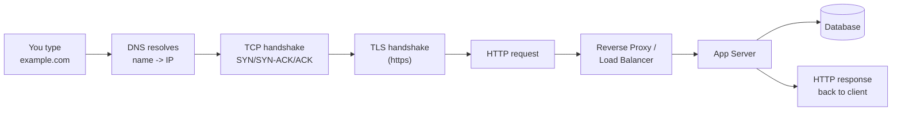

# Networking Interview Questions - DNS, OSI, Proxies & Subnets Deep Dive

> The networking questions that come up in every DevOps/SRE interview - explained in **simple words first**, then the depth. Covers DNS, the full request flow through the OSI model, proxies, the famous `0.0.0.0` vs `127.0.0.1` trap, subnets, and the AWS public/private subnet fix.

See also: [Linux Interview Scenarios & Troubleshooting](Linux%20Interview%20Scenarios%20%26%20Troubleshooting.md) · [Microservices Interview Questions - Architecture & Scenarios](Microservices%20Interview%20Questions%20-%20Architecture%20%26%20Scenarios.md) · [AWS VPC](AWS%20VPC.md)

---

## Table of Contents

- [1. Explain DNS in Simple Words](#1-explain-dns-in-simple-words)
- [2. Complete Flow of a Request from Client to Server (OSI Model)](#2-complete-flow-of-a-request-from-client-to-server-osi-model)
- [3. Forward Proxy vs Reverse Proxy](#3-forward-proxy-vs-reverse-proxy)
- [4. User Reports Slowness in the App - How Would You Approach It?](#4-user-reports-slowness-in-the-app---how-would-you-approach-it)
- [5. curl Works with IP but Fails with Domain - Why?](#5-curl-works-with-ip-but-fails-with-domain---why)
- [6. Website Returns 502 - What Can Be the Issue?](#6-website-returns-502---what-can-be-the-issue)
- [7. Difference Between 0.0.0.0 and 127.0.0.1](#7-difference-between-0000-and-127001)
- [8. Public vs Private Subnets (General and AWS)](#8-public-vs-private-subnets-general-and-aws)
- [9. You Accidentally Created a Private Subnet Instead of Public - How to Fix](#9-you-accidentally-created-a-private-subnet-instead-of-public---how-to-fix)

---



---

## 1. Explain DNS in Simple Words

**DNS (Domain Name System) is the phonebook of the internet.** Humans remember names like `google.com`; computers talk in IP addresses like `142.250.190.78`. DNS translates the name you type into the IP address the network actually needs.

**The simple analogy:** you know your friend's _name_ but to call them your phone needs their _number_. DNS is the contact list that looks up the number from the name.

**How a lookup actually works (the resolution chain):**

```
You -> Recursive Resolver -> Root server -> TLD server -> Authoritative server -> IP
```

1. **Browser/OS cache** - checks if it already knows the IP (cached from before).
2. **Recursive resolver** (your ISP's or `8.8.8.8`) - does the legwork on your behalf.
3. **Root server (`.`)** - "I don't know `google.com`, but ask the `.com` servers."
4. **TLD(Top-Level Domain) server (`.com`)** - "Ask Google's authoritative name server."
5. **Authoritative name server** - "`google.com` is `142.250.190.78`." ✅
6. The answer is **cached** at each level for a duration set by the record's **TTL** so the next lookup is instant.

**Common record types to know:**

| Record    | Maps                                 | Example                       |
| :-------- | :----------------------------------- | :---------------------------- |
| **A**     | name → IPv4                          | `example.com → 93.184.x.x`    |
| **AAAA**  | name → IPv6                          | `example.com → 2606:...`      |
| **CNAME** | name → another name (alias)          | `www → example.com`           |
| **MX**    | mail server                          | for email routing             |
| **NS**    | which name servers are authoritative | delegation                    |
| **TXT**   | arbitrary text                       | SPF/DKIM, domain verification |

**Tools:** `dig example.com +short`, `nslookup example.com`, `host example.com`.

[⬆ Back to top](#table-of-contents)

---

## 2. Complete Flow of a Request from Client to Server (OSI Model)

When you type `https://example.com` and hit Enter, here's everything that happens - mapped to the **7-layer OSI model** (top = closest to the user, bottom = the wire).

### The OSI layers

| #   | Layer            | Job                                    | Examples / Protocols       |
| :-- | :--------------- | :------------------------------------- | :------------------------- |
| 7   | **Application**  | The app the user interacts with        | HTTP, HTTPS, DNS, FTP, SSH |
| 6   | **Presentation** | Encoding, encryption, compression      | TLS/SSL, JPEG, ASCII       |
| 5   | **Session**      | Sets up/maintains sessions             | TLS sessions, sockets      |
| 4   | **Transport**    | Reliable delivery, ports, segmentation | **TCP**, UDP               |
| 3   | **Network**      | Logical addressing & routing           | **IP**, ICMP, routers      |
| 2   | **Data Link**    | Frames between adjacent nodes, MAC     | Ethernet, ARP, switches    |
| 1   | **Physical**     | Bits on the wire/radio                 | cables, fiber, Wi-Fi       |

> Mnemonic (top→bottom): **A**ll **P**eople **S**eem **T**o **N**eed **D**ata **P**rocessing.

### The end-to-end flow

1. **DNS resolution (L7)** - `example.com` → IP (see [1. Explain DNS in Simple Words](#1-explain-dns-in-simple-words)).
2. **TCP handshake (L4)** - client and server do **SYN → SYN-ACK → ACK** to open a reliable connection on port 443.
3. **TLS handshake (L6/5, for HTTPS)** - exchange certificates and keys, agree on a cipher, establish an encrypted channel.
4. **HTTP request (L7)** - client sends `GET / HTTP/1.1\nHost: example.com ...`.
5. **Encapsulation down the stack (sender)** - the request is wrapped layer by layer: HTTP data → TCP **segment** (adds ports) → IP **packet** (adds src/dst IP) → Ethernet **frame** (adds MAC) → **bits** on the wire.
6. **Routing across the internet (L3)** - routers forward the packet hop by hop using IP addresses and routing tables; switches move frames within each local network using MAC + ARP (L2).
7. **Decapsulation up the stack (receiver)** - the server strips each header in reverse (frame → packet → segment → HTTP) until the app reads the request.
8. **Server processes** - often hitting a **reverse proxy / load balancer** → app server → database, then builds a response.
9. **Response travels back** the same way, encapsulated down the server's stack and decapsulated up the client's, and the browser **renders** the page.

**Interview gold:** the two concepts they're really testing are **encapsulation/decapsulation** (each layer adds/removes its own header) and knowing **which protocol lives at which layer** (TCP=4, IP=3, HTTP/DNS=7, TLS≈6, Ethernet/ARP=2).

[⬆ Back to top](#table-of-contents)

---

## 3. Forward Proxy vs Reverse Proxy

Both sit _in the middle_ of a client-server conversation - the difference is **which side they represent**.

```
Forward Proxy:   [Clients] -> (Forward Proxy) -> Internet/Servers
                  hides/serves the CLIENT

Reverse Proxy:   Internet/Clients -> (Reverse Proxy) -> [Backend Servers]
                  hides/serves the SERVER
```

|                   | **Forward Proxy**                                                            | **Reverse Proxy**                                                               |
| :---------------- | :--------------------------------------------------------------------------- | :------------------------------------------------------------------------------ |
| Acts on behalf of | The **client**                                                               | The **server**                                                                  |
| Who it hides      | Hides the client from the server                                             | Hides the servers from the client                                               |
| Client awareness  | Client is configured to use it                                               | Client just sees one public endpoint                                            |
| Typical uses      | Corporate web filtering, caching, anonymity (VPN-like), bypassing geo-blocks | Load balancing, TLS termination, caching, security/WAF, hiding backend topology |
| Examples          | Squid, corporate proxy                                                       | **NGINX, HAProxy, AWS ALB/ELB, Cloudflare, API Gateway**                        |

**Simple way to say it:** a **forward proxy** is the _client's_ agent (the client's traffic goes out through it); a **reverse proxy** is the _server's_ receptionist (all inbound traffic comes in through it before reaching the real servers).

**Why reverse proxies matter in DevOps:** they give you **load balancing**, **TLS/SSL termination**, **caching**, a single entry point for **auth/rate-limiting**, and they hide how many backend servers exist (and their private IPs) - the foundation of scalable web architecture.

[⬆ Back to top](#table-of-contents)

---

## 4. User Reports Slowness in the App - How Would You Approach It?

Slowness is vague - the skill is **narrowing down which layer is slow** before touching anything. Work the request path methodically.

### Step 1 - Scope it (questions first)

- Is it **everyone or one user**? **All pages or one feature**? **Now or always**? **One region**?
- One user → client/network side. Everyone → server/backend side. One feature → a specific service/query.

### Step 2 - Client / network side

```bash
ping example.com            # latency / packet loss
traceroute example.com      # where the delay is on the path
dig example.com             # slow DNS? check resolution time
curl -w "@curl-format.txt" -o /dev/null -s https://example.com
#   breaks the request into DNS / connect / TLS / TTFB / total
```

Browser DevTools → Network tab: is it **DNS, connect, TTFB (server think time), or download** that's slow?

### Step 3 - Server / infra side

```bash
top / htop          # CPU saturation
free -h             # memory pressure / swapping
df -h               # disk full
vmstat 1            # iowait (disk-bound) vs cpu-bound
ss -s               # connection counts / saturation
```

Check the **load balancer / reverse proxy** metrics: latency, 5xx rate, healthy target count.

### Step 4 - Application side

- **APM / tracing** (distributed tracing) - find the slow span/service.
- **Logs** - errors, timeouts, retries.
- **Slow dependency** - a downstream service or external API timing out.

### Step 5 - Database side (the usual culprit)

- **Slow queries** - enable the slow query log; look for missing indexes, full table scans, N+1 queries.
- **Locks / contention**, connection pool exhaustion, replication lag.

**System thinking:** isolate the layer - _client → DNS → network → load balancer → app → DB_. The single most useful first move is `curl -w` (or DevTools) to see **whether time is spent in DNS, connection, TLS, server thinking (TTFB), or transfer** - that one number points you at the layer. Most "app is slow" tickets end at a **slow DB query** or a **saturated resource**.

[⬆ Back to top](#table-of-contents)

---

## 5. curl Works with IP but Fails with Domain - Why?

**`curl http://1.2.3.4` works but `curl http://example.com` fails.** The IP works, so the **network path and the server are fine** - the problem is in the step that happens _only_ with a domain name: **DNS resolution** (or name-based routing).

### Most likely cause: DNS resolution is broken

The domain isn't resolving to an IP. Confirm:

```bash
curl -v http://example.com        # error like "Could not resolve host"
dig example.com +short            # returns nothing or wrong IP
nslookup example.com
cat /etc/resolv.conf              # is a working nameserver configured?
cat /etc/hosts                    # stale/wrong static entry overriding DNS?
ping example.com                  # name -> resolves? same failure?
```

**Common root causes:**

| Cause                              | Check / Fix                                                        |
| :--------------------------------- | :----------------------------------------------------------------- |
| No/bad DNS server                  | `/etc/resolv.conf` empty or unreachable → set `nameserver 8.8.8.8` |
| Domain doesn't exist / no A record | `dig` returns NXDOMAIN → fix DNS records                           |
| Stale `/etc/hosts` entry           | Wrong manual mapping overriding real DNS → remove it               |
| Wrong/private DNS in a VPC         | EC2 can't reach the resolver; check VPC DNS settings               |
| Firewall blocking port 53          | DNS uses UDP/TCP 53; egress blocked                                |

### Second cause (DNS resolves, but domain still fails): name-based routing

If `dig` **does** resolve but the IP-only request behaves differently, the server may rely on the **`Host` header** (virtual hosts / SNI). Hitting the raw IP doesn't send the right `Host`, so:

- A reverse proxy/web server with **name-based virtual hosting** serves a different site (or default/404) for the IP.
- **HTTPS + SNI** - the server needs the hostname during TLS to pick the right certificate; an IP request gets a cert mismatch.

**Test the routing theory without DNS:**

```bash
curl -H "Host: example.com" http://1.2.3.4     # force the Host header on the IP
curl --resolve example.com:443:1.2.3.4 https://example.com   # use domain but pin the IP
```

**System thinking:** IP works + name fails = the failure is in **name → IP translation** (DNS) or **name-based serving** (Host header/SNI), _not_ connectivity. `dig`/`nslookup` instantly tells you which: no resolution → DNS; resolves but still fails → Host/SNI/vhost.

[⬆ Back to top](#table-of-contents)

---

## 6. Website Returns 502 - What Can Be the Issue?

**502 Bad Gateway** means a **proxy/gateway got an invalid (or no) response from the upstream/backend** it forwarded to. Crucially: **the proxy is up** (that's what's answering you) - the **backend behind it is the problem**.

Contrast the gateway errors:

| Code                        | Meaning                                     | Typical cause                                         |
| :-------------------------- | :------------------------------------------ | :---------------------------------------------------- |
| **502** Bad Gateway         | Upstream returned an invalid/empty response | Backend crashed, wrong port, connection refused/reset |
| **503** Service Unavailable | No healthy upstream / overloaded            | All targets unhealthy, maintenance, autoscaling gap   |
| **504** Gateway Timeout     | Upstream too slow to respond in time        | Backend hung, slow DB query, timeout too low          |

### Common causes of a 502

1. **Backend (app) is down or crashed** - the proxy can't get a valid response. `systemctl status app`, check app logs.
2. **Wrong upstream port / address** in the proxy config - proxy points at `:3000` but app listens on `:8080`.
3. **App listening on `127.0.0.1` only**, but proxy connects via the network interface → connection refused (see [7. Difference Between 0.0.0.0 and 127.0.0.1](#7-difference-between-0000-and-127001)).
4. **App returns malformed response / closes connection** prematurely (e.g. crashed mid-request, killed by OOM).
5. **Health checks failing** - load balancer marks targets unhealthy and has nothing valid to route to.
6. **Resource exhaustion** - app out of memory/threads, OOM-killed, restarting.
7. **Security group / firewall** blocking proxy → backend traffic (AWS: ALB SG can't reach instance SG on the app port).

### How to troubleshoot

```bash
# On the proxy (e.g. NGINX)
tail -f /var/log/nginx/error.log        # shows "connect() failed", "upstream prematurely closed"
nginx -t                                # config sane?

# On the backend
systemctl status myapp
ss -tulpn | grep <app-port>             # is it listening? on which interface?
curl -I http://localhost:<app-port>     # does the backend itself respond?
journalctl -u myapp -n 100              # crashes / OOM
dmesg | grep -i oom                     # OOM killer?
```

On **AWS (ALB → target):** check target group **health checks**, target **security group** (must allow the ALB SG on the app port), and that the app actually listens on the registered port.

**System thinking:** 502 = "I'm the proxy, my backend gave me garbage or nothing." So the fault is **downstream** of the thing that answered. Verify the backend is **up**, **listening on the right interface/port**, **not OOM/crashing**, and **reachable from the proxy** (firewall/SG). `curl localhost:<port>` on the backend box is the fastest way to split "proxy problem" from "app problem."

[⬆ Back to top](#table-of-contents)

---

## 7. Difference Between 0.0.0.0 and 127.0.0.1

This trips people up because both look like "local," but they mean **opposite things** depending on context.

### 127.0.0.1 - loopback (a specific address)

- The **loopback** address ("localhost"). Traffic to it **never leaves the machine**.
- When a server **binds** to `127.0.0.1:8080`, it accepts connections **only from the same machine** - nothing from the network/outside can reach it.
- Use for: local-only services (a DB only the local app should hit), security.

### 0.0.0.0 - "all interfaces" / "any" (a wildcard, not a real destination)

- It's a **placeholder**, and its meaning depends on where it's used:
  - **As a bind/listen address:** "listen on **all** network interfaces" (loopback + LAN + public IP). The service is reachable from **anywhere** that can route to the box. `0.0.0.0:8080` = reachable externally.
  - **As a route/destination (`0.0.0.0/0`):** "**all IPv4 addresses**" - the default route / "the entire internet" (used in routing tables, security group rules).
- You **connect to** `127.0.0.1`; you generally **don't connect to** `0.0.0.0` - it's "any/all," not a single host.

### The practical comparison

|                         | `127.0.0.1`                     | `0.0.0.0`                                        |
| :---------------------- | :------------------------------ | :----------------------------------------------- |
| What it is              | One specific address (loopback) | Wildcard: "all interfaces" / "any address"       |
| Bind here means         | Only local connections accepted | Accept connections on **every** interface        |
| Reachable from outside? | **No**                          | **Yes** (anything that can route to the host)    |
| As a route              | n/a                             | `0.0.0.0/0` = the whole internet (default route) |
| Security                | Safe by default                 | Exposed - secure it (firewall/SG)                |

### Why it matters in real life (the "aha")

A super common bug: your app binds to **`127.0.0.1:8080`**, then your reverse proxy or load balancer (on another host, or hitting the instance's network IP) gets **connection refused / 502** - because the app only listens on loopback. Fix: bind the app to **`0.0.0.0:8080`** (all interfaces) so it accepts external/proxy connections - _then_ lock down access with a firewall/security group. (See the 502 causes in [6. Website Returns 502 - What Can Be the Issue?](#6-website-returns-502---what-can-be-the-issue).)

```bash
ss -tulpn | grep 8080
# 127.0.0.1:8080  -> local only  (proxy on another host can't reach it)
# 0.0.0.0:8080    -> all interfaces (reachable; secure with firewall/SG)
```

**One-liner answer:** `127.0.0.1` is the loopback - _only this machine_. `0.0.0.0` means _all interfaces_ when you bind/listen, or _all addresses_ (`/0`) when it's a route. You connect to the former; you bind/route with the latter.

[⬆ Back to top](#table-of-contents)

---

## 8. Public vs Private Subnets (General and AWS)

### In general (networking)

A **subnet** is a logical subdivision of an IP network.

- **Public subnet** - hosts have addresses **reachable from the internet** (they have public/routable IPs and a path to the internet gateway).
- **Private subnet** - hosts have **internal-only** addresses, **not directly reachable** from the internet (e.g. `10.0.0.0/8`, `192.168.0.0/16`). They can reach out via NAT, but the internet can't initiate a connection in.

The distinction is fundamentally about **routing**: does this subnet have a route to/from the public internet?

### In AWS (the precise definition)

In a **VPC**, public vs private is **defined by the route table**, not a checkbox:

|                   | **Public Subnet**                                            | **Private Subnet**                                          |
| :---------------- | :----------------------------------------------------------- | :---------------------------------------------------------- |
| Defining trait    | Route table has a route `0.0.0.0/0 → Internet Gateway (IGW)` | **No** route to an IGW                                      |
| Internet inbound  | Yes (if instance has a public IP + SG allows)                | No - not directly reachable                                 |
| Internet outbound | Direct via IGW                                               | Only via a **NAT Gateway** (which lives in a public subnet) |
| Typical contents  | Load balancers, bastion hosts, public web servers            | App servers, databases, internal services                   |
| Public IP         | Instances can have public/Elastic IPs                        | Private IPs only                                            |

**Key AWS facts interviewers check:**

- A subnet is "public" **only because** its route table routes `0.0.0.0/0` to an **Internet Gateway**.
- An instance also needs a **public IP** (auto-assign or Elastic IP) _and_ permissive **security group/NACL** to actually be reachable.
- A **NAT Gateway** (or NAT instance) lets private-subnet resources make **outbound** connections (e.g. download updates) while staying unreachable from the internet inbound. The NAT itself sits in a **public** subnet.
- Best practice: **public subnet = only the front door** (ALB, bastion); **private subnet = app + DB tiers**. Defense in depth.

[⬆ Back to top](#table-of-contents)

---

## 9. You Accidentally Created a Private Subnet Instead of Public - How to Fix

**Reframe:** in AWS there's no "private/public" flag to flip - a subnet is public **because of its route table**. So "I made a private subnet by mistake" really means _its route table has no path to an Internet Gateway_. You fix it by adding that path. **No need to recreate the subnet.**

### Steps to convert a private subnet to public

1. **Ensure the VPC has an Internet Gateway (IGW) attached.**
   - If none exists: create an IGW and attach it to the VPC.

   ```bash
   aws ec2 create-internet-gateway
   aws ec2 attach-internet-gateway --internet-gateway-id igw-0abc --vpc-id vpc-0xyz
   ```

2. **Add a default route to the IGW in the subnet's route table.** This is the actual fix.
   - Either edit the route table currently associated with the subnet, or create a new "public" route table and associate the subnet with it.

   ```bash
   aws ec2 create-route \
     --route-table-id rtb-0public \
     --destination-cidr-block 0.0.0.0/0 \
     --gateway-id igw-0abc
   # associate the subnet with this route table if needed:
   aws ec2 associate-route-table --route-table-id rtb-0public --subnet-id subnet-0priv
   ```

   _(Note: don't add the IGW route to a route table shared by subnets that must stay private - use a dedicated public route table.)_

3. **Enable auto-assign public IPv4** on the subnet (so new instances get a public IP), or attach an **Elastic IP** to existing instances.

   ```bash
   aws ec2 modify-subnet-attribute --subnet-id subnet-0priv --map-public-ip-on-launch
   ```

   Existing instances won't retroactively get a public IP - allocate/associate an **Elastic IP** for those.

4. **Open the path in Security Group + NACL** - allow the required inbound (e.g. 80/443/22 from the right sources) so traffic can actually flow.

### Verify

- Route table shows `0.0.0.0/0 → igw-...`.
- Instance has a public/Elastic IP.
- SG/NACL allow the traffic. Then `curl`/SSH from outside should work.

**System thinking:** "public vs private" is **routing, not identity**. The minimal fix is _one route_ (`0.0.0.0/0 → IGW`) plus _a public IP_ on the instance and _permissive SG/NACL_. The reverse ("I exposed something that should be private") is the same logic in reverse: remove the IGW route (and use a NAT Gateway if it still needs outbound). Always prefer a **separate public route table** so you don't accidentally make other subnets public.

[⬆ Back to top](#table-of-contents)

---

> **Interview meta-tip:** networking questions reward **layered reasoning** - name the layer (DNS / TCP / TLS / HTTP / routing), explain what _only_ happens at that layer, and tie symptoms to it ("IP works, name fails → DNS"; "502 → backend, not proxy"; "can't reach my service → bound to 127.0.0.1"). And for AWS, remember the recurring theme: **public vs private is decided by the route table**, not a setting.
